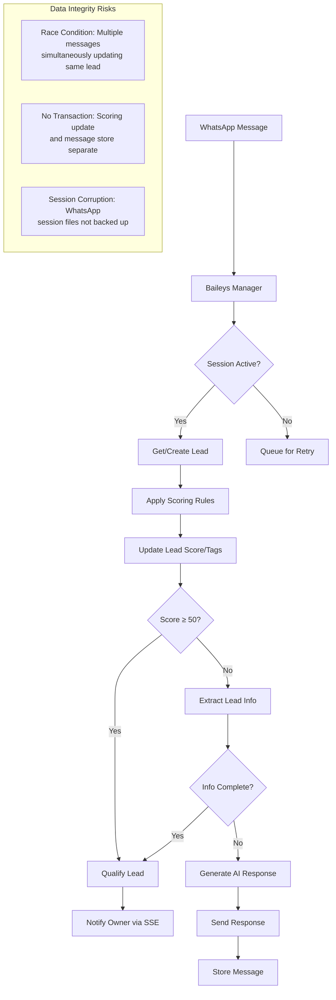

# Data Persistence & Integrity Audit Report
## WhatsApp Bot System - BotInteligente

**Audit Date:** December 30, 2025  
**Auditor:** Kilo Code (Architect Mode)  
**System Version:** 1.0.0  
**Scope:** Complete data lifecycle from user interactions to persistent storage

---

## Executive Summary

The WhatsApp bot system demonstrates a solid foundation for multi-tenant data management with well-implemented PostgreSQL Row-Level Security (RLS) and structured migration patterns. However, critical vulnerabilities in SQL injection prevention, inconsistent data types, and missing backup strategies pose significant risks to data integrity and system reliability.

### Risk Assessment
- **Critical (3):** SQL injection, No backup strategy, Referential integrity issues
- **High (4):** Race conditions, Data type inconsistencies, Missing validation, No queue system
- **Medium (2):** Session data persistence, Audit trail gaps
- **Low (1):** Caching limitations

---

## 1. Database Schema & Migration Analysis

### 1.1 Migration Structure
**Strengths:**
- Sequential migration files (001-010) with proper versioning
- Transaction blocks (BEGIN/COMMIT) in critical migrations
- Conditional column creation (`ADD COLUMN IF NOT EXISTS`)
- Backfill procedures for data consistency

**Issues Identified:**
1. **Migration 010**: Mixed ID types - `owner_user_id` INTEGER references `users.id` (INTEGER) while other tables use UUID
2. **Migration 006**: No validation for tenant UUID format during backfill
3. **Migration 003**: Hardcoded qualification threshold (70) in trigger

### 1.2 Schema Consistency
```mermaid
erDiagram
    tenants ||--o{ users : "has"
    tenants ||--o{ bots : "has"
    tenants ||--o{ leads : "has"
    tenants ||--o{ products : "has"
    tenants ||--o{ pipelines : "has"
    
    bots ||--o{ leads : "generates"
    bots ||--o{ products : "contains"
    bots ||--o{ scoring_rules : "defines"
    
    leads ||--o{ lead_messages : "contains"
    leads }o--|| pipelines : "assigned_to"
    leads }o--|| pipeline_stages : "current_stage"
    
    pipelines ||--o{ pipeline_stages : "contains"
    
    users ||--o{ leads : "owns"
    
    note "Data Type Inconsistency: users.id (INTEGER) vs leads.owner_user_id (INTEGER) OK\nbut other tables use UUID"
```

### 1.3 Foreign Key Analysis
**Missing Foreign Keys:**
- `leads.assigned_to` (TEXT) → `users.email` (no FK constraint)
- `schedules.created_by` (TEXT) → `users.email` (no FK constraint)
- `bot_images.bot_id` (TEXT) → `bots.id` (no FK constraint in schema)

**Inconsistent References:**
- `lead_stage_events.lead_id` (INTEGER) → `leads.id` (INTEGER) ✓
- `lead_stage_events.old_stage_id` (UUID) → `pipeline_stages.id` (UUID) ✓
- But `leads.owner_user_id` (INTEGER) → `users.id` (INTEGER) while users table uses SERIAL

---

## 2. Data Flow & Lifecycle Analysis

### 2.1 WhatsApp Message Processing Flow


### 2.2 Critical Data Paths
1. **Lead Qualification**: Trigger-based (`leads_sync_is_qualified`) ensures `is_qualified` matches `score ≥ 70`
2. **Multi-tenant Isolation**: RLS policies correctly implemented across all tables
3. **Data Minimization**: Automated cleanup of messages >90 days and stale leads

---

## 3. Transaction Management Assessment

### 3.1 Current Implementation
**Well Implemented:**
- `pipelineService.js`: Proper BEGIN/COMMIT/ROLLBACK with client connection management
- Transaction isolation for pipeline creation, stage reordering, and lead movement
- Error handling with rollback on failure

**Missing Transactions:**
1. **Lead scoring updates**: `scoringService.applyScoring()` updates score without transaction
2. **Message processing**: `handleIncomingMessage()` performs multiple DB operations independently
3. **Product management**: No transactions for product updates with image changes

### 3.2 ACID Compliance Gaps
- **Atomicity**: Partial updates possible in lead processing
- **Consistency**: Referential integrity gaps as identified
- **Isolation**: No explicit isolation levels defined
- **Durability**: Depends on PostgreSQL configuration (not audited)

---

## 4. Data Validation & Sanitization

### 4.1 Current Validation
**Good Practices:**
- Email normalization (`toLowerCase().trim()`)
- Keyword normalization in image search
- Basic regex validation in scoring rules (with try-catch)

**Critical Gaps:**

#### 4.1.1 SQL Injection Vulnerability
**Location**: `services/db.js` lines 45 & 85
```javascript
// VULNERABLE CODE:
await client.query(`SET app.current_tenant = '${String(tenantId).replace(/'/g, "''")}'`);

// RISK: Tenant ID could contain SQL injection payload
// Example: tenantId = "'; DROP TABLE leads; --"
// Becomes: SET app.current_tenant = '''; DROP TABLE leads; --'
```

**Impact**: Critical - Could allow tenant context escape and data destruction

#### 4.1.2 Input Validation Missing
- WhatsApp numbers (format, country code validation)
- Product SKUs (character set, length validation)
- Pricing (negative values, decimal precision)
- JSONB fields (no schema validation for `tenant.settings`)

#### 4.1.3 Regex Safety
```javascript
// services/scoringService.js - Line 44
const regex = new RegExp(rule.keyword, 'i');
// RISK: Malicious regex could cause ReDoS attacks
```

---

## 5. Caching & Queue Implementation

### 5.1 Current Caching Strategy
**In-Memory Caches:**
- `activeSessions` Map in `baileysManager.js` (bot sessions)
- `sequences` Map in `emailAutomationService.js` (email sequences)
- `availableImages` & `availableProducts` per bot session

**Limitations:**
1. **No cache invalidation** - Images/products cached indefinitely
2. **No distributed cache** - Session data lost on server restart
3. **No cache persistence** - WhatsApp sessions stored locally in `auth-sessions/`

### 5.2 Queue System Assessment
**Current State:** No proper queue implementation
- Email automation mentions "agenda/bullmq" but not implemented
- Scheduler uses `setInterval` polling (30-second intervals)
- No dead letter queue or retry logic

**Risks:**
- Email delivery failures not retried
- Scheduled task execution gaps during high load
- No monitoring of queue depth or processing delays

---

## 6. Backup & Recovery Procedures

### 6.1 Current State: **CRITICAL GAP**
**No documented or implemented backup strategy found**

**Data at Risk:**
1. **PostgreSQL Database**: No automated backups configured
2. **Session Files**: `auth-sessions/` directory not backed up
3. **Cloud Storage**: R2 bucket replication not verified
4. **Application State**: In-memory caches not persisted

### 6.2 Disaster Recovery Gaps
- No Recovery Point Objective (RPO) defined
- No Recovery Time Objective (RTO) defined
- No backup testing procedures
- No geographic redundancy for data

---

## 7. Data Consistency Verification

### 7.1 Cross-System Consistency
**Issues Identified:**

1. **Database ↔ Cache Inconsistency**
   - Bot images/products cached in memory, not invalidated on DB updates
   - `refreshBotImages()` called manually after image uploads

2. **Database ↔ External Storage**
   - R2 image deletions don't trigger database cleanup
   - No orphaned file detection or cleanup

3. **Race Conditions**
   ```javascript
   // services/baileysManager.js - Multiple async operations on same lead
   const evaluation = await scoringService.evaluateMessage(botId, userMessage);
   // ... other async operations ...
   lead = await scoringService.applyScoring(lead.id, evaluation);
   // Concurrent message could interleave operations
   ```

### 7.2 Referential Integrity Violations
**Potential Orphaned Records:**
- Delete bot without deleting associated images/products
- Delete user without reassigning owned leads
- Delete pipeline stage without updating leads

---

## 8. Prioritized Recommendations

### 8.1 Critical (Immediate Action Required)

#### **C1: Fix SQL Injection Vulnerability**
```javascript
// services/db.js - CORRECTED CODE
if (tenantId) {
    // Use parameterized query with SET LOCAL
    await client.query(`SET LOCAL app.current_tenant = $1`, [tenantId]);
}
```

**Action Items:**
1. Update `db.js` lines 45 and 85 to use parameterized queries
2. Add UUID validation before setting tenant context
3. Implement SQL injection test cases

#### **C2: Implement Database Backup Strategy**
```bash
# Recommended backup script
pg_dump $DATABASE_URL --format=custom --file=backup-$(date +%Y%m%d).dump
# Upload to Cloudflare R2 with retention policy
```

**Action Items:**
1. Implement daily automated backups with 30-day retention
2. Backup `auth-sessions/` directory
3. Test restore procedure quarterly
4. Configure point-in-time recovery (PITR) for PostgreSQL

#### **C3: Fix Referential Integrity**
```sql
-- Add missing foreign keys
ALTER TABLE leads ADD CONSTRAINT fk_leads_owner_user 
    FOREIGN KEY (owner_user_id) REFERENCES users(id) ON DELETE SET NULL;

ALTER TABLE bot_images ADD CONSTRAINT fk_bot_images_bot
    FOREIGN KEY (bot_id) REFERENCES bots(id) ON DELETE CASCADE;
```

**Action Items:**
1. Audit all missing foreign key constraints
2. Create migration to add constraints with proper ON DELETE actions
3. Clean up orphaned records before applying constraints

### 8.2 High Priority (Next Sprint)

#### **H1: Implement Queue System**
```javascript
// Recommended: BullMQ with Redis
const queue = new Queue('email-processing', {
    connection: redisConfig,
    defaultJobOptions: {
        attempts: 3,
        backoff: { type: 'exponential', delay: 1000 }
    }
});
```

**Action Items:**
1. Add Redis for queue and cache
2. Move email automation to queue
3. Implement retry logic and dead letter queues
4. Add queue monitoring dashboard

#### **H2: Standardize Data Types**
```sql
-- Migrate all IDs to UUID for consistency
ALTER TABLE users ALTER COLUMN id TYPE UUID USING gen_random_uuid();
-- Update all references accordingly
```

**Action Items:**
1. Choose consistent ID strategy (UUID recommended)
2. Create migration plan with minimal downtime
3. Update all service code to handle new ID format

#### **H3: Enhance Data Validation**
```javascript
// Validation middleware example
const validateWhatsAppNumber = (number) => {
    const regex = /^\+[1-9]\d{1,14}$/; // E.164 format
    return regex.test(number);
};

// Schema validation for JSONB
const tenantSettingsSchema = Joi.object({
    retentionDays: Joi.number().min(1).max(365),
    // ... other settings
});
```

**Action Items:**
1. Add validation middleware for all API endpoints
2. Implement Joi or Zod schemas for JSONB fields
3. Add input sanitization for all user-provided data

### 8.3 Medium Priority

#### **M1: Improve Transaction Management**
```javascript
// Wrap critical operations in transactions
async function processMessageWithTransaction(botId, msg) {
    const client = await pool.connect();
    try {
        await client.query('BEGIN');
        // All related DB operations
        await client.query('COMMIT');
    } catch (error) {
        await client.query('ROLLBACK');
        throw error;
    } finally {
        client.release();
    }
}
```

**Action Items:**
1. Audit all service methods for transaction needs
2. Wrap lead processing in transactions
3. Add transaction timeout handling

#### **M2: Implement Comprehensive Audit Logging**
```sql
CREATE TABLE data_change_audit (
    id UUID PRIMARY KEY,
    table_name TEXT NOT NULL,
    record_id TEXT NOT NULL,
    old_values JSONB,
    new_values JSONB,
    changed_by TEXT,
    changed_at TIMESTAMP DEFAULT CURRENT_TIMESTAMP
);
```

**Action Items:**
1. Add triggers for critical data changes
2. Log all modifications to leads, products, scoring rules
3. Implement audit trail query interface

#### **M3: Enhance Cache Strategy**
```javascript
// Redis-based cache with TTL
const redisCache = {
    set: async (key, value, ttl = 3600) => {
        await redis.setex(key, ttl, JSON.stringify(value));
    },
    get: async (key) => {
        const data = await redis.get(key);
        return data ? JSON.parse(data) : null;
    }
};
```

**Action Items:**
1. Implement Redis for distributed caching
2. Add cache invalidation on data updates
3. Implement cache warming for frequently accessed data

### 8.4 Low Priority

#### **L1: Data Versioning**
```sql
-- Temporal tables for historical tracking
CREATE TABLE leads_history AS 
    SELECT *, NOW() AS valid_from, 'infinity' AS valid_to 
    FROM leads;
```

**Action Items:**
1. Implement temporal tables for critical data
2. Add versioning API for audit purposes
3. Configure retention policies for historical data

#### **L2: Performance Optimization**
- Add composite indexes for frequent query patterns
- Implement query performance monitoring
- Add database connection pooling optimization

---

## 9. Implementation Roadmap

### Phase 1: Critical Fixes (Week 1-2)
1. Patch SQL injection vulnerability
2. Implement basic database backups
3. Add missing foreign key constraints

### Phase 2: Data Integrity (Week 3-4)
1. Implement queue system (Redis + BullMQ)
2. Standardize data types (UUID migration)
3. Enhance validation middleware

### Phase 3: Reliability (Week 5-6)
1. Improve transaction management
2. Implement comprehensive audit logging
3. Enhance cache strategy with Redis

### Phase 4: Advanced Features (Week 7-8)
1. Data versioning implementation
2. Performance optimization
3. Disaster recovery testing

---

## 10. Monitoring & Alerting Recommendations

### 10.1 Data Integrity Monitors
```sql
-- Daily integrity check queries
SELECT COUNT(*) as orphaned_leads FROM leads l 
LEFT JOIN bots b ON l.bot_id = b.id 
WHERE b.id IS NULL;

SELECT COUNT(*) as inconsistent_scores FROM leads 
WHERE (score >= 70 AND NOT is_qualified) 
   OR (score < 70 AND is_qualified);
```

### 10.2 Alerting Thresholds
- **Backup failures**: Immediate alert
- **Orphaned records > 100**: Daily report
- **Queue depth > 1000**: Warning alert
- **Cache miss rate > 20%**: Performance alert

### 10.3 Dashboard Metrics
1. Data consistency score (% of records passing integrity checks)
2. Backup success rate and age
3. Queue processing latency
4. Cache hit/miss ratios

---

## Conclusion

The WhatsApp bot system has a strong architectural foundation with proper multi-tenancy implementation and structured migrations. However, critical data integrity risks require immediate attention, particularly the SQL injection vulnerability and lack of backup strategy.

**Overall Data Integrity Score: 6.5/10**

**Priority Actions:**
1. **Immediate**: Fix SQL injection in `db.js`
2. **Immediate**: Implement automated database backups
3. **Short-term**: Add missing foreign key constraints
4. **Short-term**: Implement Redis queue system

With these improvements, the system will achieve enterprise-grade data persistence and integrity, ensuring reliable operation and compliance with data protection regulations.

---
*Report generated by Kilo Code Architect Mode*  
*Next Steps: Switch to Code mode for implementation of critical fixes*