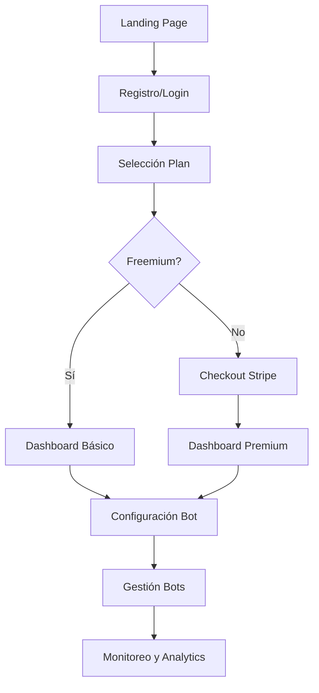
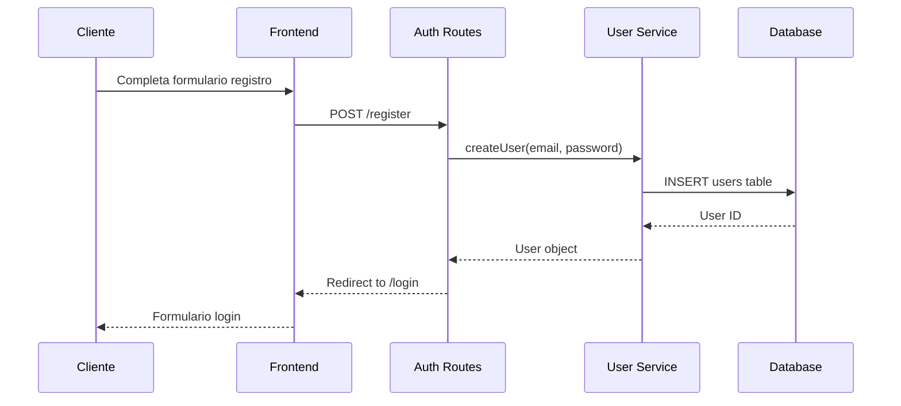
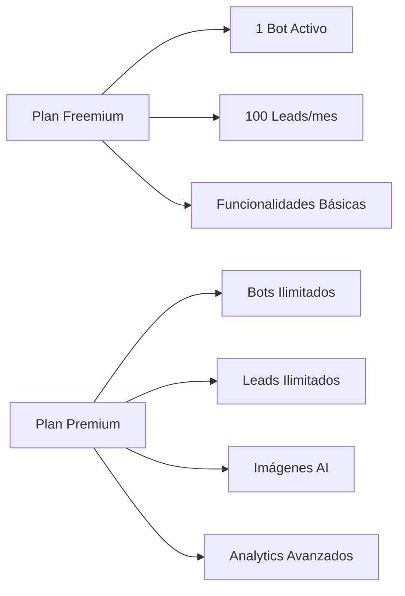
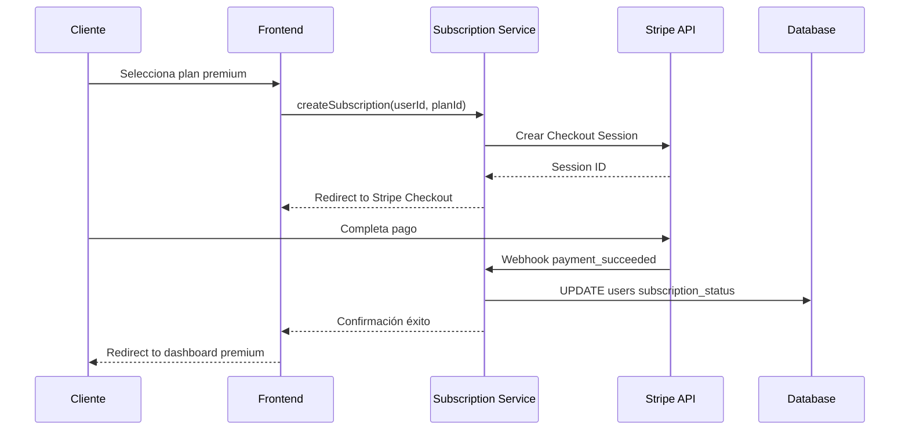
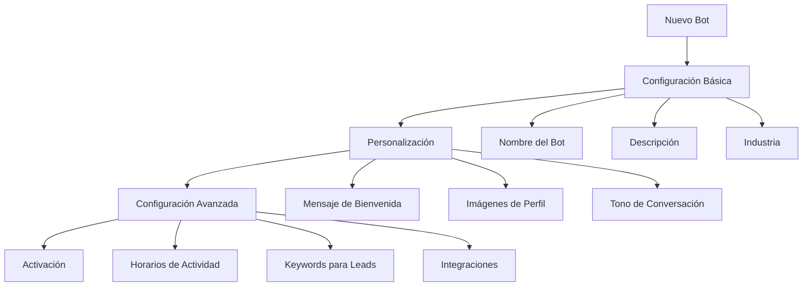
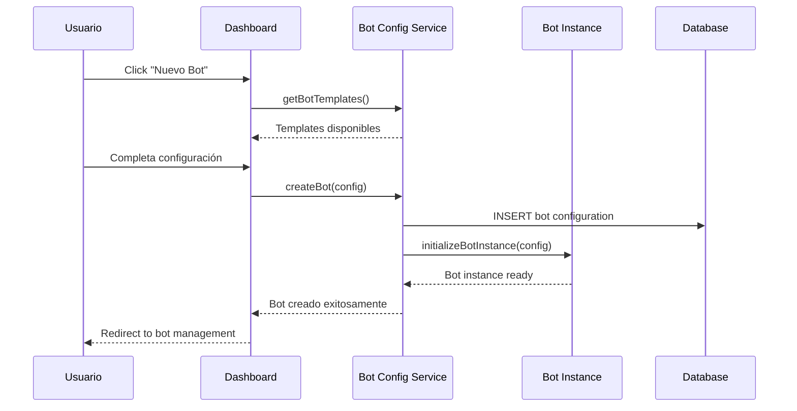
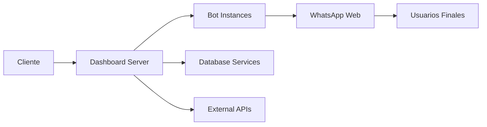

# Flujo Completo del Cliente - BotInteligente Manager

## Diagrama de Flujo General



## 1. Acceso a Landing Page ([`views/landing.ejs`](views/landing.ejs:1))

**Punto de Entrada:** Cliente accede a la página de aterrizaje

**Elementos Clave:**
- Hero section con contadores animados (usuarios, leads, conversaciones)
- Sección de características y beneficios
- Casos de éxito y testimonios
- Call-to-action para registro

**Tecnologías:**
- EJS template con variables dinámicas
- CSS responsivo con variables WordPress
- JavaScript para animaciones y interactividad

## 2. Proceso de Registro y Autenticación

### 2.1 Registro Inicial


**Servicios Involucrados:**
- [`routes/authRoutes.js`](routes/authRoutes.js:1) - Manejo de rutas de autenticación
- [`services/userService.js`](services/userService.js:1) - Creación y gestión de usuarios
- [`auth/authMiddleware.js`](auth/authMiddleware.js:1) - Validación de roles híbridos

### 2.2 Sistema de Autenticación Híbrida
- **Admin Users:** Definidos en variables de entorno ([`.env`](.env:1))
- **Team Members:** Gestionados en base de datos ([`users` table](services/userService.js:13))
- **JWT Tokens:** Con expiración de 7 días y cookies HTTP-only
- **WebSocket Auth:** Autenticación en tiempo real para eventos

## 3. Selección de Plan de Suscripción

### 3.1 Modelo Freemium


### 3.2 Integración con Stripe


**Servicios Involucrados:**
- [`services/subscriptionService.js`](services/subscriptionService.js:1) - Gestión de suscripciones
- Stripe Checkout para procesamiento de pagos
- Webhooks para actualizaciones en tiempo real

## 4. Configuración Inicial del Bot

### 4.1 Creación del Primer Bot


### 4.2 Servicio de Imágenes AI
```javascript
// Ejemplo de uso del Bot Image Service
const imageService = require('./services/botImageService');

// Selección automática de imágenes basada en contexto
const selectedImage = await imageService.selectImageForContext(
    conversationContext, 
    userPreferences
);

// Gestión de imágenes subidas
const uploadedImage = await imageService.uploadImage(
    userId, 
    imageFile, 
    keywords
);
```

**Servicios Involucrados:**
- [`services/botConfigService.js`](services/botConfigService.js:1) - Configuración de bots
- [`services/botImageService.js`](services/botImageService.js:1) - Gestión de imágenes AI
- [`services/deepseekService.js`](services/deepseekService.js:1) - Procesamiento de lenguaje natural

## 5. Gestión dentro del Bot Manager ([`views/dashboard.ejs`](views/dashboard.ejs:1))

### 5.1 Dashboard Principal
**Componentes:**
- **Resumen de Actividad:** Bots activos, conversaciones, leads capturados
- **Métricas en Tiempo Real:** Usando WebSockets ([`dashboardServer.js`](dashboardServer.js:99))
- **Lista de Bots:** Con estado (activo/pausado) y acciones rápidas
- **Alertas y Notificaciones:** Eventos importantes del sistema

### 5.2 Creación y Edición de Bots


### 5.3 Funcionalidades de Gestión

#### 5.3.1 Control de Estado del Bot
- **Activar/Desactivar:** Cambio inmediato sin reinicio del proceso
- **Pausa Dinámica:** [`botInstance.js`](botInstance.js:52) maneja pausas sin perder estado
- **Monitoreo en Tiempo Real:** WebSocket events para actualizaciones

#### 5.3.2 Configuración Avanzada
```javascript
// Configuración de características del bot
const botFeatures = {
    leadExtraction: {
        enabled: true,
        qualificationThreshold: 0.7,
        autoFollowUp: true
    },
    imageManagement: {
        aiSelection: true,
        customImages: [],
        selectionAlgorithm: 'contextual'
    },
    scheduling: {
        workingHours: { start: '09:00', end: '18:00' },
        timezone: 'America/Mexico_City'
    }
};
```

#### 5.3.3 Gestión de Leads y Conversaciones
- **Extracción Automática:** [`services/leadExtractionService.js`](services/leadExtractionService.js:1)
- **Calificación Progresiva:** Sistema de scoring basado en interacciones
- **Historial Completo:** [`services/leadDbService.js`](services/leadDbService.js:1) almacena conversaciones

### 5.4 Analytics y Reportes
**Métricas Disponibles:**
- Tasa de respuesta y engagement
- Calificación de leads capturados
- Efectividad de imágenes AI
- Horarios pico de actividad
- Conversiones por bot

## 6. Flujo de Comunicación en Tiempo Real

### 6.1 Arquitectura WebSocket


### 6.2 Eventos Principales
- `bot_status_update` - Cambios de estado del bot
- `new_lead_captured` - Nuevos leads identificados
- `conversation_update` - Actualizaciones de conversaciones
- `subscription_alert` - Alertas de suscripción
- `system_notification` - Notificaciones del sistema

## 7. Servicios Clave en el Flujo

### 7.1 User Service ([`services/userService.js`](services/userService.js:1))
- Gestión de equipos y permisos
- Control de acceso basado en roles
- Activación/desactivación de usuarios
- Auditoría de actividades

### 7.2 Subscription Service ([`services/subscriptionService.js`](services/subscriptionService.js:1))
- Validación de límites de plan
- Gestión de ciclos de facturación
- Webhooks de Stripe
- Degradación elegante en límites excedidos

### 7.3 Bot Image Service ([`services/botImageService.js`](services/botImageService.js:1))
- Selección contextual de imágenes
- Gestión de biblioteca multimedia
- Optimización de imágenes
- Análisis de efectividad

## 8. Consideraciones de Seguridad

### 8.1 Protección de Datos
- **Encriptación:** Datos sensibles en tránsito y reposo
- **Validación:** Sanitización de entradas y uploads de archivos
- **Auditoría:** Logs de todas las operaciones críticas

### 8.2 Control de Acceso
- **JWT Tokens:** Revalidación automática
- **RBAC:** Roles basados en suscripción y equipo
- **Rate Limiting:** Protección contra abuso

## 9. Escalabilidad y Performance

### 9.1 Optimizaciones Implementadas
- **Connection Pooling:** PostgreSQL con manejo eficiente de conexiones
- **Caching:** Datos frecuentemente accedidos
- **Background Processing:** Tareas pesadas fuera del request cycle
- **Horizontal Scaling:** Diseñado para múltiples instancias

### 9.2 Monitoreo
- **Health Checks:** Endpoints para verificación de estado
- **Metrics:** Métricas de performance y uso
- **Alerts:** Notificaciones proactivas de issues

---

*Este flujo representa la experiencia completa del usuario desde el descubrimiento del producto hasta el uso avanzado del sistema de gestión de bots, integrando todos los servicios y componentes del ecosistema BotInteligente.*