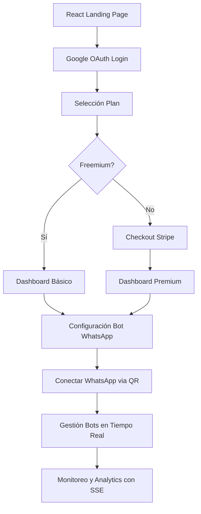
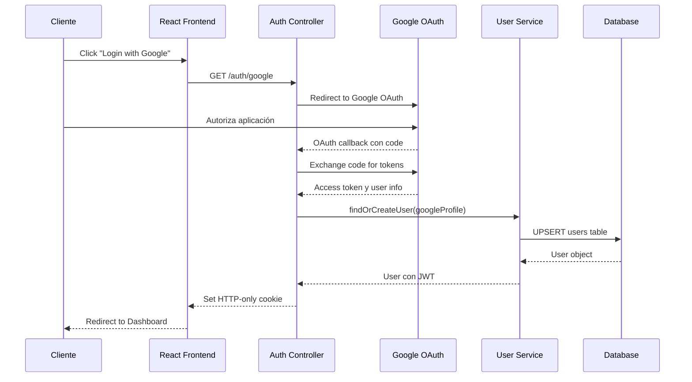
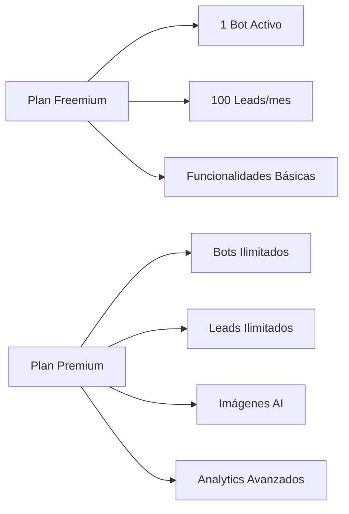
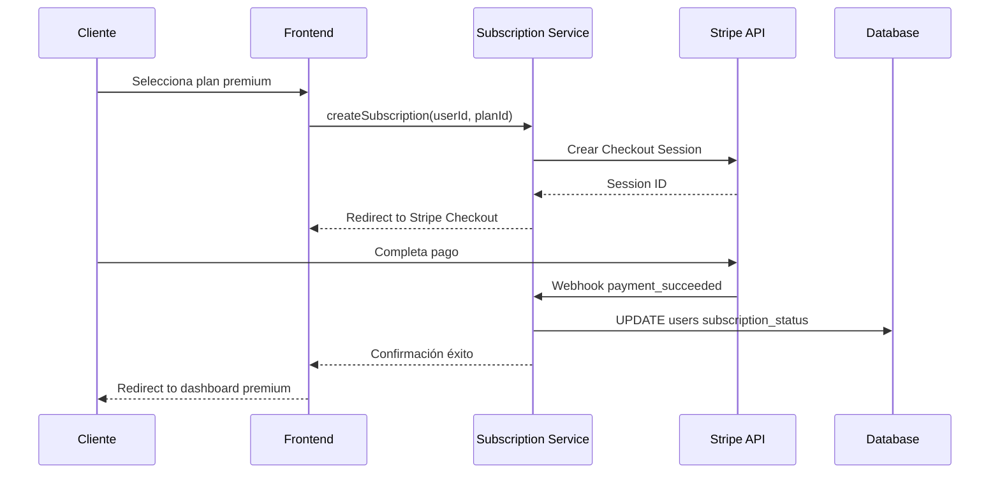
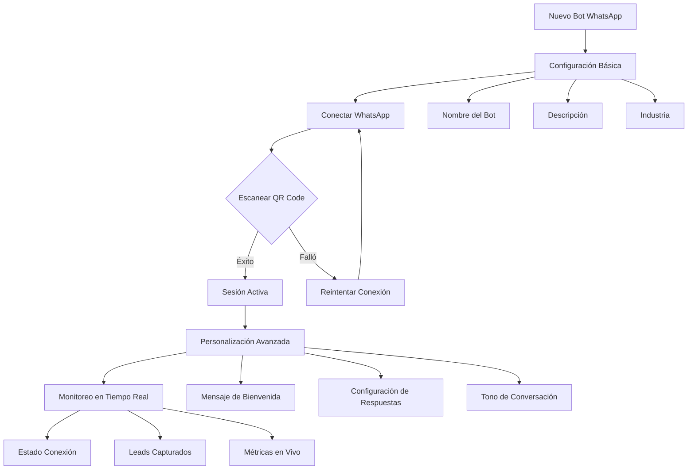
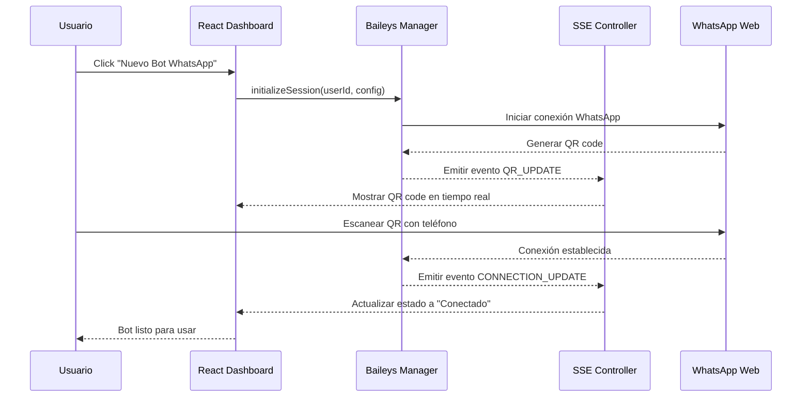
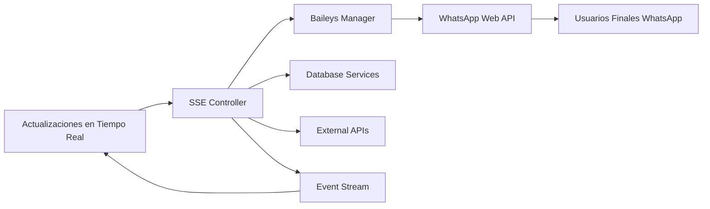

# Flujo Completo del Cliente - BotInteligente Manager (WhatsApp Migration Fases 2-4)

## Diagrama de Flujo General



## 1. Acceso a Landing Page React ([`client/src/pages/Login.jsx`](client/src/pages/Login.jsx:1))

**Punto de Entrada:** Cliente accede a la aplicación React con Vite

**Elementos Clave:**
- Hero section con contadores animados (usuarios, leads, conversaciones)
- Sección de características y beneficios
- Casos de éxito y testimonios
- Botón de login con Google OAuth
- Interfaz moderna y responsiva

**Tecnologías:**
- React 18 con Vite para desarrollo rápido
- Tailwind CSS para estilos responsivos
- Componentes modulares y reutilizables
- Context API para estado global

## 2. Proceso de Autenticación con Google OAuth

### 2.1 Flujo de Autenticación Moderno


**Servicios Involucrados:**
- [`auth/authController.js`](auth/authController.js:1) - Manejo de OAuth y JWT
- [`services/userService.js`](services/userService.js:1) - Gestión de usuarios
- [`client/src/context/AuthContext.jsx`](client/src/context/AuthContext.jsx:1) - Estado de autenticación en React

### 2.2 Sistema de Autenticación Modernizado
- **Google OAuth 2.0:** Autenticación segura sin contraseñas
- **JWT Tokens:** Firmados y almacenados en cookies HTTP-only
- **Session Management:** [`useMultiFileAuthState`](services/baileysManager.js:15) para sesiones WhatsApp
- **Context State:** [`AuthContext`](client/src/context/AuthContext.jsx:1) para estado global en React

## 3. Selección de Plan de Suscripción

### 3.1 Modelo Freemium


### 3.2 Integración con Stripe


**Servicios Involucrados:**
- [`services/subscriptionService.js`](services/subscriptionService.js:1) - Gestión de suscripciones
- Stripe Checkout para procesamiento de pagos
- Webhooks para actualizaciones en tiempo real

## 4. Configuración y Conexión de Bot WhatsApp

### 4.1 Proceso de Conexión con Baileys


### 4.2 Gestión de Sesiones con Baileys Manager
```javascript
// Ejemplo de uso del Baileys Manager
const baileysManager = require('./services/baileysManager');

// Inicialización de sesión WhatsApp
const session = await baileysManager.initializeSession(
    userId,
    botConfig,
    onQrCode, // Callback para mostrar QR
    onConnectionUpdate // Callback para estado
);

// Gestión de autenticación multi-archivo
const { state, saveCreds } = await useMultiFileAuthState(
    `./auth-sessions/${userId}`
);
```

**Servicios Involucrados:**
- [`services/baileysManager.js`](services/baileysManager.js:1) - Gestión de conexiones WhatsApp
- [`services/botConfigService.js`](services/botConfigService.js:1) - Configuración de bots
- [`client/src/components/BotCard.jsx`](client/src/components/BotCard.jsx:1) - Componente React para gestión de bots

## 5. Gestión en Dashboard React ([`client/src/pages/Dashboard.jsx`](client/src/pages/Dashboard.jsx:1))

### 5.1 Dashboard Principal con Estado en Tiempo Real
**Componentes:**
- **Resumen de Actividad:** Bots activos, conversaciones, leads capturados
- **Métricas en Tiempo Real:** Usando Server-Sent Events ([`controllers/sseController.js`](controllers/sseController.js:1))
- **Lista de Bots:** Componente [`BotCard`](client/src/components/BotCard.jsx:1) con estado y QR codes
- **Alertas y Notificaciones:** Eventos del sistema via SSE

### 5.2 Creación y Conexión de Bots WhatsApp


### 5.3 Funcionalidades de Gestión Modernizadas

#### 5.3.1 Control de Estado en Tiempo Real
- **Estado Conexión:** Monitoreo continuo via [`SSE`](controllers/sseController.js:25)
- **QR Code Dinámico:** Generación y actualización en tiempo real
- **Reconexión Automática:** Manejo de desconexiones y recuperación

#### 5.3.2 Configuración de Bot WhatsApp
```javascript
// Configuración de bot con Baileys
const botConfig = {
    sessionId: `user-${userId}-bot-${botId}`,
    authState: useMultiFileAuthState(`./auth-sessions/${userId}`),
    browser: ['BotInteligente', 'Chrome', '1.0.0'],
    syncFullHistory: false,
    markOnlineOnConnect: true,
    leadExtraction: {
        enabled: true,
        keywords: ['interesado', 'precio', 'información'],
        qualificationScore: 0.7
    }
};
```

#### 5.3.3 Gestión de Leads y Conversaciones
- **Extracción Automática:** [`services/leadExtractionService.js`](services/leadExtractionService.js:1) integrado con Baileys
- **Calificación Inteligente:** Análisis de conversaciones con [`DeepSeek`](services/deepseekService.js:1)
- **Historial Persistente:** [`services/leadDbService.js`](services/leadDbService.js:1) con metadata WhatsApp

### 5.4 Analytics y Reportes con SSE
**Métricas en Tiempo Real:**
- Estado de conexión WhatsApp
- Leads capturados por bot
- Tasa de respuesta y engagement
- Horarios de actividad pico
- Conversiones y efectividad

## 6. Flujo de Comunicación en Tiempo Real con SSE

### 6.1 Arquitectura Server-Sent Events


### 6.2 Eventos Principales SSE
- `QR_UPDATE` - Actualización de código QR para conexión
- `CONNECTION_UPDATE` - Cambios de estado de conexión WhatsApp
- `NEW_MESSAGE` - Nuevos mensajes recibidos/enviados
- `LEAD_CAPTURED` - Leads identificados automáticamente
- `BOT_STATUS` - Estado general del bot (activo/inactivo/error)
- `METRICS_UPDATE` - Métricas de performance en tiempo real

## 7. Servicios Clave en el Flujo Modernizado

### 7.1 Baileys Manager ([`services/baileysManager.js`](services/baileysManager.js:1))
- Gestión de sesiones WhatsApp con `useMultiFileAuthState`
- Conexión y reconexión automática
- Emisión de eventos SSE para estado en tiempo real
- Manejo de mensajes y respuestas automáticas

### 7.2 SSE Controller ([`controllers/sseController.js`](controllers/sseController.js:1))
- Stream de eventos en tiempo real para React frontend
- Gestión de conexiones SSE persistentes
- Broadcasting de eventos desde múltiples fuentes
- Reconexión automática en cliente

### 7.3 React Context State Management
- [`AuthContext`](client/src/context/AuthContext.jsx:1) - Estado de autenticación global
- [`BotsContext`](client/src/context/BotsContext.jsx:1) - Estado y gestión de bots
- Integración con SSE para actualizaciones en tiempo real

## 8. Consideraciones de Seguridad y Manejo de Errores

### 8.1 Protección de Datos y Sesiones
- **Sesiones WhatsApp:** Almacenamiento seguro con `useMultiFileAuthState`
- **Tokens JWT:** Cookies HTTP-only con expiración configurable
- **Validación de Entradas:** Sanitización de mensajes y configuraciones
- **Auditoría Completa:** Logs de conexiones y eventos WhatsApp

### 8.2 Manejo de Errores y Recuperación
- **Reconexión Automática:** Recuperación de sesiones WhatsApp interrumpidas
- **Fallback Strategies:** Degradación elegante en errores de API
- **Error Boundaries:** Componentes React con manejo de errores
- **Monitoring SSE:** Detección y recuperación de conexiones perdidas

## 9. Escalabilidad y Performance

### 9.1 Optimizaciones Implementadas
- **Connection Pooling:** PostgreSQL con manejo eficiente de conexiones
- **Caching:** Datos frecuentemente accedidos
- **Background Processing:** Tareas pesadas fuera del request cycle
- **Horizontal Scaling:** Diseñado para múltiples instancias

### 9.2 Monitoreo
- **Health Checks:** Endpoints para verificación de estado
- **Metrics:** Métricas de performance y uso
- **Alerts:** Notificaciones proactivas de issues

---

*Este flujo representa la experiencia completa del usuario desde el descubrimiento del producto hasta el uso avanzado del sistema de gestión de bots, integrando todos los servicios y componentes del ecosistema BotInteligente.*