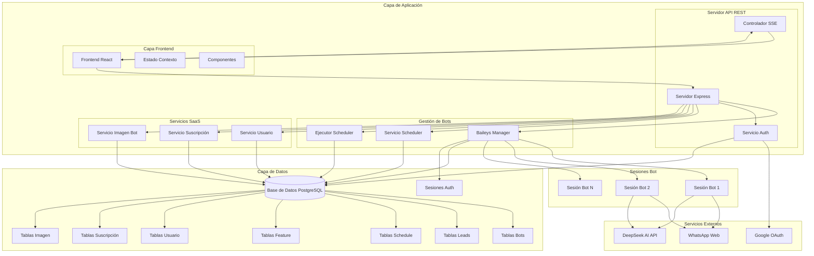
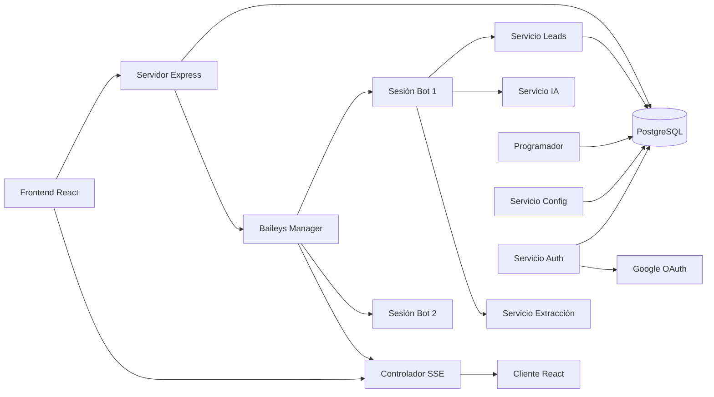
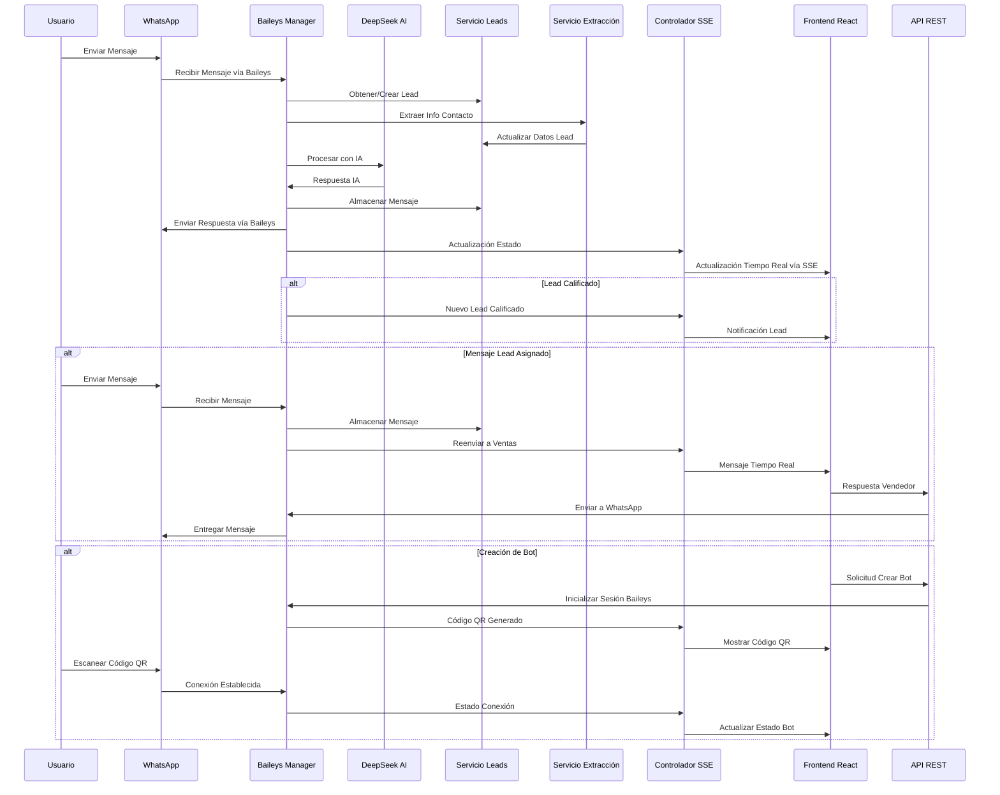

# WhatsApp Bot Manager - Arquitectura Técnica

## Resumen Ejecutivo

El WhatsApp Bot Manager es una plataforma multi-inquilino (multi-tenant) sofisticada que permite a las empresas desplegar y gestionar múltiples bots de WhatsApp impulsados por IA a través de un panel centralizado. El sistema combina captura inteligente de leads, gestión automatizada de conversaciones y coordinación de equipos de ventas en tiempo real para optimizar el compromiso con el cliente y los procesos de calificación de leads.

**Estado de Migración**: ✅ **Fases 2, 3 y 4 Completadas**
- **Fase 2**: Integración de WhatsApp Baileys con `useMultiFileAuthState`.
- **Fase 3**: Eventos Enviados por el Servidor (SSE) para Comunicación en Tiempo Real.
- **Fase 4**: Frontend React con Vite e Interfaz de Usuario Moderna.

## Stack Tecnológico

### Plataforma Central
- **Runtime**: Node.js >=20.0.0
- **Framework Web**: Express.js 4.18.3
- **Framework Frontend**: React 19.2.1 con Vite 6.4.1
- **Comunicación en Tiempo Real**: Server-Sent Events (SSE)
- **Gestión de Procesos**: Gestión de sesiones en memoria

### IA y Automatización
- **Servicio de IA**: DeepSeek Chat API
- **Integración WhatsApp**: @whiskeysockets/baileys (API Oficial de WhatsApp Web)
- **Generación de Código QR**: qrcode 1.5.3
- **Gestión de Carga de Archivos**: Multer 2.0.2
- **Persistencia de Sesión**: `useMultiFileAuthState` para almacenamiento seguro de sesiones

### Capa de Datos
- **Base de Datos**: PostgreSQL con pg 8.11.3
- **Gestión de Sesiones**: JWT con jsonwebtoken 9.0.2
- **Almacenamiento de Archivos**: Sistema de archivos gestionado por Railway / Compatible S3
- **Gestión de Base de Datos**: Pooling de conexiones con esquema estructurado

### Autenticación y Seguridad
- **Proveedor OAuth**: Google OAuth 2.0 con passport-google-oauth20 2.0.0
- **Seguridad de Sesión**: Tokens JWT con secretos configurables
- **Gestión de Cookies**: cookie-parser 1.4.6
- **Procesamiento de Pagos**: Integración con Stripe para gestión de suscripciones
- **Configuración CORS**: Intercambio de recursos de origen cruzado para integración frontend React

### Infraestructura
- **Plataforma de Despliegue**: Railway.app
- **Contenerización**: Nixpacks
- **Gestión de Entorno**: dotenv 16.4.5
- **Build Frontend**: Vite con Tailwind CSS 4.1.17

## Arquitectura del Sistema

### Diagrama de Componentes de Alto Nivel



### Componentes Principales

#### 1. Servidor API REST (`server.js`)
- **Responsabilidades Principales**:
  - Manejo de solicitudes HTTP y enrutamiento con Express.js
  - Gestión de Eventos Enviados por el Servidor (SSE) para comunicación en tiempo real
  - Orquestación de sesiones de bots usando Baileys Manager
  - Control de acceso basado en roles (Admin/Vendedor)
  - Aplicación de middleware de autenticación
  - Inicialización de base de datos y pooling de conexiones
  - Configuración CORS para integración con frontend React

#### 2. Baileys Manager (`services/baileysManager.js`)
- **Responsabilidades**:
  - Inicialización y gestión de cliente WhatsApp con @whiskeysockets/baileys
  - Persistencia de sesión usando `useMultiFileAuthState` para almacenamiento seguro
  - Generación de códigos QR y actualizaciones de estado en tiempo real vía SSE
  - Procesamiento de mensajes impulsado por IA usando DeepSeek API
  - Extracción y calificación de información de leads
  - Gestión de imágenes de bots y selección contextual de imágenes
  - Funcionalidad de pausa/reanudación dinámica sin reinicio de proceso

#### 3. Controlador SSE (`controllers/sseController.js`)
- **Responsabilidades**:
  - Gestión de conexión de Server-Sent Events
  - Difusión de eventos específicos por usuario basado en email
  - Actualizaciones de estado de bot en tiempo real y entrega de códigos QR
  - Notificaciones de leads y sincronización de mensajes
  - Monitoreo de salud de conexión y reconexión automática
  - Filtrado de eventos para acceso a datos basado en roles

#### 4. Capa de Servicios
- **Servicio de Base de Datos** (`services/db.js`): Pooling de conexiones PostgreSQL y gestión
- **Inicialización de Base de Datos** (`services/initDb.js`): Creación de esquema y configuración de tablas
- **Servicio de Base de Datos de Bots** (`services/botDbService.js`): Configuración y gestión de bots
- **Servicio de Base de Datos de Leads** (`services/leadDbService.js`): Captura de leads, asignación y gestión de mensajes
- **Servicio de Configuración de Bots** (`services/botConfigService.js`): Gestión de feature flags y ajustes de bots
- **Servicio de Programador** (`services/schedulerService.js`): Gestión automatizada de programación de bots
- **Ejecutor de Programador** (`services/schedulerExecutor.js`): Motor de ejecución de tareas programadas
- **Servicio DeepSeek** (`services/deepseekService.js`): Manejo de conversaciones IA con DeepSeek API
- **Servicio de Extracción de Leads** (`services/leadExtractionService.js`): Análisis inteligente de información de contacto
- **Servicio de Puntuación** (`services/scoringService.js`): Evaluación de reglas de puntuación y aplicación de tags.
- **Servicio de Productos** (`services/productService.js`): Gestión del catálogo de productos.

#### 5. Servicios de Plataforma SaaS
- **Servicio de Usuario** (`services/userService.js`): Gestión de miembros del equipo con roles basados en base de datos y sistema de autenticación híbrido
- **Servicio de Suscripción** (`services/subscriptionService.js`): Modelo Freemium con integración Stripe para procesamiento de pagos y gestión de planes
- **Servicio de Imágenes de Bot** (`services/botImageService.js`): Gestión de medios para envío de imágenes impulsado por IA con selección basada en palabras clave

#### 6. Capa de Autenticación
- **Controlador Auth** (`auth/authController.js`): Manejo de callback Google OAuth y generación de token JWT
- **Configuración Passport** (`auth/passport.js`): Configuración de estrategia Google OAuth
- **Middleware Auth** (`auth/authMiddleware.js`): Validación JWT y control de acceso basado en roles
- **Rutas Auth** (`routes/authRoutes.js`): Enrutamiento de endpoints de autenticación

#### 7. Arquitectura Frontend React
- **Aplicación Principal** (`client/src/App.jsx`): Componente raíz con configuración de enrutamiento y proveedores
- **Contexto de Autenticación** (`client/src/context/AuthContext.jsx`): Gestión de estado de autenticación de usuario
- **Contexto de Bots** (`client/src/context/BotsContext.jsx`): Gestión de estado de bots y leads con integración SSE
- **Página Dashboard** (`client/src/pages/Dashboard.jsx`): Interfaz de gestión de bots para administradores
- **Panel de Ventas** (`client/src/pages/SalesPanel.jsx`): Gestión de leads e interfaz de mensajería para vendedores
- **Componente Tarjeta de Bot** (`client/src/components/BotCard.jsx`): Gestión individual de bot con visualización de QR
- **Interfaz de Chat** (`client/src/components/ChatInterface.jsx`): Mensajería en tiempo real con leads asignados
- **Navegación Lateral** (`client/src/components/Sidebar.jsx`): Menú de navegación basado en roles

## Interacciones de Servicios y Flujo de Datos

### Patrones de Comunicación de Servicios



### Flujo de Procesamiento de Solicitudes de Usuario



## Infraestructura y Despliegue

### Entorno de Hospedaje
- **Plataforma**: Railway.app con despliegues automáticos e integración PostgreSQL
- **Runtime**: Node.js 18.x con dependencia Chromium para WhatsApp Web
- **Escalado**: Escalado horizontal a través de múltiples instancias de bot con backend PostgreSQL
- **Persistencia**: Base de datos PostgreSQL gestionada por Railway con pooling de conexiones
- **Almacenamiento de Archivos**: Sistema de archivos Railway para datos de sesión WhatsApp (LocalAuth)

### Configuración de Contenedor (`nixpacks.toml`)
```toml
[phases.setup]
nixPkgs = ["nodejs-18_x", "chromium"]

[phases.install]
cmds = ["npm ci --production"]

[start]
cmd = "npm start"
```

## Base de Datos y Esquema

La arquitectura de la base de datos se basa en PostgreSQL y consta de tablas principales para gestionar `bots`, `users` (usuarios), `subscriptions` (suscripciones), `leads` (clientes potenciales), `lead_messages` (mensajes), `bot_features` (configuraciones), `schedules` (programación), `bot_images` (imágenes), `products` (productos) y `scoring_rules` (reglas de puntuación).