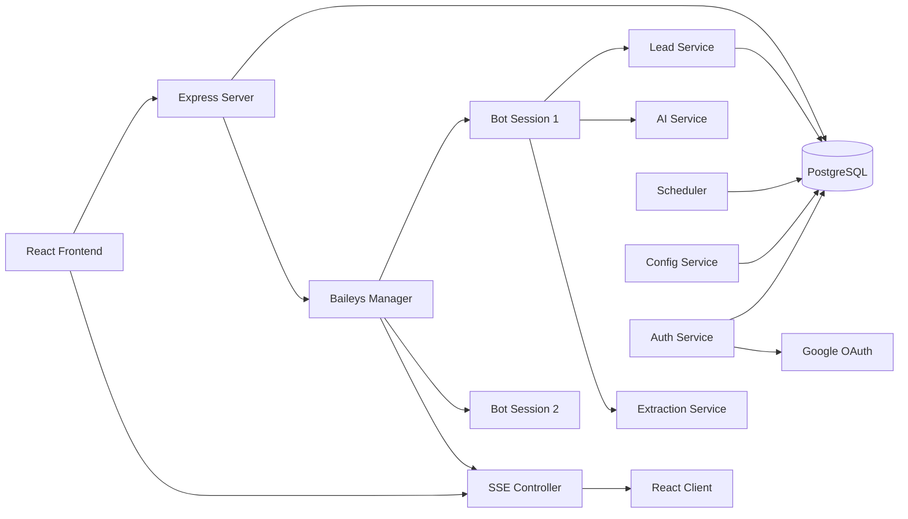
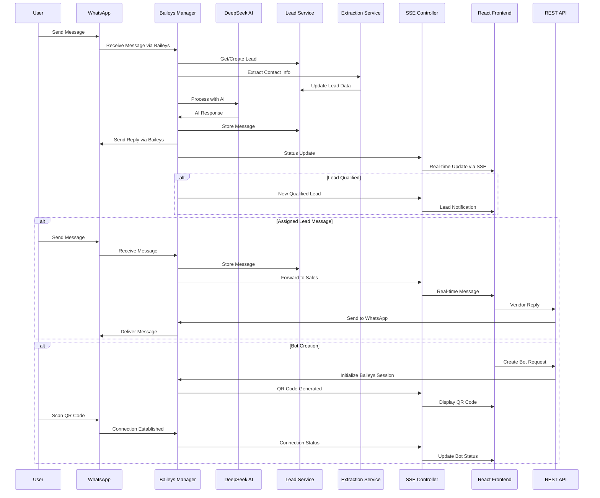
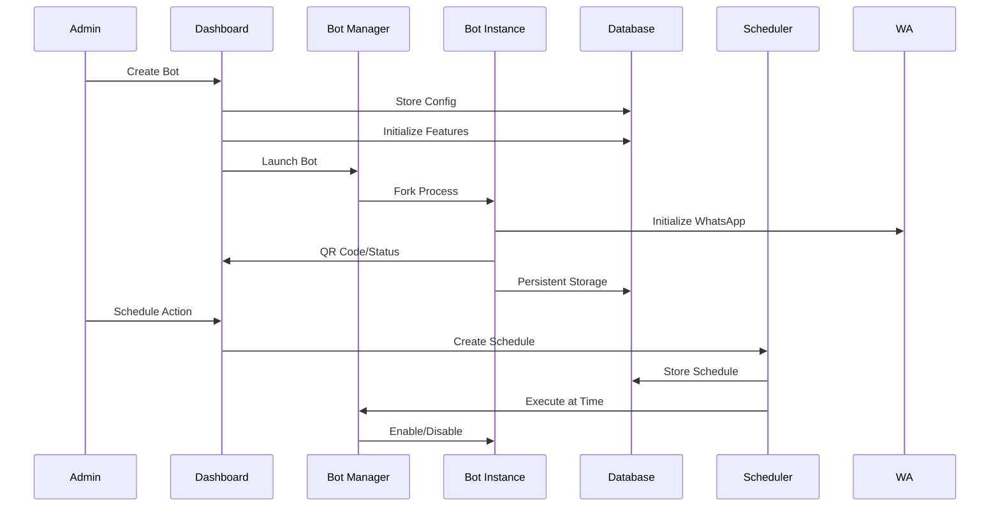
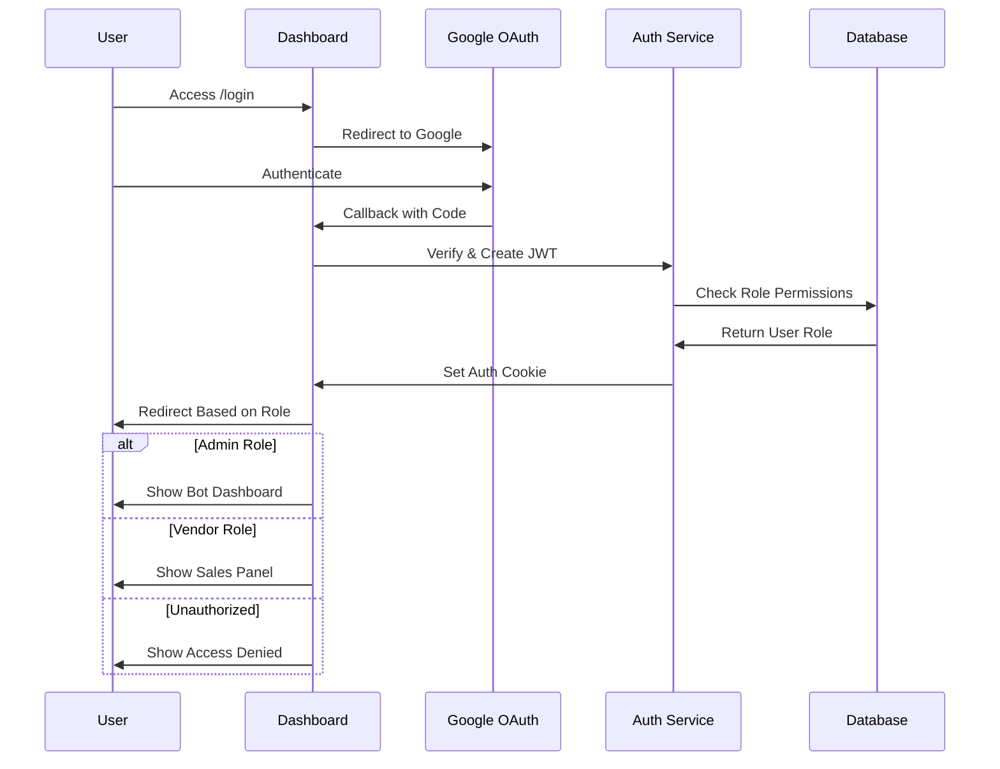
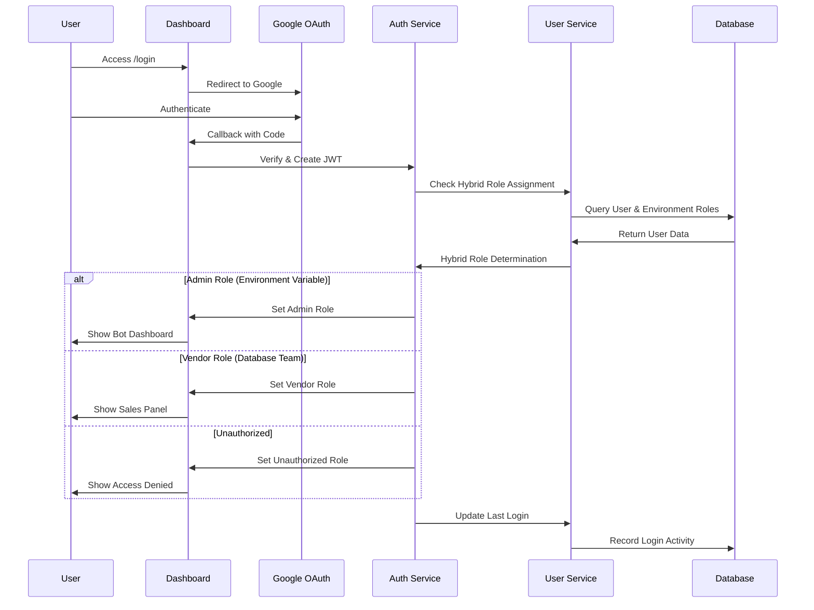

# WhatsApp Bot Manager - Technical Architecture

## Executive Summary

The WhatsApp Bot Manager is a sophisticated multi-tenant platform that enables businesses to deploy and manage multiple AI-powered WhatsApp bots through a centralized dashboard. The system combines intelligent lead capture, automated conversation management, and real-time sales team coordination to streamline customer engagement and lead qualification processes.

**Migration Status**: ✅ **Phases 2, 3, and 4 Completed**
- **Phase 2**: WhatsApp Baileys Integration with useMultiFileAuthState
- **Phase 3**: Server-Sent Events (SSE) for Real-time Communication
- **Phase 4**: React Frontend with Vite and Modern UI

## Technology Stack

### Core Platform
- **Runtime**: Node.js 18.x
- **Web Framework**: Express.js 4.18.3
- **Frontend Framework**: React 19.2.0 with Vite 7.2.4
- **Real-time Communication**: Server-Sent Events (SSE)
- **Process Management**: In-memory session management

### AI & Automation
- **AI Service**: DeepSeek Chat API
- **WhatsApp Integration**: @whiskeysockets/baileys (Official WhatsApp Web API)
- **QR Code Generation**: qrcode 1.5.3
- **File Upload Management**: Multer 2.0.2
- **Session Persistence**: useMultiFileAuthState for secure session storage

### Data Layer
- **Database**: PostgreSQL with pg 8.11.3
- **Session Management**: JWT with jsonwebtoken 9.0.2
- **File Storage**: Railway-managed file system
- **Database Management**: Connection pooling with structured schema

### Authentication & Security
- **OAuth Provider**: Google OAuth 2.0 with passport-google-oauth20 2.0.0
- **Session Security**: JWT tokens with configurable secrets
- **Cookie Management**: cookie-parser 1.4.6
- **Payment Processing**: Stripe integration for subscription management
- **CORS Configuration**: Cross-origin resource sharing for React frontend

### Infrastructure
- **Deployment Platform**: Railway.app
- **Containerization**: Nixpacks
- **Environment Management**: dotenv 16.4.5
- **Frontend Build**: Vite with Tailwind CSS 4.1.17

## System Architecture

### High-Level Component Diagram


### Core Components

#### 1. REST API Server ([`server.js`](server.js:1))
- **Primary Responsibilities**:
  - HTTP request handling and routing with Express.js
  - Server-Sent Events (SSE) management for real-time communication
  - Bot session orchestration using Baileys Manager
  - Role-based access control (Admin/Vendor)
  - Authentication middleware enforcement
  - Database initialization and connection pooling
  - CORS configuration for React frontend integration

#### 2. Baileys Manager ([`services/baileysManager.js`](services/baileysManager.js:1))
- **Responsibilities**:
  - WhatsApp client initialization and management with @whiskeysockets/baileys
  - Session persistence using useMultiFileAuthState for secure storage
  - QR code generation and real-time status updates via SSE
  - AI-powered message processing using DeepSeek API
  - Lead information extraction and qualification
  - Bot image management and contextual image selection
  - Dynamic pause/resume functionality without process restart

#### 3. SSE Controller ([`controllers/sseController.js`](controllers/sseController.js:1))
- **Responsibilities**:
  - Server-Sent Events connection management
  - User-specific event broadcasting based on email
  - Real-time bot status updates and QR code delivery
  - Lead notifications and message synchronization
  - Connection health monitoring and automatic reconnection
  - Event filtering for role-based data access

#### 4. Service Layer
- **Database Service** ([`services/db.js`](services/db.js:1)): PostgreSQL connection pooling and management
- **Database Initialization** ([`services/initDb.js`](services/initDb.js:1)): Schema creation and table setup
- **Bot Database Service** ([`services/botDbService.js`](services/botDbService.js:1)): Bot configuration and management
- **Lead Database Service** ([`services/leadDbService.js`](services/leadDbService.js:1)): Lead capture, assignment, and message management
- **Bot Configuration Service** ([`services/botConfigService.js`](services/botConfigService.js:1)): Feature flag management and bot settings
- **Scheduler Service** ([`services/schedulerService.js`](services/schedulerService.js:1)): Automated bot scheduling management
- **Scheduler Executor** ([`services/schedulerExecutor.js`](services/schedulerExecutor.js:1)): Scheduled task execution engine
- **DeepSeek Service** ([`services/deepseekService.js`](services/deepseekService.js:1)): AI conversation handling with DeepSeek API
- **Lead Extraction Service** ([`services/leadExtractionService.js`](services/leadExtractionService.js:1)): Intelligent contact information parsing

#### 5. SaaS Platform Services
- **User Service** ([`services/userService.js`](services/userService.js:1)): Team member management with database-driven roles and hybrid authentication system
- **Subscription Service** ([`services/subscriptionService.js`](services/subscriptionService.js:1)): Freemium model with Stripe integration for payment processing and plan management
- **Bot Image Service** ([`services/botImageService.js`](services/botImageService.js:1)): Media management for AI-powered image sending with keyword-based selection

#### 6. Authentication Layer
- **Auth Controller** ([`auth/authController.js`](auth/authController.js:1)): Google OAuth callback handling and JWT token generation
- **Passport Configuration** ([`auth/passport.js`](auth/passport.js:1)): Google OAuth strategy setup
- **Auth Middleware** ([`auth/authMiddleware.js`](auth/authMiddleware.js:1)): JWT validation and role-based access control
- **Auth Routes** ([`routes/authRoutes.js`](routes/authRoutes.js:1)): Authentication endpoint routing

#### 7. React Frontend Architecture
- **Main Application** ([`client/src/App.jsx`](client/src/App.jsx:1)): Root component with routing and provider setup
- **Authentication Context** ([`client/src/context/AuthContext.jsx`](client/src/context/AuthContext.jsx:1)): User authentication state management
- **Bots Context** ([`client/src/context/BotsContext.jsx`](client/src/context/BotsContext.jsx:1)): Bot and lead state management with SSE integration
- **Dashboard Page** ([`client/src/pages/Dashboard.jsx`](client/src/pages/Dashboard.jsx:1)): Bot management interface for administrators
- **Sales Panel** ([`client/src/pages/SalesPanel.jsx`](client/src/pages/SalesPanel.jsx:1)): Lead management and messaging interface for vendors
- **Bot Card Component** ([`client/src/components/BotCard.jsx`](client/src/components/BotCard.jsx:1)): Individual bot management with QR display
- **Chat Interface** ([`client/src/components/ChatInterface.jsx`](client/src/components/ChatInterface.jsx:1)): Real-time messaging with assigned leads
- **Sidebar Navigation** ([`client/src/components/Sidebar.jsx`](client/src/components/Sidebar.jsx:1)): Role-based navigation menu

## Service Interactions & Data Flow

### Service Communication Patterns



### User Request Processing Flow



### Bot Management Flow



### Authentication & Authorization Flow



### Service Responsibilities Matrix

| Service | Primary Responsibility | Dependencies | Data Stores |
|---------|------------------------|--------------|-------------|
| **Dashboard Server** | HTTP routing, WebSocket management, bot orchestration | All services, PostgreSQL | Session state, active bots |
| **Bot Instance** | WhatsApp client, AI processing, lead capture, image handling | DeepSeek API, Lead Service, Bot Image Service | Local auth, session data |
| **Lead Service** | Lead management, message storage, assignment | PostgreSQL | leads, lead_messages tables |
| **Bot Config Service** | Feature flag management, bot settings | PostgreSQL | bot_features table |
| **Scheduler Service** | Automated task scheduling | PostgreSQL, Scheduler Executor | schedules table |
| **Scheduler Executor** | Task execution engine | Scheduler Service, Bot Manager | In-memory intervals |
| **DeepSeek Service** | AI conversation handling | DeepSeek API | None (stateless) |
| **Lead Extraction Service** | Contact info parsing | DeepSeek API | None (stateless) |
| **Auth Service** | User authentication, JWT management, hybrid role resolution | Google OAuth, PostgreSQL, User Service | JWT tokens, user roles |
| **User Service** | Team management, user status, role assignment | PostgreSQL | users table |
| **Subscription Service** | Freemium plan management, Stripe integration, billing | PostgreSQL, Stripe API | subscriptions table |
| **Bot Image Service** | Media management, keyword-based image selection | PostgreSQL, File System | bot_images table, uploads directory |
| **Database Service** | Connection pooling, query execution | PostgreSQL | All application data |

### Real-time Communication Events

| Event Type | Source | Destination | Payload |
|------------|--------|-------------|---------|
| `CONNECTED` | SSE Controller | React Clients | Connection confirmation, client ID |
| `INIT` | REST API | React Clients | Bot list, initial state for user |
| `INIT_LEADS` | REST API | React Clients | Qualified leads list |
| `QR_GENERATED` | Baileys Manager | React Dashboard | QR code data URL, bot ID |
| `UPDATE_BOT` | Baileys Manager | React Dashboard | Bot status, runtime status, QR codes |
| `NEW_BOT` | REST API | React Dashboard | New bot configuration and status |
| `BOT_DELETED` | REST API | React Dashboard | Deleted bot ID |
| `NEW_QUALIFIED_LEAD` | Baileys Manager | React Dashboard & Sales | Lead information, bot ID |
| `LEAD_ASSIGNED` | Lead Service | React Dashboard & Sales | Updated lead assignment |
| `NEW_MESSAGE_FOR_SALES` | Baileys Manager | React Sales Panel | Message from assigned lead, lead ID |
| `MESSAGE_SENT` | REST API | React Sales Panel | Vendor message confirmation, lead ID |
| `LEAD_MESSAGES` | REST API | React Sales Panel | Full message history for lead |
| `SCHEDULE_CREATED` | Scheduler Service | React Dashboard | New schedule details |
| `BOT_FEATURES_UPDATED` | Config Service | React Dashboard | Updated feature flags |

## Infrastructure & Deployment

### Hosting Environment
- **Platform**: Railway.app with automatic deployments and PostgreSQL integration
- **Runtime**: Node.js 18.x with Chromium dependency for WhatsApp Web
- **Scaling**: Horizontal scaling through multiple bot instances with PostgreSQL backend
- **Persistence**: Railway-managed PostgreSQL database with connection pooling
- **File Storage**: Railway file system for WhatsApp session data (LocalAuth)

### Container Configuration ([`nixpacks.toml`](nixpacks.toml:1))
```toml
[phases.setup]
nixPkgs = ["nodejs-18_x", "chromium"]

[phases.install]
cmds = ["npm ci --production"]

[start]
cmd = "npm start"
```

### Railway Configuration ([`railway.json`](railway.json:1))
- **Builder**: NIXPACKS
- **Start Command**: `npm start`
- **Restart Policy**: ON_FAILURE with 10 retries
- **Database**: PostgreSQL service with automatic connection management

## Authentication & Security Architecture

### Enhanced Hybrid Role System with Team Management


### Hybrid Role Assignment System
- **Environment-Based Admins**: Primary administrators defined in ADMIN_EMAILS environment variable
- **Database-Managed Teams**: Vendors and team members managed through User Service with activation controls
- **Dynamic Role Resolution**: System checks environment variables first, then database for role assignment
- **Team Management**: Admins can add, remove, and activate/deactivate team members via User Service
- **Status Tracking**: Last login timestamps and active/inactive user status monitoring

### Security Measures
- **JWT Token Management**: Secure token storage in HTTP-only cookies with 7-day expiration
- **Hybrid Role-Based Access Control**: Environment variables + database teams with distinct permissions
- **User Status Controls**: Active/inactive user management with admin oversight
- **Session Protection**: Automatic token validation and cleanup
- **Environment Security**: Sensitive configuration in environment variables
- **WebSocket Authentication**: JWT validation for real-time connections
- **Content Security Policy**: CSP headers for XSS protection
- **Team-Based Access**: Database-driven team membership with audit trails

## Database Schema

### Bot Management Database ([`services/botDbService.js`](services/botDbService.js))
```sql
CREATE TABLE bots (
    id TEXT PRIMARY KEY NOT NULL,
    name TEXT NOT NULL,
    port INTEGER UNIQUE NOT NULL,
    prompt TEXT NOT NULL,
    status TEXT NOT NULL DEFAULT 'enabled',
    owner_email TEXT NOT NULL,
    created_at TIMESTAMP DEFAULT CURRENT_TIMESTAMP
);
```

### User Management Database ([`services/userService.js`](services/userService.js:1))
```sql
CREATE TABLE users (
    id SERIAL PRIMARY KEY,
    email TEXT NOT NULL UNIQUE,
    role TEXT NOT NULL DEFAULT 'vendor',
    added_by TEXT NOT NULL,
    created_at TIMESTAMP DEFAULT CURRENT_TIMESTAMP,
    last_login TIMESTAMP,
    is_active BOOLEAN DEFAULT TRUE
);
```

### Subscription Management Database ([`services/subscriptionService.js`](services/subscriptionService.js:1))
```sql
CREATE TABLE subscriptions (
    id SERIAL PRIMARY KEY,
    user_email TEXT NOT NULL UNIQUE,
    plan TEXT NOT NULL DEFAULT 'free',
    status TEXT NOT NULL DEFAULT 'active',
    bot_limit INTEGER NOT NULL DEFAULT 1,
    stripe_customer_id TEXT,
    stripe_subscription_id TEXT,
    current_period_end TIMESTAMP,
    created_at TIMESTAMP DEFAULT CURRENT_TIMESTAMP,
    updated_at TIMESTAMP DEFAULT CURRENT_TIMESTAMP
);
```

### Bot Image Management Database ([`services/botImageService.js`](services/botImageService.js:1))
```sql
CREATE TABLE bot_images (
    id SERIAL PRIMARY KEY,
    bot_id TEXT NOT NULL,
    filename TEXT NOT NULL,
    original_name TEXT NOT NULL,
    keyword TEXT NOT NULL,
    created_at TIMESTAMP DEFAULT CURRENT_TIMESTAMP
);
```

### Lead Management Database ([`services/leadDbService.js`](services/leadDbService.js:14))
```sql
CREATE TABLE leads (
    id SERIAL PRIMARY KEY,
    bot_id TEXT NOT NULL,
    whatsapp_number TEXT NOT NULL,
    name TEXT,
    email TEXT,
    location TEXT,
    phone TEXT,
    status TEXT NOT NULL DEFAULT 'capturing',
    assigned_to TEXT,
    captured_at TIMESTAMP DEFAULT CURRENT_TIMESTAMP,
    qualified_at TIMESTAMP,
    last_message_at TIMESTAMP DEFAULT CURRENT_TIMESTAMP,
    UNIQUE(bot_id, whatsapp_number)
);

CREATE TABLE lead_messages (
    id SERIAL PRIMARY KEY,
    lead_id INTEGER NOT NULL REFERENCES leads(id) ON DELETE CASCADE,
    sender TEXT NOT NULL,
    message TEXT NOT NULL,
    timestamp TIMESTAMP DEFAULT CURRENT_TIMESTAMP
);
```

### Feature Configuration Database ([`services/botConfigService.js`](services/botConfigService.js:14))
```sql
CREATE TABLE bot_features (
    id SERIAL PRIMARY KEY,
    bot_id TEXT NOT NULL UNIQUE,
    scheduling_enabled BOOLEAN DEFAULT FALSE,
    auto_response_enabled BOOLEAN DEFAULT TRUE,
    lead_capture_enabled BOOLEAN DEFAULT TRUE,
    working_hours_enabled BOOLEAN DEFAULT FALSE,
    working_hours_start TEXT DEFAULT '09:00',
    working_hours_end TEXT DEFAULT '18:00',
    updated_at TIMESTAMP DEFAULT CURRENT_TIMESTAMP
);
```

### Scheduler Database ([`services/schedulerService.js`](services/schedulerService.js:15))
```sql
CREATE TABLE schedules (
    id SERIAL PRIMARY KEY,
    bot_id TEXT NOT NULL,
    action TEXT NOT NULL,
    scheduled_at TIMESTAMP NOT NULL,
    status TEXT NOT NULL DEFAULT 'pending',
    executed BOOLEAN DEFAULT FALSE,
    executed_at TIMESTAMP,
    created_by TEXT NOT NULL,
    created_at TIMESTAMP DEFAULT CURRENT_TIMESTAMP
);
```

## Core Functionality & Operational Logic

### Recent System Enhancements

#### 1. WhatsApp Baileys Integration (Phase 2)
- **Official WhatsApp Web API**: Migrated from whatsapp-web.js to @whiskeysockets/baileys for improved reliability
- **Session Management**: Secure session persistence using useMultiFileAuthState with bot-specific auth directories
- **Enhanced Connection Handling**: Automatic reconnection, QR code generation, and connection state management
- **Memory Optimization**: In-memory session management replacing child process architecture
- **Message Processing**: Improved message handling with support for multiple message types (text, images, media)

#### 2. Server-Sent Events Implementation (Phase 3)
- **Real-time Communication**: Replaced WebSockets with SSE for simplified real-time updates
- **User-specific Events**: Targeted event broadcasting based on user email for multi-tenant isolation
- **Connection Management**: Automatic reconnection, health monitoring, and connection cleanup
- **Event Filtering**: Role-based event delivery ensuring users only receive relevant data
- **Performance Optimization**: Reduced overhead compared to WebSocket connections

#### 3. React Frontend Migration (Phase 4)
- **Modern UI Framework**: Migrated from EJS templates to React 19 with Vite for faster development
- **Component Architecture**: Modular component design with reusable BotCard, ChatInterface, and Sidebar components
- **State Management**: Context-based state management with AuthContext and BotsContext for global state
- **Real-time Integration**: SSE client integration with automatic reconnection and event handling
- **Responsive Design**: Tailwind CSS for modern, mobile-responsive interface design

#### 4. REST API Architecture
- **API-First Design**: Complete migration from server-rendered EJS views to RESTful API endpoints
- **Authentication Flow**: JWT-based authentication with Google OAuth integration
- **CORS Configuration**: Proper cross-origin setup for React frontend integration
- **Error Handling**: Structured error responses and validation middleware
- **File Upload**: Multer-based image upload with proper validation and storage

#### 5. Enhanced Bot Session Management
- **Dynamic Status Control**: Real-time bot enable/disable without session restart
- **QR Code Delivery**: Real-time QR code generation and delivery via SSE to specific users
- **Image Management**: Context-aware image selection with keyword-based triggers
- **Lead Extraction**: AI-powered contact information parsing from natural conversations
- **Multi-tenant Isolation**: Secure session separation between different bot owners

#### 6. Real-time Communication Framework
- **SSE Event Types**: Comprehensive event system for bot status, leads, messages, and system notifications
- **Bi-directional Messaging**: Sales team can send messages through bot sessions to WhatsApp users
- **Connection Health**: Automatic reconnection and status monitoring for both SSE and WhatsApp connections
- **User-specific Broadcasting**: Events are filtered and delivered only to relevant users based on ownership
- **State Synchronization**: Consistent view across all connected React clients with role-based data filtering

### Multi-Tenant Bot Architecture
- **Isolated Instances**: Each bot runs in separate child processes with independent WhatsApp sessions
- **Independent Authentication**: Unique LocalAuth sessions per bot using clientId-based storage
- **Configurable Prompts**: Custom AI behavior and system prompts per bot instance
- **Resource Management**: Automatic process cleanup, restart, and memory optimization
- **Port Management**: Dynamic port assignment for bot instances with collision prevention

### Intelligent Lead Capture System
1. **Initial Contact**: Bot engages user with AI-powered responses using DeepSeek API
2. **Information Extraction**: Uses [`services/leadExtractionService.js`](services/leadExtractionService.js:1) to parse contact details from conversations
3. **Progressive Qualification**: Systematically collects name, email, location, phone through natural dialogue
4. **Automatic Handoff**: Qualified leads automatically appear in sales panel for vendor assignment
5. **Conversation Continuity**: Sales team can continue conversations seamlessly through the same bot instance
6. **Historical Processing**: Existing WhatsApp chats are loaded and processed without generating duplicate responses

### Real-time Communication Framework
- **WebSocket Events**: Live bot status, lead notifications, message updates, and scheduling events
- **Bi-directional Communication**: Dashboard to bots, bots to dashboard, and sales panel interactions
- **State Synchronization**: Consistent view across all connected clients with role-based data filtering
- **Event-driven Architecture**: Reactive updates based on system events with JWT authentication
- **Connection Management**: Automatic reconnection and authentication validation

### Automated Scheduling System
- **Time-based Actions**: Enable/disable bots at specified times with timezone support
- **Recurring Task Execution**: 30-second interval for checking and executing pending schedules via [`services/schedulerExecutor.js`](services/schedulerExecutor.js:1)
- **Feature Gates**: Scheduling functionality controlled by bot-specific feature flags
- **Audit Trail**: Complete history of scheduled actions, executions, and status changes
- **Real-time Updates**: Immediate feedback on schedule creation, execution, and cancellation

## Scalability Considerations

### Current Architecture Strengths
- **Process Isolation**: Bot failures don't affect dashboard or other bots
- **Horizontal Scaling**: Can deploy multiple dashboard instances with PostgreSQL backend
- **Stateless Authentication**: JWT tokens enable distributed sessions across instances
- **Connection Pooling**: Efficient database connection management for concurrent access
- **Role-Based Access**: Granular permission system supports multiple user types

### Current Architecture Improvements
- **PostgreSQL Integration**: Resolved SQLite single-writer constraint with proper concurrent access
- **Enhanced Memory Management**: Improved bot instance lifecycle and resource cleanup
- **WebSocket Authentication**: Secure real-time communication with JWT validation
- **Database Schema Optimization**: Proper indexing and foreign key relationships

### Potential Scaling Challenges
- **Memory Management**: Multiple Chromium instances in bot processes remain resource-intensive
- **WebSocket Connections**: Scaling real-time connections across multiple dashboard instances
- **Bot Process Limits**: Maximum concurrent bot instances per server due to Chromium memory usage
- **Database Connection Limits**: PostgreSQL connection pool sizing for high concurrent usage

### Recommended Scaling Path
1. **Container Orchestration**: Deploy bot instances as separate containers with resource limits
2. **Message Queue**: Implement Redis or RabbitMQ for event distribution and background processing
3. **Load Balancing**: Add load balancer for multiple dashboard instances with sticky sessions
4. **Database Optimization**: Implement read replicas and connection pooling optimization
5. **Bot Instance Pooling**: Dynamic bot instance management with auto-scaling based on demand
6. **Caching Layer**: Add Redis caching for frequently accessed bot configurations and lead data

### Performance Optimizations Implemented
- **Database Connection Pooling**: Efficient connection reuse via [`services/db.js`](services/db.js:1)
- **Exponential Backoff**: Bot initialization retry logic with increasing delays
- **Historical Chat Optimization**: Batch processing of existing conversations without response generation
- **WebSocket Message Batching**: Efficient real-time updates with minimal overhead
- **Role-Based Data Filtering**: Reduced data transfer by sending only relevant information to each role

## Monitoring & Observability

### Built-in Monitoring
- **Process Health**: Automatic bot restart on failure
- **Connection Status**: Real-time WhatsApp connection monitoring
- **Lead Pipeline**: Track lead conversion and qualification rates
- **Scheduler Execution**: Audit trail for automated actions

### Operational Metrics
- **Bot Uptime**: Individual bot connection stability
- **Message Throughput**: Conversation volume per bot
- **Lead Conversion**: Capture to qualification ratios
- **AI Response Times**: DeepSeek API performance

This architecture provides a robust foundation for managing multiple WhatsApp bots with intelligent lead capture, real-time coordination, and scalable infrastructure designed for business-grade deployment.