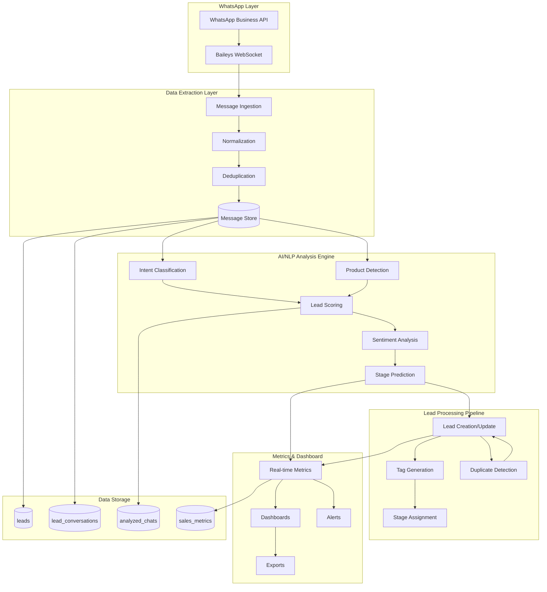
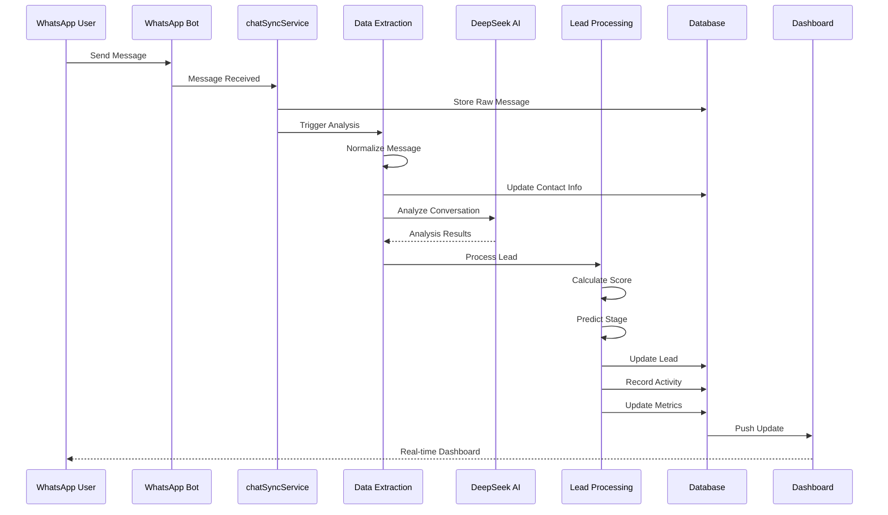

# Conversation Analysis & Lead Processing System

## Design Document

**Version:** 1.0  
**Date:** 2026-01-01  
**Status:** Draft

---

## Table of Contents

1. [Executive Summary](#executive-summary)
2. [Architecture Overview](#architecture-overview)
3. [Data Extraction Layer](#data-extraction-layer)
4. [AI/NLP Analysis Engine](#ainlp-analysis-engine)
5. [Lead Processing Pipeline](#lead-processing-pipeline)
6. [Metrics & Dashboard Integration](#metrics--dashboard-integration)
7. [API Endpoints](#api-endpoints)
8. [Implementation Plan](#implementation-plan)
9. [Database Schema Extensions](#database-schema-extensions)

---

## Executive Summary

This document outlines the comprehensive design for a **Conversation Analysis & Lead Processing System** that automatically analyzes all WhatsApp bot conversations to extract client data, classify intent, score leads, and populate sales dashboards.

### Key Objectives

- **Extract client data** (ID, phone, timestamps, message content) from all WhatsApp conversations
- **Analyze intent**, products mentioned, and interest levels using AI/NLP
- **Classify leads** in the Sales Panel pipeline automatically
- **Populate metrics dashboards** in real-time

### Current System Analysis

The existing codebase already contains foundational components:

| Component | Location | Status |
|-----------|----------|--------|
| Chat Analysis | [`services/chatAnalysisService.js`](services/chatAnalysisService.js) | ✅ Implemented |
| Lead Extraction | [`services/leadExtractionService.js`](services/leadExtractionService.js) | ✅ Implemented |
| Lead Database | [`services/leadDbService.js`](services/leadDbService.js) | ✅ Implemented |
| Lead Service | [`services/leadService.js`](services/leadService.js) | ✅ Implemented |
| Metrics Service | [`services/metricsService.js`](services/metricsService.js) | ✅ Implemented |
| Bulk Analysis | [`services/bulkAnalysisService.js`](services/bulkAnalysisService.js) | ✅ Implemented |

This design focuses on **enhancing** these existing components with new capabilities.

---

## Architecture Overview

### System Architecture Diagram



### Data Flow Diagram



---

## Data Extraction Layer

### 1. Message Collection Strategy

#### 1.1 WhatsApp Message Sources

The system extracts messages from multiple sources:

1. **Baileys WebSocket Store** - Real-time messages via `@whiskeysockets/baileys`
2. **Database Backup** - Historical messages from `lead_messages` table
3. **Analyzed Chats** - Previously processed conversations

#### 1.2 Database Query for All Conversations

```javascript
// services/conversationExtractionService.js

/**
 * Fetches all conversations for a specific bot
 * @param {string} botId - Bot UUID
 * @param {string} tenantId - Tenant UUID
 * @param {Object} options - Query options
 * @returns {Promise<Object[]>} Array of conversations with messages
 */
async function getAllConversations(botId, tenantId, options = {}) {
    const { 
        limit = 1000, 
        offset = 0,
        fromDate = null,
        toDate = null,
        includeMessages = true 
    } = options;

    // Base query for contacts
    let contactsQuery = `
        SELECT DISTINCT 
            l.id as lead_id,
            l.contact_phone,
            l.contact_name,
            l.contact_email,
            l.lead_score,
            l.qualification_status,
            l.intent_level,
            l.pipeline_stage_id,
            l.assigned_to,
            l.created_at as first_contact,
            l.last_message_at,
            COUNT(lm.id) as message_count
        FROM leads l
        LEFT JOIN lead_messages lm ON l.id = lm.lead_id
        WHERE l.bot_id = $1 
            AND l.tenant_id = $2
            ${fromDate ? 'AND l.created_at >= $3' : ''}
            ${toDate ? 'AND l.created_at <= $4' : ''}
        GROUP BY l.id
        ORDER BY l.last_message_at DESC
        LIMIT $${5 + (fromDate ? 1 : 0) + (toDate ? 1 : 0)}
        OFFSET $${6 + (fromDate ? 1 : 0) + (toDate ? 1 : 0)}
    `;

    const params = [botId, tenantId];
    let paramIndex = 3;

    if (fromDate) params.push(fromDate), paramIndex++;
    if (toDate) params.push(toDate), paramIndex++;
    params.push(limit, offset);

    const contacts = await pool.query(contactsQuery, params);

    // Fetch messages for each contact if requested
    if (includeMessages) {
        for (const contact of contacts.rows) {
            contact.messages = await getMessagesForLead(contact.lead_id);
        }
    }

    return contacts.rows;
}

/**
 * Gets all messages for a lead
 */
async function getMessagesForLead(leadId, limit = 100) {
    const result = await pool.query(`
        SELECT 
            lm.id,
            lm.message_direction,
            lm.message_type,
            lm.message_content,
            lm.message_media_url,
            lm.ai_analysis,
            lm.created_at as timestamp
        FROM lead_messages lm
        WHERE lm.lead_id = $1
        ORDER BY lm.created_at ASC
        LIMIT $2
    `, [leadId, limit]);

    return result.rows;
}
```

### 2. Message Parsing & Normalization

#### 2.1 Message Format Standardization

```javascript
// Standard message format for analysis
const messageSchema = {
    id: 'uuid',
    lead_id: 'uuid',
    direction: 'inbound' | 'outbound',
    type: 'text' | 'image' | 'document' | 'audio' | 'video',
    content: 'string',
    media_url: 'string|null',
    timestamp: 'ISO8601',
    normalized: {
        clean_text: 'string',
        language: 'iso639-1',
        entities: [{
            type: 'email' | 'phone' | 'url' | 'money',
            value: 'string',
            confidence: 0.0-1.0
        }]
    }
};
```

#### 2.2 Contact Information Extraction

```javascript
// services/contactExtractionService.js

/**
 * Extracts and normalizes contact information from all conversation sources
 */
async function extractContactInfo(leadId, messages) {
    const extractionResult = {
        phone_numbers: [],
        emails: [],
        names: [],
        locations: [],
        companies: [],
        interests: []
    };

    // Aggregate data from all messages
    for (const message of messages) {
        if (message.message_direction === 'inbound') {
            const extracted = await extractFromMessage(message.message_content);
            
            // Merge results with deduplication
            extractionResult.emails.push(...extracted.emails);
            extractionResult.phone_numbers.push(...extracted.phones);
            extractionResult.names.push(...extracted.names);
            extractionResult.locations.push(...extracted.locations);
        }
    }

    // Deduplicate and score
    return {
        emails: deduplicateAndScore(extractionResult.emails),
        phones: deduplicateAndScore(extractionResult.phone_numbers),
        names: deduplicateAndScore(extractionResult.names),
        locations: deduplicateAndScore(extractionResult.locations)
    };
}
```

---

## AI/NLP Analysis Engine

### 1. Intent Classification

The system uses DeepSeek AI to classify conversation intent:

```javascript
// services/intentClassificationService.js

const INTENT_TYPES = {
    PURCHASE: 'purchase',           // Wants to buy
    INQUIRY: 'inquiry',             // General question
    SUPPORT: 'support',              // Needs help
    COMPLAINT: 'complaint',          // Issue/Problem
    FEEDBACK: 'feedback',            // Opinion/Review
    CANCELLATION: 'cancellation',    // Wants to cancel
    RENEWAL: 'renewal',              // Wants to renew
    INFORMATION: 'information',      // Needs info
    APPOINTMENT: 'appointment'       // Wants to schedule
};

/**
 * Classifies the intent of a conversation
 */
async function classifyIntent(conversation, tenantId) {
    const systemPrompt = `Eres un clasificador de intenciones de ventas.
Analiza la conversación y determina la intención principal del cliente.

Categorías disponibles:
- purchase: El cliente quiere comprar un producto o servicio
- inquiry: El cliente tiene preguntas generales
- support: El cliente necesita ayuda técnica o soporte
- complaint: El cliente tiene una queja o problema
- feedback: El cliente quiere dar opinión o review
- cancellation: El cliente quiere cancelar un servicio
- renewal: El cliente quiere renovar o continuar
- appointment: El cliente quiere agendar una cita/reunión
- information: El cliente busca información específica

Responde SOLO con JSON válido:
{
    "primary_intent": "purchase|inquiry|support|complaint|feedback|cancellation|renewal|appointment|information",
    "confidence": 0.0-1.0,
    "sub_intents": ["inquiry"],
    "urgency": "high|medium|low",
    "reasoning": "Explicación breve de la clasificación"
}`;

    const conversationText = formatConversationForPrompt(conversation);

    const response = await deepseekService.chatCompletion({
        messages: [
            { role: 'system', content: systemPrompt },
            { role: 'user', content: conversationText }
        ],
        temperature: 0.3,
        max_tokens: 500
    });

    return parseIntentResponse(response);
}
```

### 2. Product/Service Detection

```javascript
// services/productDetectionService.js

/**
 * Detects products and services mentioned in conversations
 */
async function detectProducts(conversation, tenantId, botId) {
    // Get configured products for this bot
    const products = await productService.getBotProducts(botId);

    // Keyword-based detection with fuzzy matching
    const detectedProducts = [];
    
    for (const product of products) {
        const detection = analyzeProductMention(conversation, product);
        if (detection.detected) {
            detectedProducts.push({
                product_id: product.id,
                product_name: product.name,
                category: product.category,
                confidence: detection.confidence,
                mentions: detection.count,
                intent: detection.intent, // purchase|inquiry|comparison
                price_discussed: detection.price_mentioned,
                first_mention: detection.first_mention,
                last_mention: detection.last_mention
            });
        }
    }

    // Sort by confidence and mentions
    detectedProducts.sort((a, b) => b.confidence - a.confidence);

    return {
        products_mentioned: detectedProducts.length,
        products: detectedProducts,
        top_product: detectedProducts[0] || null
    };
}

/**
 * Keyword matching with variations
 */
function analyzeProductMention(conversation, product) {
    const variations = [
        product.name,
        ...product.aliases || [],
        ...product.keywords || []
    ];

    let count = 0;
    let priceMentioned = false;
    const messages = conversation.map(m => m.content.toLowerCase());

    for (const text of messages) {
        for (const keyword of variations) {
            if (text.includes(keyword.toLowerCase())) {
                count++;
                if (text.includes('$') || text.includes('precio') || text.includes('costo')) {
                    priceMentioned = true;
                }
                break;
            }
        }
    }

    return {
        detected: count > 0,
        count,
        confidence: Math.min(1, count * 0.2),
        intent: detectIntentFromContext(messages, product.name),
        price_mentioned: priceMentioned,
        first_mention: count > 0,
        last_mention: count > 0
    };
}
```

### 3. Interest Level Scoring Algorithm

```javascript
// services/leadScoringService.js

/**
 * Calculates comprehensive lead score based on multiple factors
 * Score Range: 0-100
 */
async function calculateLeadScore(leadId, conversation) {
    const factors = {
        engagement: await calculateEngagementScore(conversation),
        intent: await calculateIntentScore(conversation),
        productInterest: await calculateProductInterestScore(conversation),
        urgency: await calculateUrgencyScore(conversation),
        sentiment: await calculateSentimentScore(conversation),
        completeness: await calculateCompletenessScore(leadId),
        recency: await calculateRecencyScore(leadId)
    };

    // Weighted scoring formula
    const weights = {
        engagement: 0.20,
        intent: 0.25,
        productInterest: 0.20,
        urgency: 0.15,
        sentiment: 0.10,
        completeness: 0.05,
        recency: 0.05
    };

    let totalScore = 0;
    const breakdown = {};

    for (const [factor, weight] of Object.entries(weights)) {
        const score = factors[factor].score * weight;
        breakdown[factor] = {
            score: factors[factor].score,
            weight,
            contribution: score,
            details: factors[factor].details
        };
        totalScore += score;
    }

    // Normalize to 0-100
    totalScore = Math.min(100, Math.max(0, Math.round(totalScore)));

    return {
        total_score: totalScore,
        breakdown,
        factors,
        grade: getScoreGrade(totalScore),
        recommendation: getRecommendation(totalScore, factors)
    };
}

function getScoreGrade(score) {
    if (score >= 80) return 'A - Hot Lead';
    if (score >= 60) return 'B - Warm Lead';
    if (score >= 40) return 'C - Neutral';
    if (score >= 20) return 'D - Cold Lead';
    return 'E - Inactive';
}

function getRecommendation(score, factors) {
    if (score >= 80) return 'Prioritize immediate follow-up, assign to top performer';
    if (score >= 60) return 'Schedule follow-up within 24-48 hours';
    if (score >= 40) return 'Add to nurturing sequence';
    if (score >= 20) return 'Low priority, periodic check-ins';
    return 'Consider for re-engagement campaign';
}

/**
 * Engagement Score (0-100)
 * Based on message frequency, response length, interaction depth
 */
async function calculateEngagementScore(conversation) {
    if (!conversation || conversation.length === 0) {
        return { score: 0, details: { reason: 'No conversation data' } };
    }

    let score = 0;
    const details = {};

    // Message count factor (max 30 points)
    const messageCount = conversation.filter(m => m.direction === 'inbound').length;
    details.message_count = messageCount;
    if (messageCount >= 10) score += 30;
    else if (messageCount >= 5) score += 20;
    else if (messageCount >= 2) score += 10;
    else score += 5;

    // Response length factor (max 25 points)
    const avgResponseLength = conversation
        .filter(m => m.direction === 'inbound')
        .reduce((sum, m) => sum + (m.content?.length || 0), 0) / Math.max(messageCount, 1);
    details.avg_response_length = Math.round(avgResponseLength);
    if (avgResponseLength > 100) score += 25;
    else if (avgResponseLength > 50) score += 15;
    else if (avgResponseLength > 20) score += 10;
    else score += 5;

    // Conversation duration factor (max 25 points)
    const duration = getConversationDuration(conversation);
    details.duration_hours = duration;
    if (duration > 72) score += 25;
    else if (duration > 24) score += 20;
    else if (duration > 4) score += 15;
    else if (duration > 1) score += 10;
    else score += 5;

    // Back-and-forth factor (max 20 points)
    const exchanges = countExchanges(conversation);
    details.exchanges = exchanges;
    if (exchanges >= 10) score += 20;
    else if (exchanges >= 5) score += 15;
    else if (exchanges >= 3) score += 10;
    else score += 5;

    return { score: Math.min(100, score), details };
}
```

### 4. Sentiment/Emotion Analysis

```javascript
// services/sentimentAnalysisService.js

/**
 * Analyzes sentiment and emotion in conversation
 */
async function analyzeSentiment(conversation) {
    const systemPrompt = `Eres un analizador de sentimientos especializado en conversaciones de ventas.

Analiza el tono emocional del cliente considerando:
1. SENTIMIENTO GENERAL: Positivo, Neutral, Negativo
2. EMOCIONES: Entusiasmo, Interés, Frustración, Impaciencia, Satisfacción, Insatisfacción
3. SEÑALES DE COMPRA: Indicadores de intención de compra
4. SEÑALES DE RIESGO: Indicadores de abandono o insatisfacción

Responde SOLO con JSON válido:
{
    "overall_sentiment": "positive|neutral|negative",
    "sentiment_score": -1.0 a 1.0,
    "emotions": {
        "enthusiasm": 0.0-1.0,
        "interest": 0.0-1.0,
        "frustration": 0.0-1.0,
        "patience": 0.0-1.0,
        "satisfaction": 0.0-1.0,
        "dissatisfaction": 0.0-1.0
    },
    "buying_signals": ["señal1", "señal2"],
    "risk_signals": ["señal1", "señal2"],
    "summary": "Resumen breve del estado emocional"
}`;

    const conversationText = formatConversationForPrompt(conversation);

    const response = await deepseekService.chatCompletion({
        messages: [
            { role: 'system', content: systemPrompt },
            { role: 'user', content: conversationText }
        ],
        temperature: 0.2,
        max_tokens: 800
    });

    return parseSentimentResponse(response);
}
```

### 5. Stage Prediction

```javascript
// services/stagePredictionService.js

/**
 * Predicts optimal pipeline stage based on conversation analysis
 */
async function predictStage(leadId, conversation, analysis) {
    const currentStage = await leadDbService.getLeadStage(leadId);
    const stageCriteria = await getStageCriteria();

    // Calculate stage probability
    const probabilities = {};

    for (const stage of stageCriteria) {
        probabilities[stage.name] = calculateStageProbability(
            stage,
            conversation,
            analysis,
            currentStage
        );
    }

    // Get highest probability stage
    const predictedStage = Object.entries(probabilities)
        .sort(([, a], [, b]) => b - a)[0][0];

    // Calculate confidence
    const sortedProbs = Object.values(probabilities).sort((a, b) => b - a);
    const confidence = sortedProbs[0] - sortedProbs[1];

    // Determine if stage change is recommended
    const stageChangeRecommended = 
        predictedStage !== currentStage?.name && 
        confidence > 0.3;

    return {
        current_stage: currentStage?.name,
        predicted_stage: predictedStage,
        confidence: Math.max(0, confidence),
        probabilities,
        stage_change_recommended: stageChangeRecommended,
        reasoning: generateStageReasoning(predictedStage, analysis),
        suggested_actions: getSuggestedActions(predictedStage)
    };
}

function calculateStageProbability(stage, conversation, analysis, currentStage) {
    let probability = 0.5; // Base probability

    // Adjust based on lead score
    if (stage.type === 'won') {
        if (analysis.leadScore >= 80) probability += 0.3;
        else if (analysis.leadScore >= 60) probability += 0.1;
        else probability -= 0.3;
    }

    if (stage.type === 'lost') {
        if (analysis.sentiment < -0.5) probability += 0.3;
        else if (analysis.leadScore < 30) probability += 0.2;
    }

    // Adjust based on intent
    if (stage.type === 'proposal' && analysis.intent === 'purchase') {
        probability += 0.2;
    }

    if (stage.type === 'negotiation' && analysis.intent === 'purchase') {
        probability += 0.15;
    }

    // Adjust based on conversation length
    if (stage.type === 'scheduled' && conversation.length >= 5) {
        probability += 0.1;
    }

    // Stage progression bonus (can't jump more than 2 stages)
    if (currentStage) {
        const currentOrder = currentStage.display_order;
        const newOrder = stage.display_order;
        if (newOrder > currentOrder + 2) {
            probability -= 0.2 * (newOrder - currentOrder - 2);
        }
    }

    return Math.min(1, Math.max(0, probability));
}
```

### 6. Follow-up Timing Recommendations

```javascript
// services/followUpService.js

/**
 * Determines optimal follow-up timing
 */
async function getFollowUpRecommendation(conversation, analysis) {
    const now = new Date();
    let suggestedTime;
    let urgency;
    let channel;
    let message;

    // Analyze conversation for timing signals
    const lastMessage = conversation[conversation.length - 1];
    const isOutsideHours = isOutsideBusinessHours(now);
    const daysSinceLast = getDaysSince(lastMessage?.timestamp);
    const hasUnansweredQuestions = hasQuestions(lastMessage?.content);

    if (analysis.urgency >= 0.8) {
        // High urgency - immediate follow-up
        suggestedTime = new Date(now.getTime() + 30 * 60000); // 30 minutes
        urgency = 'critical';
        channel = 'whatsapp';
        message = ' cliente mostró alta urgencia - contactar inmediatamente';
    } else if (analysis.urgency >= 0.5 || hasUnansweredQuestions) {
        // Medium urgency - follow up within hours
        suggestedTime = new Date(now.getTime() + 2 * 3600000); // 2 hours
        urgency = 'high';
        channel = 'whatsapp';
        message = ' cliente tiene preguntas pendientes - responder pronto';
    } else if (analysis.intent === 'purchase' && analysis.leadScore >= 70) {
        // Hot lead - same day follow-up
        suggestedTime = addBusinessHours(now, 4);
        urgency = 'medium';
        channel = 'whatsapp';
        message = ' lead caliente - seguir hoy';
    } else if (isOutsideHours) {
        // After hours - next business day
        suggestedTime = getNextBusinessMorning();
        urgency = 'low';
        channel = 'email';
        message = ' fuera de horario - email mañana';
    } else {
        // Standard follow-up
        suggestedTime = addBusinessDays(now, 1);
        urgency = 'low';
        channel = 'whatsapp';
        message = ' seguimiento estándar';
    }

    return {
        suggested_time: suggestedTime.toISOString(),
        urgency,
        recommended_channel: channel,
        reason: message,
        template_suggestion: getTemplateForStage(analysis.pipelineCategory)
    };
}
```

---

## Lead Processing Pipeline

### 1. Automatic Lead Creation/Updates

```javascript
// services/leadProcessingPipeline.js

/**
 * Main pipeline orchestrator for lead processing
 */
class LeadProcessingPipeline {
    constructor() {
        this.stages = [
            'messageIngestion',
            'contactExtraction',
            'conversationAnalysis',
            'leadScoring',
            'duplicateDetection',
            'stageAssignment',
            'tagGeneration',
            'metricsUpdate',
            'notificationTrigger'
        ];
    }

    async processMessage(messageData, tenantId) {
        const context = {
            tenantId,
            messageId: messageData.id,
            leadId: null,
            created: false,
            results: {}
        };

        try {
            // Execute pipeline stages
            for (const stage of this.stages) {
                const result = await this.executeStage(stage, messageData, context);
                context.results[stage] = result;
                
                if (result.skipRemaining) {
                    break;
                }
            }

            return {
                success: true,
                lead_id: context.leadId,
                created: context.created,
                results: context.results
            };

        } catch (error) {
            console.error('Pipeline error:', error);
            await this.handleError(error, context);
            throw error;
        }
    }

    async executeStage(stageName, messageData, context) {
        console.log(`📊 Executing stage: ${stageName}`);
        
        switch (stageName) {
            case 'messageIngestion':
                return await this.ingestMessage(messageData, context);
            
            case 'contactExtraction':
                return await this.extractContact(messageData, context);
            
            case 'conversationAnalysis':
                return await this.analyzeConversation(messageData, context);
            
            case 'leadScoring':
                return await this.scoreLead(messageData, context);
            
            case 'duplicateDetection':
                return await this.detectDuplicates(messageData, context);
            
            case 'stageAssignment':
                return await this.assignStage(messageData, context);
            
            case 'tagGeneration':
                return await this.generateTags(messageData, context);
            
            case 'metricsUpdate':
                return await this.updateMetrics(messageData, context);
            
            case 'notificationTrigger':
                return await this.triggerNotifications(messageData, context);
            
            default:
                return { success: true };
        }
    }
}

/**
 * Stage 1: Message Ingestion
 */
async function ingestMessage(messageData, context) {
    const { tenantId, messageId } = context;
    
    // Store message in database
    const message = await leadDbService.addMessage(
        messageData.lead_id,
        messageData.direction,
        messageData.content,
        messageData.type,
        tenantId
    );

    return {
        success: true,
        message_id: message.id,
        timestamp: message.created_at
    };
}

/**
 * Stage 2: Contact Extraction (using leadExtractionService)
 */
async function extractContact(messageData, context) {
    const leadInfo = await leadExtractionService.extractLeadInfo(
        messageData.content
    );

    if (Object.keys(leadInfo).length > 0) {
        await leadDbService.updateLeadInfo(messageData.lead_id, leadInfo);
    }

    return {
        success: true,
        extracted: leadInfo
    };
}
```

### 2. Pipeline Stage Assignment Logic

```javascript
// services/pipelineStageService.js

/**
 * Stage assignment based on analysis results
 */
async function assignPipelineStage(leadId, analysis, context) {
    const stageRules = await getStageRules();
    const currentStage = await leadDbService.getLeadStage(leadId);

    let newStage = currentStage;
    let assignmentReason = '';

    // Apply rules in order
    for (const rule of stageRules) {
        if (evaluateRule(rule, analysis, currentStage)) {
            newStage = rule.target_stage;
            assignmentReason = rule.reason;
            break;
        }
    }

    // If no rule matches, use score-based default
    if (!newStage) {
        newStage = getDefaultStageByScore(analysis.leadScore);
        assignmentReason = 'Auto-assigned by score';
    }

    // Update lead stage
    await leadDbService.updateLeadStage(leadId, newStage);

    // Log the change
    await leadDbService.logActivity(leadId, 'stage_change', {
        from_stage: currentStage?.id,
        to_stage: newStage,
        reason: assignmentReason,
        analysis: analysis
    }, context.userId);

    return {
        previous_stage: currentStage?.name,
        new_stage: newStage,
        reason: assignmentReason,
        confidence: calculateStageConfidence(analysis)
    };
}

const STAGE_RULES = [
    {
        name: 'high_value_purchase',
        condition: (a) => a.leadScore >= 80 && a.intent === 'purchase',
        target_stage: 'negociacion',
        reason: 'Alto score e intención de compra clara'
    },
    {
        name: 'scheduled_appointment',
        condition: (a) => a.intent === 'appointment',
        target_stage: 'scheduled',
        reason: 'Cliente quiere agendar cita'
    },
    {
        name: 'support_issue',
        condition: (a) => a.intent === 'support',
        target_stage: 'contacted',
        reason: 'Requiere atención de soporte'
    },
    {
        name: 'complaint_detected',
        condition: (a) => a.intent === 'complaint' || a.sentiment < -0.3,
        target_stage: 'contacted',
        reason: 'Queja detectada - requiere atención'
    },
    {
        name: 'low_engagement',
        condition: (a) => a.leadScore < 30,
        target_stage: 'lead',
        reason: 'Bajo engagement - mantener en seguimiento inicial'
    },
    {
        name: 'product_interest',
        condition: (a) => a.productsMentioned?.length > 0,
        target_stage: 'proposal',
        reason: 'Interés en productos específicos'
    }
];

function getDefaultStageByScore(score) {
    if (score >= 75) return 'proposal';
    if (score >= 50) return 'contacted';
    if (score >= 25) return 'lead';
    return 'lead';
}
```

### 3. Tag Generation & Categorization

```javascript
// services/tagGenerationService.js

/**
 * Generates intelligent tags based on conversation analysis
 */
async function generateTags(leadId, analysis) {
    const tags = new Set();

    // Intent-based tags
    if (analysis.intent === 'purchase') tags.add('interesado_en_compra');
    if (analysis.intent === 'inquiry') tags.add('consulta');
    if (analysis.intent === 'support') tags.add('requiere_soporte');
    if (analysis.intent === 'complaint') tags.add('queja');

    // Product-based tags
    for (const product of analysis.productsMentioned || []) {
        tags.add(`producto_${normalizeTag(product.name)}`);
    }

    // Sentiment-based tags
    if (analysis.sentiment > 0.5) tags.add('sentimiento_positivo');
    if (analysis.sentiment < -0.3) tags.add('sentimiento_negativo');

    // Urgency-based tags
    if (analysis.urgency >= 0.7) tags.add('urgente');
    if (analysis.urgency >= 0.4) tags.add('seguimiento_requerido');

    // Score-based tags
    if (analysis.leadScore >= 80) tags.add('lead_caliente');
    else if (analysis.leadScore >= 60) tags.add('lead_tibio');
    else tags.add('lead_frio');

    // Interaction tags
    if (analysis.messageCount >= 10) tags.add('conversacion_activa');
    if (analysis.questionsAsked > 3) tags.add('multiples_preguntas');

    // Time-based tags
    const hour = new Date().getHours();
    if (hour >= 22 || hour < 6) tags.add('horario_extendido');
    if (hour >= 9 && hour < 18) tags.add('horario_ laboral');

    // Save tags to lead
    await leadDbService.updateLeadTags(leadId, Array.from(tags));

    return {
        tags: Array.from(tags),
        count: tags.size,
        new_tags: tags.size // Can track newly added vs existing
    };
}
```

### 4. Duplicate Detection & Merging

```javascript
// services/duplicateDetectionService.js

/**
 * Detects and handles duplicate leads
 */
async function detectDuplicates(contactInfo, tenantId) {
    const duplicates = [];

    // Check by phone number (normalized)
    const normalizedPhone = normalizePhone(contactInfo.phone);
    if (normalizedPhone) {
        const phoneMatches = await leadDbService.searchByPhone(normalizedPhone, tenantId);
        duplicates.push(...phoneMatches);
    }

    // Check by email
    if (contactInfo.email) {
        const emailMatches = await leadDbService.searchByEmail(contactInfo.email, tenantId);
        duplicates.push(...emailMatches);
    }

    // Remove self from duplicates
    const filteredDuplicates = duplicates.filter(
        d => d.id !== contactInfo.leadId
    );

    if (filteredDuplicates.length === 0) {
        return { has_duplicates: false };
    }

    // Determine merge strategy
    const primaryLead = selectPrimaryLead(filteredDuplicates);
    const mergeCandidates = filteredDuplicates.filter(d => d.id !== primaryLead.id);

    return {
        has_duplicates: true,
        primary_lead: primaryLead.id,
        duplicate_count: mergeCandidates.length,
        duplicates: mergeCandidates.map(d => ({
            id: d.id,
            reason: getDuplicateReason(d, contactInfo),
            merge_recommended: shouldMerge(d, primaryLead)
        })),
        action_required: mergeCandidates.length > 0
    };
}

async function mergeLeads(primaryLeadId, duplicateLeadId, tenantId) {
    // Get both leads
    const primaryLead = await leadDbService.getLeadById(primaryLeadId);
    const duplicateLead = await leadDbService.getLeadById(duplicateLeadId);

    // Merge data (primary takes precedence)
    const mergedData = {
        name: primaryLead.name || duplicateLead.name,
        email: primaryLead.email || duplicateLead.email,
        location: primaryLead.location || duplicateLead.location,
        lead_score: Math.max(primaryLead.lead_score, duplicateLead.lead_score),
        tags: [...new Set([...primaryLead.tags, ...duplicateLead.tags])],
        notes: `${primaryLead.notes || ''}\n\n[ANEXADO de lead ${duplicateLeadId}]: ${duplicateLead.notes || ''}`
    };

    // Update primary lead
    await leadDbService.updateLead(primaryLeadId, mergedData, tenantId);

    // Transfer conversations
    await leadDbService.transferConversations(duplicateLeadId, primaryLeadId);

    // Transfer activities
    await leadDbService.transferActivities(duplicateLeadId, primaryLeadId);

    // Mark duplicate as merged
    await leadDbService.markAsMerged(duplicateLeadId, primaryLeadId);

    // Delete or archive duplicate
    await leadDbService.archiveLead(duplicateLeadId);

    return {
        success: true,
        primary_lead: primaryLeadId,
        merged_from: duplicateLeadId,
        merged_at: new Date().toISOString()
    };
}
```

---

## Metrics & Dashboard Integration

### 1. Real-time Metrics Update

```javascript
// services/metricsUpdateService.js

/**
 * Updates real-time metrics when analysis completes
 */
async function updateRealTimeMetrics(analysisResult, leadId, tenantId) {
    const updates = [];

    // Lead metrics
    if (analysisResult.created) {
        updates.push(recordMetric('leads_received', 1, 1, {
            lead_id: leadId,
            bot_id: analysisResult.botId,
            score: analysisResult.leadScore
        }));
    }

    // Score update
    updates.push(recordMetric('score_update', analysisResult.leadScore, 1, {
        lead_id: leadId,
        previous_score: analysisResult.previousScore,
        change: analysisResult.leadScore - analysisResult.previousScore
    }));

    // Stage change
    if (analysisResult.stageChanged) {
        updates.push(recordMetric('stage_progression', 1, 1, {
            lead_id: leadId,
            from_stage: analysisResult.previousStage,
            to_stage: analysisResult.newStage
        }));
    }

    // Pipeline distribution update
    updates.push(updatePipelineDistribution(tenantId));

    // Response time tracking
    if (analysisResult.firstResponseTime) {
        updates.push(recordMetric('response_time', 
            analysisResult.firstResponseTime, 
            1, 
            { unit: 'seconds' }
        ));
    }

    // Wait for all updates
    await Promise.all(updates);

    // Trigger real-time notification
    await triggerMetricsUpdate(tenantId, {
        type: 'metrics_updated',
        lead_id: leadId,
        metrics: {
            lead_score: analysisResult.leadScore,
            stage: analysisResult.pipelineCategory,
            products: analysisResult.productsMentioned
        }
    });

    return { success: true };
}
```

### 2. Performance Indicators

```javascript
// services/performanceIndicatorsService.js

/**
 * Calculates comprehensive performance indicators
 */
async function getPerformanceIndicators(tenantId, dateRange) {
    const {
        leadsReceived,
        leadsConverted,
        avgResponseTime,
        avgLeadScore,
        conversionRate,
        stageProgression
    } = await Promise.all([
        getLeadsReceived(tenantId, dateRange),
        getLeadsConverted(tenantId, dateRange),
        getAverageResponseTime(tenantId, dateRange),
        getAverageLeadScore(tenantId, dateRange),
        getConversionRate(tenantId, dateRange),
        getStageProgression(tenantId, dateRange)
    ]);

    return {
        period: dateRange,
        leads: {
            received: leadsReceived,
            converted: leadsConverted,
            conversion_rate: conversionRate,
            trend: calculateTrend('leads', leadsReceived)
        },
        response_time: {
            average_seconds: avgResponseTime,
            trend: calculateTrend('response_time', avgResponseTime),
            benchmark: 300 // 5 minutes benchmark
        },
        quality: {
            average_score: avgLeadScore,
            high_value_leads: await getHighValueLeadsCount(tenantId, dateRange),
            hot_leads_percentage: await getHotLeadsPercentage(tenantId)
        },
        pipeline: {
            distribution: stageProgression,
            bottleneck_stage: identifyBottleneck(stageProgression),
            progression_rate: calculateProgressionRate(stageProgression)
        },
        generated_at: new Date().toISOString()
    };
}
```

### 3. Team Performance Tracking

```javascript
// services/teamPerformanceService.js

/**
 * Gets team performance metrics
 */
async function getTeamPerformance(tenantId, dateRange) {
    const teamMembers = await getTeamMembers(tenantId);

    const performanceData = await Promise.all(
        teamMembers.map(member => getMemberPerformance(member.id, tenantId, dateRange))
    );

    // Calculate rankings
    const rankings = {
        by_conversions: [...performanceData].sort((a, b) => b.conversions - a.conversions),
        by_response_time: [...performanceData].sort((a, b) => a.avg_response_time - b.avg_response_time),
        by_lead_score: [...performanceData].sort((a, b) => b.avg_lead_score - a.avg_lead_score),
        by_conversion_rate: [...performanceData].sort((a, b) => b.conversion_rate - a.conversion_rate)
    };

    return {
        period: dateRange,
        team_size: teamMembers.length,
        members: performanceData,
        rankings,
        top_performer: rankings.by_conversions[0],
        aggregate: calculateAggregateMetrics(performanceData)
    };
}

async function getMemberPerformance(userId, tenantId, dateRange) {
    const [
        assignedLeads,
        convertedLeads,
        activities,
        avgResponseTime
    ] = await Promise.all([
        getAssignedLeadsCount(userId, tenantId, dateRange),
        getConvertedLeadsCount(userId, tenantId, dateRange),
        getActivitiesCount(userId, tenantId, dateRange),
        getAvgResponseTimeForUser(userId, tenantId, dateRange)
    ]);

    const conversionRate = assignedLeads > 0 
        ? (convertedLeads / assignedLeads * 100).toFixed(2) 
        : 0;

    return {
        user_id: userId,
        assigned_leads: assignedLeads,
        converted_leads: convertedLeads,
        conversion_rate: parseFloat(conversionRate),
        activities_count: activities,
        avg_response_time_seconds: avgResponseTime,
        avg_lead_score: await getAvgLeadScoreForUser(userId, tenantId),
        active_pipeline_value: await getPipelineValue(userId, tenantId)
    };
}
```

---

## API Endpoints

### Conversation Analysis Endpoints

```javascript
// routes/conversationAnalysisRoutes.js

import express from 'express';
const router = express.Router();
import { requireAuth } from '../auth/authMiddleware.js';
import conversationAnalysisService from '../services/conversationAnalysisService.js';

/**
 * POST /api/conversations/analyze
 * Analiza una conversación específica
 */
router.post('/analyze', requireAuth, async (req, res) => {
    try {
        const tenantId = req.user.tenant_id;
        const { leadId, botId } = req.body;

        if (!leadId && !botId) {
            return res.status(400).json({ 
                error: 'leadId o botId es requerido' 
            });
        }

        const result = await conversationAnalysisService.analyzeConversation(
            { leadId, botId },
            tenantId
        );

        res.json({
            success: true,
            data: result
        });
    } catch (error) {
        res.status(500).json({ error: error.message });
    }
});

/**
 * POST /api/conversations/analyze-all
 * Analiza todas las conversaciones de un bot
 */
router.post('/analyze-all', requireAuth, async (req, res) => {
    try {
        const tenantId = req.user.tenant_id;
        const { botId, options } = req.body;

        if (!botId) {
            return res.status(400).json({ error: 'botId es requerido' });
        }

        // Start async processing
        conversationAnalysisService.analyzeAllConversationsAsync(
            botId, 
            tenantId, 
            options
        ).catch(console.error);

        res.json({
            success: true,
            message: 'Análisis masivo iniciado',
            bot_id: botId
        });
    } catch (error) {
        res.status(500).json({ error: error.message });
    }
});

/**
 * GET /api/conversations/:leadId
 * Obtiene conversación completa de un lead
 */
router.get('/:leadId', requireAuth, async (req, res) => {
    try {
        const { leadId } = req.params;
        const tenantId = req.user.tenant_id;
        const { includeAnalysis, limit } = req.query;

        const conversation = await conversationAnalysisService.getConversation(
            leadId,
            tenantId,
            { includeAnalysis: includeAnalysis === 'true', limit: parseInt(limit) || 100 }
        );

        res.json({
            success: true,
            data: conversation
        });
    } catch (error) {
        res.status(500).json({ error: error.message });
    }
});

/**
 * GET /api/conversations/:leadId/analysis
 * Obtiene análisis de conversación
 */
router.get('/:leadId/analysis', requireAuth, async (req, res) => {
    try {
        const { leadId } = req.params;
        const tenantId = req.user.tenant_id;

        const analysis = await conversationAnalysisService.getAnalysis(leadId, tenantId);

        res.json({
            success: true,
            data: analysis
        });
    } catch (error) {
        res.status(500).json({ error: error.message });
    }
});

/**
 * GET /api/conversations/stats/overview
 * Obtiene estadísticas de conversaciones
 */
router.get('/stats/overview', requireAuth, async (req, res) => {
    try {
        const tenantId = req.user.tenant_id;
        const { botId, dateFrom, dateTo } = req.query;

        const stats = await conversationAnalysisService.getConversationStats(
            tenantId,
            { botId, dateFrom, dateTo }
        );

        res.json({
            success: true,
            data: stats
        });
    } catch (error) {
        res.status(500).json({ error: error.message });
    }
});

export default router;
```

### Lead Processing Endpoints

```javascript
// routes/leadProcessingRoutes.js

import express from 'express';
const router = express.Router();
import { requireAuth } from '../auth/authMiddleware.js';
import leadProcessingService from '../services/leadProcessingService.js';

/**
 * POST /api/leads/:leadId/process
 * Reprocesa un lead específico
 */
router.post('/:leadId/process', requireAuth, async (req, res) => {
    try {
        const { leadId } = req.params;
        const tenantId = req.user.tenant_id;

        const result = await leadProcessingService.processLead(leadId, tenantId);

        res.json({
            success: true,
            data: result
        });
    } catch (error) {
        res.status(500).json({ error: error.message });
    }
});

/**
 * POST /api/leads/merge
 * Fusiona leads duplicados
 */
router.post('/merge', requireAuth, async (req, res) => {
    try {
        const tenantId = req.user.tenant_id;
        const { primaryLeadId, duplicateLeadId } = req.body;

        if (!primaryLeadId || !duplicateLeadId) {
            return res.status(400).json({ 
                error: 'primaryLeadId y duplicateLeadId son requeridos' 
            });
        }

        const result = await leadProcessingService.mergeLeads(
            primaryLeadId,
            duplicateLeadId,
            tenantId
        );

        res.json({
            success: true,
            data: result
        });
    } catch (error) {
        res.status(500).json({ error: error.message });
    }
});

/**
 * GET /api/leads/duplicates
 * Encuentra potenciales duplicados
 */
router.get('/duplicates', requireAuth, async (req, res) => {
    try {
        const tenantId = req.user.tenant_id;
        const { botId, threshold } = req.query;

        const duplicates = await leadProcessingService.findDuplicates(
            tenantId,
            { botId, similarityThreshold: parseFloat(threshold) || 0.8 }
        );

        res.json({
            success: true,
            data: duplicates
        });
    } catch (error) {
        res.status(500).json({ error: error.message });
    }
});

/**
 * GET /api/leads/scoring
 * Obtiene scoring de todos los leads
 */
router.get('/scoring', requireAuth, async (req, res) => {
    try {
        const tenantId = req.user.tenant_id;
        const { botId, minScore, maxScore, stage } = req.query;

        const scoring = await leadProcessingService.getLeadsScoring(
            tenantId,
            { botId, minScore, maxScore, pipelineStage: stage }
        );

        res.json({
            success: true,
            data: scoring
        });
    } catch (error) {
        res.status(500).json({ error: error.message });
    }
});

export default router;
```

### Metrics Endpoints

```javascript
// routes/metricsRoutes.js

import express from 'express';
const router = express.Router();
import { requireAuth } from '../auth/authMiddleware.js';
import metricsService from '../services/metricsService.js';
import performanceIndicatorsService from '../services/performanceIndicatorsService.js';

/**
 * GET /api/metrics/dashboard
 * Obtiene métricas del dashboard
 */
router.get('/dashboard', requireAuth, async (req, res) => {
    try {
        const tenantId = req.user.tenant_id;
        const { period = 'month' } = req.query;

        const metrics = await metricsService.getDashboardMetrics(
            tenantId,
            { period }
        );

        res.json({
            success: true,
            data: metrics
        });
    } catch (error) {
        res.status(500).json({ error: error.message });
    }
});

/**
 * GET /api/metrics/performance
 * Obtiene indicadores de rendimiento
 */
router.get('/performance', requireAuth, async (req, res) => {
    try {
        const tenantId = req.user.tenant_id;
        const { dateFrom, dateTo } = req.query;

        const indicators = await performanceIndicatorsService.getPerformanceIndicators(
            tenantId,
            { from: dateFrom, to: dateTo }
        );

        res.json({
            success: true,
            data: indicators
        });
    } catch (error) {
        res.status(500).json({ error: error.message });
    }
});

/**
 * GET /api/metrics/team
 * Obtiene rendimiento del equipo
 */
router.get('/team', requireAuth, async (req, res) => {
    try {
        const tenantId = req.user.tenant_id;
        const { dateFrom, dateTo } = req.query;

        const teamPerformance = await performanceIndicatorsService.getTeamPerformance(
            tenantId,
            { from: dateFrom, to: dateTo }
        );

        res.json({
            success: true,
            data: teamPerformance
        });
    } catch (error) {
        res.status(500).json({ error: error.message });
    }
});

/**
 * GET /api/metrics/pipeline
 * Obtiene métricas del pipeline
 */
router.get('/pipeline', requireAuth, async (req, res) => {
    try {
        const tenantId = req.user.tenant_id;
        const { pipelineId } = req.query;

        const pipelineMetrics = await metricsService.getPipelineMetrics(
            tenantId,
            pipelineId
        );

        res.json({
            success: true,
            data: pipelineMetrics
        });
    } catch (error) {
        res.status(500).json({ error: error.message });
    }
});

/**
 * GET /api/metrics/trends/:metricType
 * Obtiene tendencias de una métrica
 */
router.get('/trends/:metricType', requireAuth, async (req, res) => {
    try {
        const tenantId = req.user.tenant_id;
        const { metricType } = req.params;
        const { days = 30 } = req.query;

        const trends = await metricsService.getMetricsTrend(
            tenantId,
            metricType,
            parseInt(days)
        );

        res.json({
            success: true,
            metric_type: metricType,
            period_days: parseInt(days),
            data: trends
        });
    } catch (error) {
        res.status(500).json({ error: error.message });
    }
});

export default router;
```

---

## Implementation Plan

### Phase 1: Foundation (Week 1-2)

**Objectives:**
- Set up data extraction layer
- Enhance existing analysis services

| Task | Description | Effort | Dependencies |
|------|-------------|--------|--------------|
| 1.1 | Create `conversationExtractionService.js` | 3 days | - |
| 1.2 | Enhance `chatAnalysisService.js` with new analysis types | 2 days | 1.1 |
| 1.3 | Implement `contactExtractionService.js` | 2 days | 1.1 |
| 1.4 | Add message normalization utilities | 1 day | - |
| 1.5 | Unit tests for extraction layer | 2 days | 1.1-1.4 |

**Deliverables:**
- Service for extracting all conversations by bot
- Normalized message format
- Contact information extraction

### Phase 2: AI/NLP Engine (Week 3-4)

**Objectives:**
- Implement comprehensive lead scoring
- Add sentiment analysis
- Build stage prediction

| Task | Description | Effort | Dependencies |
|------|-------------|--------|--------------|
| 2.1 | Implement `intentClassificationService.js` | 3 days | - |
| 2.2 | Implement `productDetectionService.js` | 2 days | - |
| 2.3 | Build `leadScoringService.js` with weighted scoring | 3 days | 2.1, 2.2 |
| 2.4 | Add `sentimentAnalysisService.js` | 2 days | - |
| 2.5 | Implement `stagePredictionService.js` | 2 days | 2.3 |
| 2.6 | Add `followUpService.js` | 1 day | - |
| 2.7 | Integration tests for AI services | 2 days | 2.1-2.6 |

**Deliverables:**
- Intent classification (9 categories)
- Product detection with keyword matching
- Lead scoring (0-100) with breakdown
- Sentiment analysis with buying/risk signals
- Stage prediction with confidence scores
- Follow-up timing recommendations

### Phase 3: Lead Processing (Week 5-6)

**Objectives:**
- Build comprehensive lead processing pipeline
- Implement duplicate detection
- Add automatic tagging

| Task | Description | Effort | Dependencies |
|------|-------------|--------|--------------|
| 3.1 | Create `LeadProcessingPipeline` orchestrator | 3 days | Phase 1 & 2 |
| 3.2 | Implement `pipelineStageService.js` | 2 days | 3.1 |
| 3.3 | Add `tagGenerationService.js` | 2 days | 3.1 |
| 3.4 | Build `duplicateDetectionService.js` | 3 days | - |
| 3.5 | Implement `mergeLeads` functionality | 2 days | 3.4 |
| 3.6 | Add bulk processing utilities | 2 days | - |
| 3.7 | Pipeline integration tests | 2 days | 3.1-3.6 |

**Deliverables:**
- Pipeline orchestrator with 9 stages
- Automatic stage assignment based on rules
- Intelligent tag generation
- Duplicate detection with merge recommendations
- Bulk processing capabilities

### Phase 4: Metrics & Dashboard (Week 7-8)

**Objectives:**
- Real-time metrics updates
- Performance indicators
- Team tracking

| Task | Description | Effort | Dependencies |
|------|-------------|--------|--------------|
| 4.1 | Enhance `metricsUpdateService.js` for real-time | 2 days | - |
| 4.2 | Build `performanceIndicatorsService.js` | 3 days | - |
| 4.3 | Implement `teamPerformanceService.js` | 2 days | 4.2 |
| 4.4 | Add metrics aggregation utilities | 2 days | - |
| 4.5 | Create API endpoints for metrics | 2 days | 4.1-4.4 |
| 4.6 | Performance testing | 2 days | All |

**Deliverables:**
- Real-time metrics updates
- Comprehensive performance indicators
- Team performance tracking
- Trend analysis
- Dashboard-ready data structures

### Phase 5: API & Integration (Week 9-10)

**Objectives:**
- Create REST API endpoints
- Add real-time notifications
- Documentation

| Task | Description | Effort | Dependencies |
|------|-------------|--------|--------------|
| 5.1 | Create `conversationAnalysisRoutes.js` | 2 days | - |
| 5.2 | Create `leadProcessingRoutes.js` | 2 days | - |
| 5.3 | Create `metricsRoutes.js` | 2 days | - |
| 5.4 | Add SSE real-time notifications | 3 days | - |
| 5.5 | API documentation (OpenAPI) | 2 days | 5.1-5.3 |
| 5.6 | End-to-end testing | 3 days | All |

**Deliverables:**
- REST API for all operations
- Real-time SSE notifications
- OpenAPI documentation
- Integration tests

---

## Database Schema Extensions

### New Tables Required

```sql
-- ============================================
-- 1. ANALYZED_CHATS Table (Already Exists)
-- ============================================
-- See migrations/010_sales_pipeline.sql for base schema

-- ADDITIONAL COLUMNS TO ADD:
ALTER TABLE analyzed_chats ADD COLUMN IF NOT EXISTS intent_classification VARCHAR(50);
ALTER TABLE analyzed_chats ADD COLUMN IF NOT EXISTS products_detected JSONB;
ALTER TABLE analyzed_chats ADD COLUMN IF NOT EXISTS sentiment_score DECIMAL(5,2);
ALTER TABLE analyzed_chats ADD COLUMN IF NOT EXISTS urgency_level DECIMAL(5,2);
ALTER TABLE analyzed_chats ADD COLUMN IF NOT EXISTS followup_recommendation JSONB;
ALTER TABLE analyzed_chats ADD COLUMN IF NOT EXISTS buying_signals TEXT[];
ALTER TABLE analyzed_chats ADD COLUMN IF NOT EXISTS risk_signals TEXT[];
ALTER TABLE analyzed_chats ADD COLUMN IF NOT EXISTS duplicate_of UUID REFERENCES analyzed_chats(id);

-- ============================================
-- 2. CONVERSATION_ANALYSIS Table (NEW)
-- ============================================
CREATE TABLE IF NOT EXISTS conversation_analysis (
    id UUID PRIMARY KEY DEFAULT gen_random_uuid(),
    tenant_id UUID NOT NULL REFERENCES tenants(id) ON DELETE CASCADE,
    lead_id UUID NOT NULL REFERENCES leads(id) ON DELETE CASCADE,
    analyzed_at TIMESTAMP WITH TIME ZONE DEFAULT NOW(),
    
    -- Analysis Results
    intent_classification VARCHAR(50) NOT NULL,
    intent_confidence DECIMAL(5,2) DEFAULT 0,
    sentiment_score DECIMAL(5,2) DEFAULT 0,
    engagement_level VARCHAR(20) DEFAULT 'medium',
    urgency_level DECIMAL(5,2) DEFAULT 0,
    
    -- Product Detection
    products_detected JSONB DEFAULT '[]',
    products_confidence DECIMAL(5,2) DEFAULT 0,
    
    -- Lead Scoring
    lead_score DECIMAL(5,2) DEFAULT 0,
    score_breakdown JSONB DEFAULT '{}',
    score_grade VARCHAR(10),
    
    -- Stage Prediction
    predicted_stage VARCHAR(100),
    stage_confidence DECIMAL(5,2) DEFAULT 0,
    stage_change_recommended BOOLEAN DEFAULT false,
    
    -- Follow-up
    followup_timing TIMESTAMP WITH TIME ZONE,
    followup_channel VARCHAR(50),
    followup_reason TEXT,
    
    -- Signals
    buying_signals TEXT[] DEFAULT '{}',
    risk_signals TEXT[] DEFAULT '{}',
    questions_asked INTEGER DEFAULT 0,
    
    -- Metadata
    messages_analyzed INTEGER DEFAULT 0,
    analysis_duration_ms INTEGER,
    model_used VARCHAR(100),
    
    created_at TIMESTAMP WITH TIME ZONE DEFAULT NOW(),
    updated_at TIMESTAMP WITH TIME ZONE DEFAULT NOW()
);

-- Indexes
CREATE INDEX IF NOT EXISTS idx_conversation_analysis_lead ON conversation_analysis(lead_id);
CREATE INDEX IF NOT EXISTS idx_conversation_analysis_intent ON conversation_analysis(intent_classification);
CREATE INDEX IF NOT EXISTS idx_conversation_analysis_score ON conversation_analysis(lead_score DESC);
CREATE INDEX IF NOT EXISTS idx_conversation_analysis_stage ON conversation_analysis(predicted_stage);
CREATE INDEX IF NOT EXISTS idx_conversation_analysis_date ON conversation_analysis(analyzed_at DESC);

-- ============================================
-- 3. LEAD_DUPLICATES Table (NEW)
-- ============================================
CREATE TABLE IF NOT EXISTS lead_duplicates (
    id UUID PRIMARY KEY DEFAULT gen_random_uuid(),
    tenant_id UUID NOT NULL REFERENCES tenants(id) ON DELETE CASCADE,
    lead_id UUID NOT NULL REFERENCES leads(id) ON DELETE CASCADE,
    duplicate_lead_id UUID NOT NULL REFERENCES leads(id) ON DELETE CASCADE,
    similarity_score DECIMAL(5,2) NOT NULL,
    duplicate_type VARCHAR(50) NOT NULL, -- phone|email|name|combined
    match_fields JSONB NOT NULL, -- Which fields matched
    status VARCHAR(50) DEFAULT 'detected', -- detected|reviewed|merged|ignored
    merged_at TIMESTAMP WITH TIME ZONE,
    merged_by UUID REFERENCES auth_users(id),
    review_notes TEXT,
    created_at TIMESTAMP WITH TIME ZONE DEFAULT NOW()
);

-- Indexes
CREATE INDEX IF NOT EXISTS idx_lead_duplicates_lead ON lead_duplicates(lead_id);
CREATE INDEX IF NOT EXISTS idx_lead_duplicates_status ON lead_duplicates(status);
CREATE INDEX IF NOT EXISTS idx_lead_duplicates_similarity ON lead_duplicates(similarity_score DESC);

-- ============================================
-- 4. METRICS_EVENTS Table (NEW)
-- ============================================
CREATE TABLE IF NOT EXISTS metrics_events (
    id UUID PRIMARY KEY DEFAULT gen_random_uuid(),
    tenant_id UUID NOT NULL REFERENCES tenants(id) ON DELETE CASCADE,
    event_type VARCHAR(100) NOT NULL,
    event_data JSONB DEFAULT '{}',
    lead_id UUID REFERENCES leads(id),
    user_id UUID REFERENCES auth_users(id),
    bot_id UUID REFERENCES bots(id),
    created_at TIMESTAMP WITH TIME ZONE DEFAULT NOW()
);

-- Indexes
CREATE INDEX IF NOT EXISTS idx_metrics_events_type ON metrics_events(event_type);
CREATE INDEX IF NOT EXISTS idx_metrics_events_lead ON metrics_events(lead_id);
CREATE INDEX IF NOT EXISTS idx_metrics_events_date ON metrics_events(created_at DESC);

-- ============================================
-- 5. FOLLOWUP_QUEUE Table (NEW)
-- ============================================
CREATE TABLE IF NOT EXISTS followup_queue (
    id UUID PRIMARY KEY DEFAULT gen_random_uuid(),
    tenant_id UUID NOT NULL REFERENCES tenants(id) ON DELETE CASCADE,
    lead_id UUID NOT NULL REFERENCES leads(id) ON DELETE CASCADE,
    scheduled_at TIMESTAMP WITH TIME ZONE NOT NULL,
    channel VARCHAR(50) NOT NULL, -- whatsapp|email|sms
    priority VARCHAR(20) DEFAULT 'normal', -- critical|high|normal|low
    status VARCHAR(50) DEFAULT 'pending', -- pending|completed|cancelled|missed
    reason TEXT,
    template_suggestion TEXT,
    completed_at TIMESTAMP WITH TIME ZONE,
    completed_by UUID REFERENCES auth_users(id),
    notes TEXT,
    created_at TIMESTAMP WITH TIME ZONE DEFAULT NOW()
);

-- Indexes
CREATE INDEX IF NOT EXISTS idx_followup_queue_lead ON followup_queue(lead_id);
CREATE INDEX IF NOT EXISTS idx_followup_queue_scheduled ON followup_queue(scheduled_at);
CREATE INDEX IF NOT EXISTS idx_followup_queue_status ON followup_queue(status);
CREATE INDEX IF NOT EXISTS idx_followup_queue_priority ON followup_queue(priority);

-- ============================================
-- Updated Triggers
-- ============================================
CREATE OR REPLACE FUNCTION update_conversation_analysis_updated_at()
RETURNS TRIGGER AS $$
BEGIN
    NEW.updated_at = NOW();
    RETURN NEW;
END;
$$ language 'plpgsql';

CREATE TRIGGER update_conversation_analysis_updated_at
BEFORE UPDATE ON conversation_analysis
FOR EACH ROW
EXECUTE FUNCTION update_conversation_analysis_updated_at();
```

---

## Appendices

### A. Existing Services Reference

| Service | File | Purpose |
|---------|------|---------|
| Chat Analysis | [`services/chatAnalysisService.js`](services/chatAnalysisService.js) | Main analysis service using DeepSeek |
| Lead Extraction | [`services/leadExtractionService.js`](services/leadExtractionService.js) | AI-powered contact info extraction |
| Lead Database | [`services/leadDbService.js`](services/leadDbService.js) | Lead CRUD operations |
| Lead Service | [`services/leadService.js`](services/leadService.js) | Business logic for leads |
| Metrics Service | [`services/metricsService.js`](services/metricsService.js) | Dashboard metrics |
| Bulk Analysis | [`services/bulkAnalysisService.js`](services/bulkAnalysisService.js) | Batch processing |

### B. API Endpoint Summary

| Method | Endpoint | Description |
|--------|----------|-------------|
| POST | `/api/conversations/analyze` | Analyze single conversation |
| POST | `/api/conversations/analyze-all` | Batch analyze all conversations |
| GET | `/api/conversations/:leadId` | Get conversation with messages |
| GET | `/api/conversations/:leadId/analysis` | Get conversation analysis |
| POST | `/api/leads/:leadId/process` | Reprocess a lead |
| POST | `/api/leads/merge` | Merge duplicate leads |
| GET | `/api/leads/duplicates` | Find potential duplicates |
| GET | `/api/metrics/dashboard` | Get dashboard metrics |
| GET | `/api/metrics/performance` | Get performance indicators |
| GET | `/api/metrics/team` | Get team performance |
| GET | `/api/metrics/pipeline` | Get pipeline metrics |

### C. Configuration Requirements

```env
# AI Services
DEEPSEEK_API_KEY=your_deepseek_api_key
DEEPSEEK_MODEL=deepseek-chat
DEEPSEEK_TEMPERATURE=0.3
DEEPSEEK_MAX_TOKENS=1000

# Processing
BATCH_SIZE=50
MAX_CONCURRENT_ANALYSIS=5
ANALYSIS_TIMEOUT_MS=30000

# Metrics
METRICS_UPDATE_INTERVAL=5000
ENABLE_REALTIME_METRICS=true
```

---

## Document Information

| Field | Value |
|-------|-------|
| **Author** | System Design |
| **Version** | 1.0 |
| **Created** | 2026-01-01 |
| **Last Updated** | 2026-01-01 |
| **Status** | Ready for Implementation |

---

*This document provides a comprehensive design for the Conversation Analysis & Lead Processing System. Implementation should follow the phased approach outlined in the Implementation Plan section.*
