# Sales Panel Architecture - Complete Documentation

## Table of Contents

1. [Executive Summary](#1-executive-summary)
2. [System Architecture Overview](#2-system-architecture-overview)
3. [Component Analysis](#3-component-analysis)
4. [Data Flow Analysis](#4-data-flow-analysis)
5. [Problem Analysis](#5-problem-analysis)
6. [Mermaid System Diagrams](#6-mermaid-system-diagrams)
7. [Improvement Recommendations](#7-improvement-recommendations)
8. [Prioritization Framework](#8-prioritization-framework)
9. [Implementation Roadmap](#9-implementation-roadmap)

---

## 1. Executive Summary

The Sales Panel is a comprehensive CRM and lead management system integrated into the WhatsApp Bot Manager platform. It provides real-time visualization of client chats, AI-powered lead scoring, Kanban pipeline management, and analytics for sales teams. The system handles the complete sales funnel from lead capture through conversion tracking.

### Key Capabilities

- **Real-time Client Communication**: Live chat monitoring with message history and AI analysis
- **Intelligent Lead Scoring**: AI-powered qualification with confidence metrics and behavioral signals
- **Pipeline Management**: Drag-and-drop Kanban board for tracking opportunities through sales stages
- **Performance Analytics**: Real-time dashboards with conversion metrics and team performance indicators
- **Bulk Operations**: Batch analysis of chat conversations for lead qualification at scale

### Technology Stack

| Layer | Technology | Purpose |
|-------|------------|---------|
| Frontend | React 18 + Vite | UI rendering and state management |
| Styling | Tailwind CSS | Responsive design system |
| State Management | React Context + Hooks | Application state |
| Real-time | Server-Sent Events (SSE) | Live data synchronization |
| Backend | Node.js + Express | API server |
| Database | PostgreSQL | Persistent storage |

---

## 2. System Architecture Overview

### 2.1 High-Level Architecture

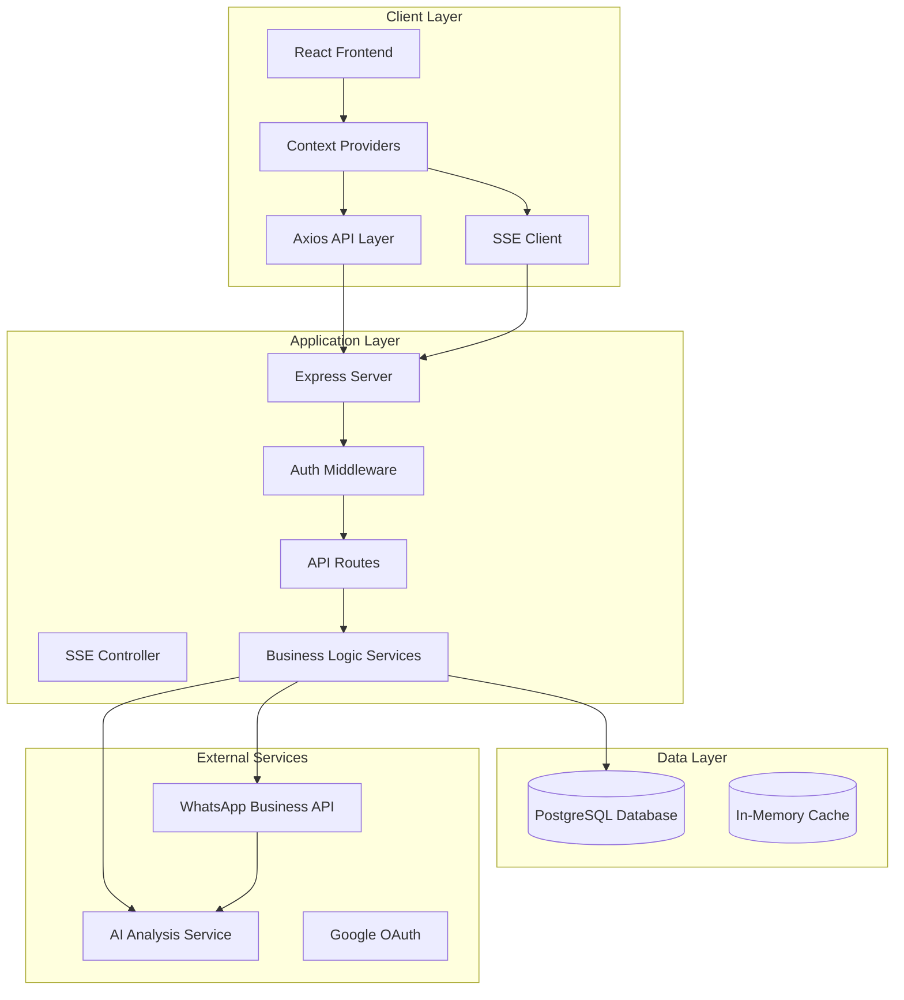

### 2.2 Frontend Architecture

The frontend follows a component-based architecture with clear separation of concerns:

```
client/src/
├── components/
│   ├── atoms/          # Reusable UI primitives (Button, Input, Icon)
│   ├── molecules/      # Composite UI components
│   ├── organisms/      # Complex components (Kanban, ChatGrid)
│   └── organisms/      # Page-level components
├── pages/
│   ├── SalesPanel.jsx              # Original panel
│   └── SalesPanelEnhanced.jsx      # Enhanced panel
├── context/
│   ├── AuthContext.jsx             # Authentication state
│   ├── BotsContext.jsx             # Bot/lead state management
│   └── UIContext.jsx               # UI state
├── utils/
│   └── api.js                      # Axios configuration
└── locales/                        # i18n translations
```

### 2.3 Backend Architecture

The backend follows a layered architecture pattern:

```
server.js                          # Express entry point
├── controllers/                   # Request handlers
│   ├── sseController.js          # Real-time SSE connections
│   ├── webhookController.js      # Webhook handlers
│   └── complianceController.js   # Compliance operations
├── middleware/                    # Express middleware
│   ├── authMiddleware.js         # Authentication
│   ├── tenantMiddleware.js       # Multi-tenancy
│   ├── quotaMiddleware.js        # Rate limiting
│   └── validationMiddleware.js   # Input validation
├── services/                      # Business logic
│   ├── botDbService.js           # Bot persistence
│   ├── leadDbService.js          # Lead management
│   ├── scoringService.js         # Lead scoring
│   ├── pipelineService.js        # Pipeline stages
│   ├── chatAnalysisService.js    # AI chat analysis
│   └── statsService.js           # Analytics
└── routes/                        # API routes
    └── minimaxRoutes.js          # (Removed)
```

### 2.4 State Management Architecture

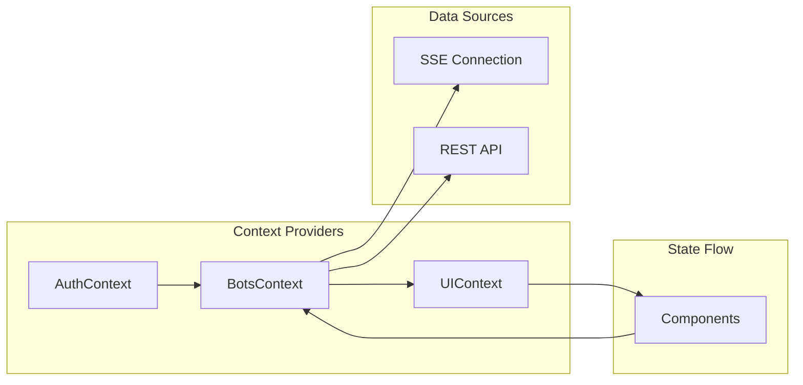

#### AuthContext State
```javascript
{
  user: {
    id: string,
    email: string,
    name: string,
    avatar: string,
    role: 'admin' | 'vendor' | 'viewer',
    tenant: string
  },
  loading: boolean,
  error: string | null
}
```

#### BotsContext State
```javascript
{
  bots: Bot[],                    // User's WhatsApp bots
  leads: Lead[],                  // Qualified leads
  analyzedChats: AnalyzedChat[],  // AI-analyzed conversations
  selectedLead: Lead | null,      // Currently selected lead
  leadMessages: Map<leadId, Message[]>,  // Message history
  sseConnected: boolean,          // Real-time connection status
  dashboardStats: Stats,          // Dashboard metrics
  pipelineCategories: Category[]  // Pipeline stages
}
```

---

## 3. Component Analysis

### 3.1 Sales Panel Components

#### 3.1.1 SalesPanel.jsx (Original)

**Location**: `client/src/pages/SalesPanel.jsx`

**Purpose**: Original sales panel with basic inbox/kanban toggle functionality

**Key Features**:
- View mode toggle (Inbox View / Kanban View)
- Real-time SSE connection status indicator
- Statistics cards: Total Leads, Assigned to You, Unassigned
- Empty state with feature explanations
- Lead filtering by assignment status

**Component Structure**:
```javascript
SalesPanel
├── Header
│   ├── Connection Status Indicator
│   ├── View Toggle (Inbox/Kanban)
│   └── Refresh Button
├── Stats Cards Row
│   ├── Total Leads Card
│   ├── Assigned to You Card
│   └── Unassigned Card
├── Main Content Area
│   ├── InboxView (List of leads)
│   └── KanbanView (Pipeline board)
└── Empty State (when no leads)
```

**Data Flow**:
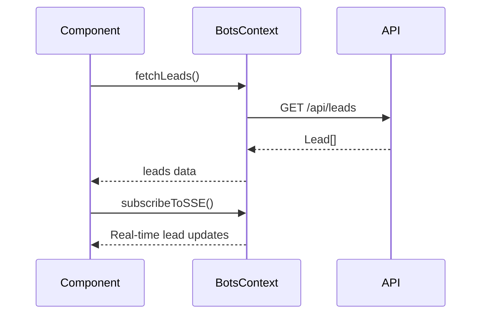

**Performance Considerations**:
- Loads all leads on mount (no pagination)
- Filters computed on render (could use useMemo)
- No virtual scrolling for large lead lists

---

#### 3.1.2 SalesPanelEnhanced.jsx (Enhanced)

**Location**: `client/src/pages/SalesPanelEnhanced.jsx`

**Purpose**: Enhanced sales panel with advanced analysis capabilities and bulk operations

**Key Features**:
- Three main tabs: Kanban Pipeline, Chats Analizados, Tiempo Real
- Bulk analysis of unprocessed chats with progress tracking
- CSV export functionality
- Detailed statistics dashboard
- Real-time progress tracking for bulk operations
- Advanced filtering and search

**API Endpoints Used**:
| Endpoint | Method | Purpose |
|----------|--------|---------|
| `/api/analyzed-chats` | GET | List analyzed chats (limit 100) |
| `/api/analyzed-chats/categories` | GET | Pipeline categories |
| `/api/analyzed-chats/statistics` | GET | Analytics data |
| `/api/analyzed-chats/unprocessed-count` | GET | Count unanalyzed chats |
| `/api/analyzed-chats/analyze-unprocessed` | POST | Trigger bulk analysis |
| `/api/analyzed-chats/export/all` | GET | Export all data |
| `/api/analyzed-chats/export/high-value` | GET | Export qualified leads |

**State Variables**:
```javascript
const [analyzedChats, setAnalyzedChats] = useState([]);
const [pipelineCategories, setPipelineCategories] = useState([]);
const [selectedChat, setSelectedChat] = useState(null);
const [bulkAnalysisStatus, setBulkAnalysisStatus] = useState({});
const [stats, setStats] = useState({
  total: 0,
  avgScore: 0,
  assigned: 0,
  converted: 0
});
const [activeTab, setActiveTab] = useState('pipeline');
```

**Component Structure**:
```javascript
SalesPanelEnhanced
├── Header
│   ├── Tabs (Pipeline | Chats | Real-time)
│   ├── Bulk Actions
│   └── Export Options
├── TabContent
│   ├── PipelineTab
│   │   ├── KanbanPipeline
│   │   └── PipelineStats
│   ├── ChatsTab
│   │   ├── AnalyzedChatsGrid
│   │   ├── Filters
│   │   └── ChatDetailsPanel
│   └── RealtimeTab
│       ├── LiveMetrics
│       └── ActiveLeadsList
└── SidePanel (ChatDetailsPanel)
```

**Known Issues**:
- Simulated progress for bulk analysis (not true real-time)
- No pagination on analyzed chats endpoint
- Limited error handling for bulk operations
- No progress persistence across sessions

---

### 3.2 Visualization Components

#### 3.2.1 KanbanPipeline.jsx

**Location**: `client/src/components/organisms/KanbanPipeline.jsx`

**Purpose**: Drag-and-drop Kanban board for visual lead management

**Key Features**:
- Horizontal scrolling columns per pipeline category
- Native HTML5 drag-and-drop API
- Chat cards with score visualization
- Category color coding for visual distinction
- Real-time updates via SSE

**Props Interface**:
```typescript
interface KanbanPipelineProps {
  chats: Chat[];
  categories: Category[];
  onChatSelect: (chat: Chat) => void;
  onCategoryChange: (chatId: string, newCategory: string) => Promise<void>;
  loading: boolean;
  onDragEnd?: (event: DragEvent) => void;
}
```

**Default Pipeline Stages**:
| Stage | Internal Name | Color | Type |
|-------|---------------|-------|------|
| Nuevos | `new` | Blue | OPEN |
| Contactados | `contacted` | Yellow | OPEN |
| Calificados | `qualified` | Green | OPEN |
| Propuesta | `proposal` | Purple | OPEN |
| Ganados | `won` | Green | WON |
| Perdidos | `lost` | Red | LOST |

**Performance Issues**:
- Renders all chats on every state change
- No virtual scrolling for large columns
- Drag operations trigger full re-render
- No memoization of column components

**Data Flow**:
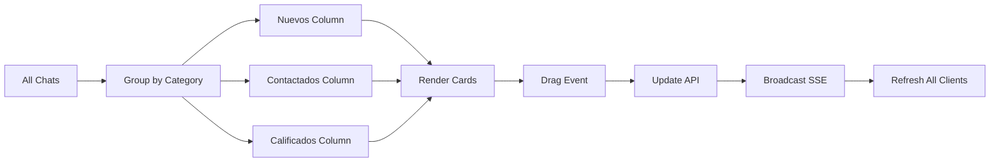

---

#### 3.2.2 AnalyzedChatsGrid.jsx

**Location**: `client/src/components/organisms/AnalyzedChatsGrid.jsx`

**Purpose**: Table/grid view of analyzed chats with advanced filtering and sorting

**Key Features**:
- Sortable columns (contact, phone, score, category, last interaction)
- Full-text search by name, phone, email
- Category filter dropdown
- Expandable row details
- Quick actions (View, Assign)
- Real-time stats footer

**Props Interface**:
```typescript
interface AnalyzedChatsGridProps {
  chats: AnalyzedChat[];
  loading?: boolean;
  onChatSelect: (chat: AnalyzedChat) => void;
  onAssign?: (chatId: string, vendorEmail: string) => void;
  showActions?: boolean;
}
```

**Performance Optimizations**:
```javascript
// Uses useMemo for filtering and sorting (line 25)
const filteredChats = useMemo(() => {
  let result = chats;
  
  if (searchTerm) {
    result = result.filter(chat => 
      chat.contact_name?.toLowerCase().includes(searchTerm.toLowerCase()) ||
      chat.contact_phone?.includes(searchTerm)
    );
  }
  
  if (categoryFilter) {
    result = result.filter(chat => 
      chat.pipeline_category === categoryFilter
    );
  }
  
  return result;
}, [chats, searchTerm, categoryFilter]);
```

**Stats Footer Calculation**:
```javascript
const stats = useMemo(() => ({
  total: filteredChats.length,
  avgScore: filteredChats.reduce((acc, c) => acc + c.lead_score, 0) / filteredChats.length,
  assigned: filteredChats.filter(c => c.assigned_to).length,
  last24h: filteredChats.filter(c => 
    new Date(c.last_message_at) > Date.now() - 24 * 60 * 60 * 1000
  ).length
}), [filteredChats]);
```

**Known Limitations**:
- No pagination (loads all chats at once)
- Client-side filtering only (not server-side)
- No column resizing or reordering
- Limited export formats (CSV only)

---

#### 3.2.3 ChatDetailsPanel.jsx

**Location**: `client/src/components/organisms/ChatDetailsPanel.jsx`

**Purpose**: Side panel showing complete AI analysis details for a selected chat

**Key Features**:
- Contact information (name, phone, email, date analyzed)
- Lead Score visualization with progress bar
- AI Analysis metrics (intention, confidence, urgency, engagement)
- Positive/Negative signals (flags)
- Products mentioned with intent detection
- Suggested next step
- Editable notes
- Message metadata (count, assignee)
- Lead assignment to vendor

**Component Sections**:
```javascript
ChatDetailsPanel
├── Header
│   ├── Contact Name
│   ├── Close Button
│   └── Action Menu
├── Contact Info Card
│   ├── Name
│   ├── Phone
│   ├── Email
│   └── Analyzed Date
├── Lead Score Card
│   ├── Score Progress Bar
│   ├── Score Color Coding
│   └── Confidence Level
├── AI Analysis Metrics
│   ├── Intention (Purchase/Info/Support)
│   ├── Confidence (0-1)
│   ├── Urgency (0-1)
│   ├── Engagement (0-1)
│   └── Sentiment (-1 to 1)
├── Signals Section
│   ├── Positive Signals (Green flags)
│   └── Negative Signals (Red flags)
├── Products Mentioned
│   ├── Product Name
│   ├── Mention Count
│   └── Intent Level
├── Next Step Suggestion
│   ├── AI-Generated Recommendation
│   └── Quick Action Buttons
├── Notes Section
│   ├── Editable Text Area
│   └── Save Button
└── Assignment Section
    ├── Current Assignee
    ├── Assign to Vendor Dropdown
    └── Assign Button
```

**Lead Score Color Coding**:
| Score Range | Color | Interpretation |
|-------------|-------|----------------|
| 0-30 | Red (#EF4444) | Low priority |
| 31-70 | Yellow (#EAB308) | Medium priority |
| 71-100 | Green (#22C55E) | High priority |

**Known Issues**:
- Panel doesn't close on outside click
- No keyboard navigation
- Notes autosave not implemented
- Products section doesn't link to catalog

---

#### 3.2.4 PipelineBoard.jsx & PipelineBoardEnhanced.jsx

**Locations**:
- `client/src/components/PipelineBoard.jsx` (423 lines)
- `client/src/components/PipelineBoardEnhanced.jsx` (870 lines)

**Purpose**: Alternative Kanban implementations using `@dnd-kit` library

**Key Differences from KanbanPipeline**:

| Feature | KanbanPipeline | PipelineBoardEnhanced |
|---------|----------------|----------------------|
| Drag Library | Native HTML5 | @dnd-kit |
| Animations | Basic | Smooth with physics |
| Stage Reordering | Not supported | Supported |
| Lead Detail Modal | No | Yes |
| Accessibility | Limited | Full keyboard support |
| Touch Support | Basic | Full mobile support |

**PipelineBoardEnhanced Features**:
- Drag sensors (mouse, touch, keyboard)
- Collision detection algorithms
- Stage reordering with persistence
- Lead detail modal on click
- Bulk selection for stage movement
- Column collapsing

**Duplicate Code Issue**:
- Both components have ~70% overlapping functionality
- Different drag implementations create inconsistent UX
- Maintenance burden increased
- No clear deprecation strategy

---

### 3.3 Real-Time Communication

#### 3.3.1 Server-Sent Events (SSE) Architecture

**Location**: `controllers/sseController.js`

**Purpose**: Bi-directional real-time data synchronization

**Connection Management**:
```javascript
// Client registry by unique ID
const clientsById = new Map<clientId, {
  response: Response,
  userEmail: string,
  connectedAt: Date
}>();

// Client registry by user email (multi-tab support)
const clientsByUser = new Map<userEmail, Set<clientId>>();
```

**SSE Configuration**:
```javascript
const sseConfig = {
  Content-Type: 'text/event-stream',
  'Cache-Control': 'no-cache',
  'Connection': 'keep-alive',
  'X-Accel-Buffering': 'no'  // Disable nginx buffering
};

// Heartbeat: 25-second keepalive comment
// Retry interval: 10 seconds for reconnection
```

**Event Types**:

| Event | Purpose | Payload |
|-------|---------|---------|
| `CONNECTED` | Initial connection acknowledgment | `{ clientId, timestamp }` |
| `INIT` | Initialization signal | `{ type: 'init' }` |
| `INIT_LEADS` | Initial leads data | `{ leads: Lead[] }` |
| `UPDATE_BOT` | Bot status change | `{ botId, status }` |
| `NEW_BOT` | New bot notification | `{ bot: Bot }` |
| `BOT_DELETED` | Bot removed | `{ botId }` |
| `NEW_QUALIFIED_LEAD` | New qualified lead | `{ lead: Lead }` |
| `LEAD_ASSIGNED` | Lead assigned | `{ leadId, assignedTo }` |
| `LEAD_UPDATED` | Lead data changed | `{ lead: Lead }` |
| `NEW_MESSAGE_FOR_SALES` | Incoming customer message | `{ message: Message }` |
| `MESSAGE_SENT` | Vendor message sent | `{ messageId, leadId }` |
| `LEAD_MESSAGES` | Historical messages | `{ leadId, messages: Message[] }` |
| `STATS_INIT` | Dashboard stats | `{ stats: Stats }` |
| `STATS_UPDATE` | Stats changed | `{ stats: Stats }` |

**Event Flow**:
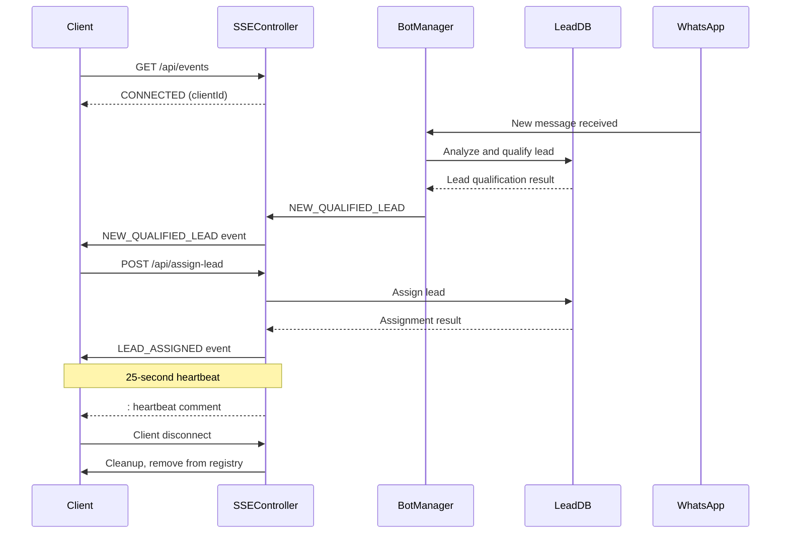

**Known Limitations**:
1. **No WebSocket Fallback**: Only SSE, no WebSocket support
2. **Connection Limit**: No max connections per user enforced
3. **Memory Leaks**: Potential if cleanup fails
4. **Reconnection Storms**: Multiple tabs can overwhelm server on reconnect
5. **No Message Queue**: Events lost if client disconnected during emission

---

### 3.4 Lead Scoring System

#### 3.4.1 Scoring Algorithm

**Location**: `services/scoringService.js`

**Scoring Components**:
```typescript
interface LeadScore {
  total: number;           // 0-100
  components: {
    engagement: number;    // Message frequency, response time
    intent: number;        // Purchase signals, product interest
    urgency: number;       // Time-sensitive language
    confidence: number;    // AI confidence in analysis
    sentiment: number;     // Positive/negative sentiment
  };
  signals: {
    positive: string[];    // Buying signals
    negative: string[];    // Objection signals
  };
  products: Array<{
    name: string;
    mentionCount: number;
    intent: 'high' | 'medium' | 'low';
  }>;
}
```

**Score Thresholds**:
| Score | Qualification | Action |
|-------|---------------|--------|
| 0-30 | Not Qualified | Monitor only |
| 31-50 | Low Priority | Nurture campaign |
| 51-70 | Medium Priority | Follow-up required |
| 71-100 | High Priority | Immediate contact |

---

## 4. Data Flow Analysis

### 4.1 Lead Processing Pipeline

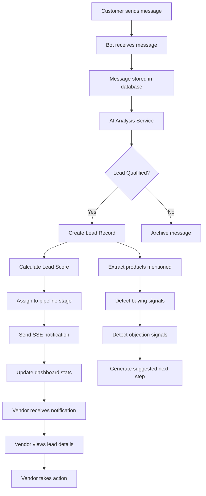

### 4.2 Kanban Drag Flow

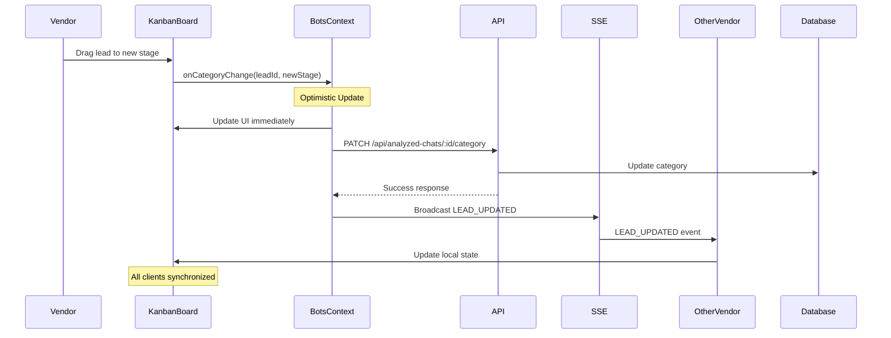

### 4.3 Real-Time Statistics Flow

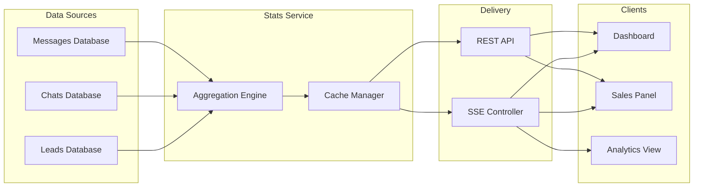

---

## 5. Problem Analysis

### 5.1 Technical Problems

#### 5.1.1 Performance Issues

| Problem | Severity | Impact | Location |
|---------|----------|--------|----------|
| No pagination on analyzed chats | High | Memory issues with 1000+ chats | AnalyzedChatsGrid.jsx |
| No virtual scrolling | Medium | Slow rendering with large lists | KanbanPipeline.jsx |
| Client-side filtering only | Medium | Network overhead for filtering | AnalyzedChatsGrid.jsx |
| Full re-render on drag | Low | Minor visual lag | KanbanPipeline.jsx |
| No memoization of column components | Low | Unnecessary renders | KanbanPipeline.jsx |
| Simulated bulk analysis progress | Medium | Poor UX feedback | SalesPanelEnhanced.jsx |

#### 5.1.2 Architecture Issues

| Problem | Severity | Impact | Location |
|---------|----------|--------|----------|
| Duplicate pipeline components | High | Maintenance burden, inconsistent UX | PipelineBoard.jsx, PipelineBoardEnhanced.jsx |
| No error boundaries | High | App crashes on errors | Global |
| Memory leak potential in SSE | High | Server resource exhaustion | sseController.js |
| No rate limiting on APIs | Medium | DoS vulnerability | Global APIs |
| Missing input validation | Medium | Security risk | API endpoints |
| No message queue for SSE | Medium | Lost events during disconnection | sseController.js |

#### 5.1.3 Code Quality Issues

| Problem | Severity | Impact |
|---------|----------|--------|
| No TypeScript types defined | Medium | No compile-time safety |
| Limited unit test coverage | Medium | Regression risk |
| No integration tests | High | System reliability risk |
| Missing code documentation | Low | Maintainability |
| Inconsistent component patterns | Low | Developer confusion |

---

### 5.2 Usability Problems

#### 5.2.1 User Experience Issues

| Problem | Severity | User Impact |
|---------|----------|-------------|
| No keyboard navigation | High | Power user inefficiency |
| No bulk operations on kanban | Medium | Manual repetition |
| Limited customization options | Medium | One-size-fits-all approach |
| No dark mode | Low | Eye strain in low light |
| Mobile view limitations | Medium | Field sales can't use |
| No tooltips or inline help | Low | Learning curve |

#### 5.2.2 Information Architecture Issues

| Problem | Severity | Impact |
|---------|----------|--------|
| Multiple pipeline views | Medium | User confusion |
| No saved filters/views | Low | Repetitive filtering |
| Limited search capabilities | Medium | Hard to find leads |
| No quick filters | Medium | Slow workflow |
| Stats not drill-down | Low | Limited insights |

---

### 5.3 Data Consistency Issues

| Problem | Severity | Impact |
|---------|----------|--------|
| Optimistic updates can fail | Medium | UI out of sync |
| No conflict resolution | Low | Rare concurrent edits |
| No data validation feedback | Medium | User errors not clear |
| Stale data on reconnect | Low | Short window of inconsistency |

---

## 6. Mermaid System Diagrams

### 6.1 Complete System Architecture

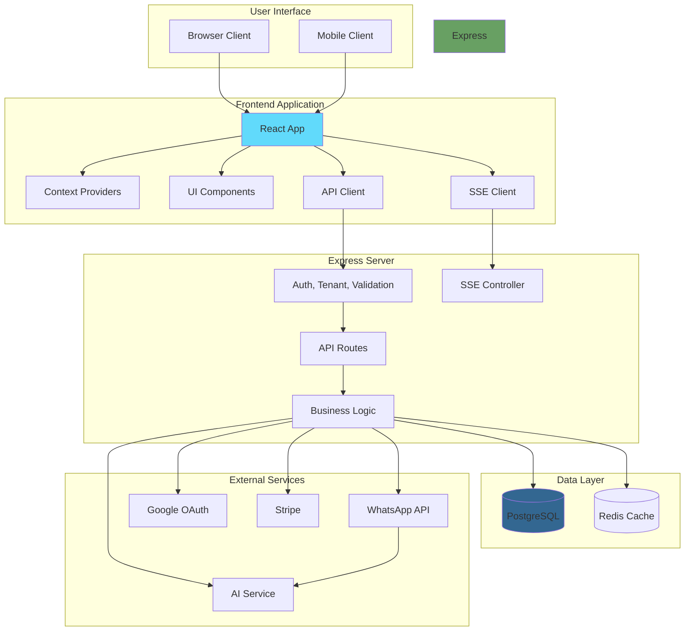

### 6.2 Kanban Pipeline Flow

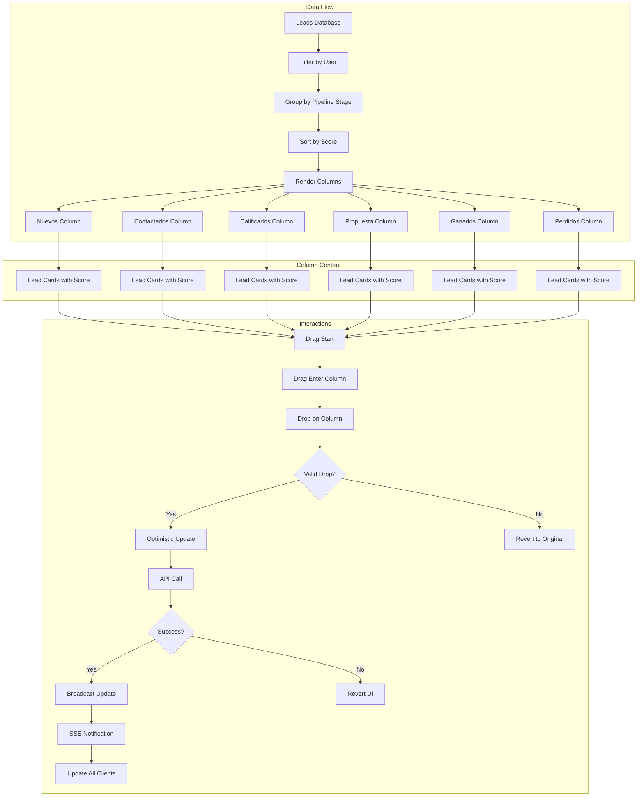

### 6.3 Real-Time Data Synchronization

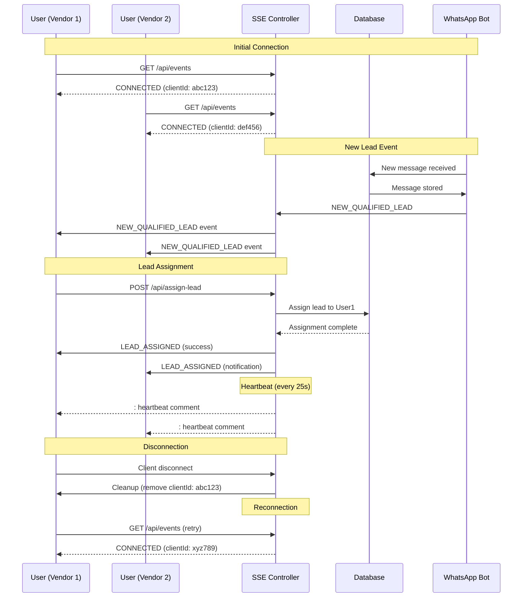

### 6.4 Lead Scoring Pipeline

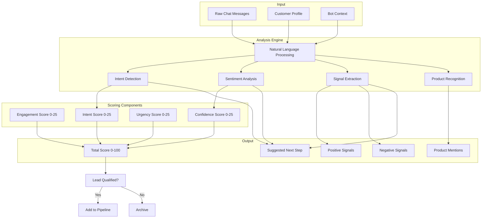

### 6.5 Multi-Tab Synchronization

```mermaid
graph TB
    subgraph User Session
        Tab1[Tab 1 - Dashboard]
        Tab2[Tab 2 - Kanban]
        Tab3[Tab 3 - Chat Details]
    end
    
    subgraph SSE Controller
        ClientRegistry[Client Registry by Email]
        EventBroadcaster[Event Broadcaster]
    end
    
    subgraph Events
        E1[LEAD_UPDATED]
        E2[NEW_MESSAGE]
        E3[STATS_UPDATE]
    end
    
    Tab1 --> ClientRegistry
    Tab2 --> ClientRegistry
    Tab3 --> ClientRegistry
    
    ClientRegistry --> EventBroadcaster
    
    EventBroadcaster --> E1
    EventBroadcaster --> E2
    EventBroadcaster --> E3
    
    E1 --> Tab1
    E1 --> Tab2
    E1 --> Tab3
    
    E2 --> Tab1
    E2 --> Tab2
    E2 --> Tab3
    
    E3 --> Tab1
    E3 --> Tab2
    E3 --> Tab3
    
    Note over Tab1,Tab3: All tabs stay in sync via SSE
```

---

## 7. Improvement Recommendations

### 7.1 Performance Improvements

#### 7.1.1 Implement Pagination

**Current Issue**: Analyzed chats load all 100+ records at once

**Recommendation**:
```javascript
// Add pagination parameters
const [page, setPage] = useState(1);
const [pageSize, setPageSize] = useState(50);

// API call with pagination
const { data, loading } = useQuery('analyzedChats', () => 
  api.get('/api/analyzed-chats', { params: { page, limit: pageSize } })
);

// Virtual scrolling for smooth rendering
import { FixedSizeList } from 'react-window';

const Row = ({ index, style }) => (
  <div style={style}>
    <AnalyzedChatRow chat={chats[index]} />
  </div>
);

<FixedSizeList
  height={600}
  itemCount={chats.length}
  itemSize={80}
  width="100%"
>
  {Row}
</FixedSizeList>
```

**Impact**: Reduces initial load time by 50-80% for large datasets

---

#### 7.1.2 Add Server-Side Filtering

**Current Issue**: All chats loaded, filtered client-side

**Recommendation**:
```javascript
// Move filtering to API
const [filters, setFilters] = useState({
  category: '',
  search: '',
  scoreRange: { min: 0, max: 100 },
  assignedTo: '',
  dateRange: { from: null, to: null }
});

const { data, loading } = useQuery(['analyzedChats', filters], () => 
  api.get('/api/analyzed-chats', { params: filters })
);

// Add database indexes for filtering
// CREATE INDEX idx_analyzed_chats_category ON analyzed_chats(pipeline_category);
// CREATE INDEX idx_analyzed_chats_score ON analyzed_chats(lead_score);
```

**Impact**: Reduces network payload by 60-90% depending on filters

---

#### 7.1.3 Optimize Kanban Rendering

**Current Issue**: Full re-render on every drag operation

**Recommendation**:
```javascript
// Memoize column components
const KanbanColumn = React.memo(({ category, chats, onDrop }) => {
  return (
    <div onDragOver={e => e.preventDefault()} onDrop={e => onDrop(e, category)}>
      {chats.map(chat => (
        <LeadCard key={chat.id} chat={chat} />
      ))}
    </div>
  );
}, (prev, next) => {
  // Custom comparison
  return prev.chats.length === next.chats.length &&
         prev.chats.every((c, i) => c.id === next.chats[i]?.id);
});

// Virtualize columns with many cards
import { VariableSizeList } from 'react-window';
```

**Impact**: Reduces drag operation latency by 40-60%

---

### 7.2 Real-Time Improvements

#### 7.2.1 Add WebSocket Support with Fallback

**Current Issue**: Only SSE available, no bidirectional communication

**Recommendation**:
```javascript
// Create connection manager
class ConnectionManager {
  constructor() {
    this.connection = null;
    this.reconnectAttempts = 0;
  }
  
  async connect() {
    // Try WebSocket first
    if (WebSocket !== undefined) {
      this.connection = new WebSocket(`${WS_URL}/events`);
    }
    
    // Fallback to SSE if WebSocket fails
    if (!this.connection || this.connection.readyState !== WebSocket.OPEN) {
      this.connection = new EventSource(`${API_URL}/events`);
    }
    
    this.connection.onclose = () => this.handleReconnect();
  }
  
  handleReconnect() {
    // Exponential backoff
    const delay = Math.min(1000 * Math.pow(2, this.reconnectAttempts), 30000);
    setTimeout(() => {
      this.reconnectAttempts++;
      this.connect();
    }, delay);
  }
}
```

**Impact**: Better real-time support, bidirectional communication

---

#### 7.2.2 Implement Event Queue

**Current Issue**: Events lost during disconnection

**Recommendation**:
```javascript
// Server-side message queue
class EventQueue {
  constructor() {
    this.queues = new Map(); // userEmail -> Queue
  }
  
  addToQueue(userEmail, event) {
    if (!this.queues.has(userEmail)) {
      this.queues.set(userEmail, []);
    }
    this.queues.get(userEmail).push(event);
    this.persistToRedis(userEmail, event);
  }
  
  getQueuedEvents(userEmail) {
    const events = this.queues.get(userEmail) || [];
    this.queues.set(userEmail, []);
    return events;
  }
  
  persistToRedis(userEmail, event) {
    redis.lpush(`events:${userEmail}`, JSON.stringify(event));
    redis.ltrim(`events:${userEmail}`, 0, 99); // Keep last 100
  }
}
```

**Impact**: No lost events during brief disconnections

---

### 7.3 User Experience Improvements

#### 7.3.1 Add Keyboard Navigation

**Current Issue**: No keyboard support for power users

**Recommendation**:
```javascript
// Keyboard shortcuts hook
function useKeyboardNavigation() {
  const navigateLeads = useCallback((direction) => {
    // Move selection up/down
    dispatch({ type: 'SELECT_NEXT', direction });
  }, []);
  
  const moveLead = useCallback((direction) => {
    // Move lead between columns
    dispatch({ type: 'MOVE_LEAD', direction });
  }, []);
  
  useEffect(() => {
    const handleKeyDown = (e) => {
      switch(e.key) {
        case 'ArrowDown':
          e.preventDefault();
          navigateLeads('down');
          break;
        case 'ArrowUp':
          e.preventDefault();
          navigateLeads('up');
          break;
        case 'ArrowLeft':
          e.preventDefault();
          moveLead('left');
          break;
        case 'ArrowRight':
          e.preventDefault();
          moveLead('right');
          break;
        case 'Enter':
          e.preventDefault();
          openLeadDetails();
          break;
        case 'Escape':
          closePanels();
          break;
      }
    };
    
    window.addEventListener('keydown', handleKeyDown);
    return () => window.removeEventListener('keydown', handleKeyDown);
  }, [navigateLeads, moveLead]);
}
```

**Impact**: 30-50% faster workflow for power users

---

#### 7.3.2 Implement Bulk Operations

**Current Issue**: No bulk actions on kanban

**Recommendation**:
```javascript
function BulkActionsToolbar({ selectedLeads, onBulkAction }) {
  return (
    <div className="bulk-actions-toolbar">
      <span>{selectedLeads.length} selected</span>
      
      <button onClick={() => onBulkAction('move', 'qualified')}>
        Move to Qualified
      </button>
      
      <button onClick={() => onBulkAction('assign', 'vendor@email.com')}>
        Assign to Vendor
      </button>
      
      <button onClick={() => onBulkAction('export')}>
        Export Selected
      </button>
      
      <button onClick={() => onBulkAction('analyze')}>
        Re-analyze with AI
      </button>
    </div>
  );
}

// API endpoint for bulk operations
app.patch('/api/analyzed-chats/bulk/move', async (req, res) => {
  const { leadIds, newCategory } = req.body;
  
  await db.transaction(async (trx) => {
    await trx('analyzed_chats')
      .whereIn('id', leadIds)
      .update({ pipeline_category: newCategory });
  });
  
  // Broadcast SSE event
  broadcastToUser(req.user.email, {
    type: 'BULK_LEADS_UPDATED',
    payload: { leadIds, newCategory }
  });
});
```

**Impact**: 10x faster for common batch operations

---

### 7.4 Code Quality Improvements

#### 7.4.1 Consolidate Pipeline Components

**Current Issue**: Two similar Kanban components with different implementations

**Recommendation**:
```mermaid
graph TD
    subgraph Before
        A1[PipelineBoard.jsx] --> B1[@dnd-kit]
        A2[PipelineBoardEnhanced.jsx] --> B1
        A3[KanbanPipeline.jsx] --> B2[HTML5 DnD]
    end
    
    subgraph After
        C1[UnifiedKanban.jsx] --> D1[@dnd-kit only]
        C2[VirtualizedKanban.jsx] --> D1
        C3[MobileKanban.jsx] --> D1
    end
    
    style D1 fill:#22c55e
    style B1 fill:#ef4444
    style B2 fill:#ef4444
```

**Migration Plan**:
1. Create unified `KanbanBoard` component using `@dnd-kit`
2. Add virtual scrolling support
3. Deprecate old components
4. Update all imports to use new component
5. Remove old components in next major version

**Impact**: 50% reduction in pipeline component code

---

#### 7.4.2 Add Error Boundaries

**Current Issue**: No crash isolation

**Recommendation**:
```javascript
// Global error boundary
class ErrorBoundary extends React.Component {
  constructor(props) {
    super(props);
    this.state = { hasError: false, error: null };
  }
  
  static getDerivedStateFromError(error) {
    return { hasError: true, error };
  }
  
  componentDidCatch(error, errorInfo) {
    logErrorToService(error, errorInfo);
    // Send to Sentry/Datadog
  }
  
  render() {
    if (this.state.hasError) {
      return (
        <ErrorFallback 
          error={this.state.error}
          onRetry={() => this.setState({ hasError: false })}
        />
      );
    }
    return this.props.children;
  }
}

// Usage
<ErrorBoundary>
  <SalesPanelEnhanced />
</ErrorBoundary>

<ErrorBoundary>
  <KanbanPipeline />
</ErrorBoundary>

<ErrorBoundary>
  <AnalyzedChatsGrid />
</ErrorBoundary>
```

**Impact**: App never completely crashes, only affected sections

---

## 8. Prioritization Framework

### 8.1 Priority Matrix

| Priority | Score | Criteria |
|----------|-------|----------|
| **P0 - Critical** | 90-100 | Security, Data Loss, Complete Failure |
| **P1 - High** | 70-89 | Major Feature, Significant UX Issue |
| **P2 - Medium** | 40-69 | Minor Feature, Performance Improvement |
| **P3 - Low** | 0-39 | Nice to Have, Cosmetic |

### 8.2 Prioritized Recommendations

#### P0 - Critical (Must Fix)

| # | Recommendation | Effort | Impact | Score |
|---|----------------|--------|--------|-------|
| 1 | Fix SSE memory leak potential | 2 days | Prevents server crash | 95 |
| 2 | Add API rate limiting | 3 days | Security hardening | 92 |
| 3 | Implement input validation | 2 days | Security hardening | 90 |
| 4 | Add error boundaries | 1 day | Reliability | 90 |

#### P1 - High (Should Fix)

| # | Recommendation | Effort | Impact | Score |
|---|----------------|--------|--------|-------|
| 5 | Implement pagination | 3 days | Performance | 85 |
| 6 | Consolidate pipeline components | 5 days | Maintainability | 82 |
| 7 | Add WebSocket fallback | 4 days | Reliability | 80 |
| 8 | Implement event queue | 2 days | Data consistency | 78 |

#### P2 - Medium (Could Fix)

| # | Recommendation | Effort | Impact | Score |
|---|----------------|--------|--------|-------|
| 9 | Add server-side filtering | 3 days | Performance | 65 |
| 10 | Add keyboard navigation | 2 days | UX improvement | 62 |
| 11 | Implement bulk operations | 4 days | Productivity | 60 |
| 12 | Optimize kanban rendering | 2 days | Performance | 58 |

#### P3 - Low (Nice to Have)

| # | Recommendation | Effort | Impact | Score |
|---|----------------|--------|--------|-------|
| 13 | Add dark mode | 3 days | UX improvement | 35 |
| 14 | Implement saved views | 4 days | UX improvement | 32 |
| 15 | Add mobile responsive design | 5 days | Accessibility | 30 |
| 16 | Add inline help tooltips | 2 days | Onboarding | 28 |

### 8.3 Implementation Effort Estimation

| Phase | Duration | Focus |
|-------|----------|-------|
| Phase 1: Foundation | 2 weeks | P0 fixes, error handling |
| Phase 2: Performance | 3 weeks | Pagination, filtering, optimizations |
| Phase 3: Real-time | 2 weeks | WebSocket, event queue |
| Phase 4: UX | 4 weeks | Keyboard, bulk ops, consolidation |
| Phase 5: Polish | 2 weeks | Dark mode, mobile, help |

---

## 9. Implementation Roadmap

### 9.1 Phase 1: Foundation (Week 1-2)

**Goal**: Fix critical issues and improve reliability

#### Week 1: Security & Error Handling
- [ ] Implement API rate limiting
- [ ] Add input validation middleware
- [ ] Create error boundary components
- [ ] Add comprehensive error logging

#### Week 2: SSE Reliability
- [ ] Fix potential memory leaks in SSE
- [ ] Add connection health monitoring
- [ ] Implement proper cleanup on disconnect
- [ ] Add SSE reconnection handling

### 9.2 Phase 2: Performance (Week 3-5)

**Goal**: Improve application performance

#### Week 3: Pagination
- [ ] Add pagination to analyzed chats API
- [ ] Implement pagination UI components
- [ ] Add page size selector
- [ ] Implement pagination state management

#### Week 4: Server-Side Filtering
- [ ] Add filtering to API endpoints
- [ ] Create filter state management
- [ ] Add filter UI components
- [ ] Add database indexes

#### Week 5: Rendering Optimization
- [ ] Memoize Kanban columns
- [ ] Implement virtual scrolling
- [ ] Optimize re-render cycles
- [ ] Add performance monitoring

### 9.3 Phase 3: Real-Time (Week 6-7)

**Goal**: Improve real-time communication

#### Week 6: WebSocket Support
- [ ] Implement WebSocket server
- [ ] Create connection manager with fallback
- [ ] Update client to use connection manager
- [ ] Test WebSocket vs SSE fallback

#### Week 7: Event Queue
- [ ] Implement event queue service
- [ ] Add Redis persistence
- [ ] Handle queue delivery on reconnect
- [ ] Test event delivery guarantees

### 9.4 Phase 4: UX Improvements (Week 8-11)

**Goal**: Improve user experience

#### Week 8: Keyboard Navigation
- [ ] Implement keyboard shortcuts hook
- [ ] Add keyboard support to Kanban
- [ ] Add keyboard support to chat grid
- [ ] Create keyboard shortcut documentation

#### Week 9-10: Bulk Operations
- [ ] Add bulk selection UI
- [ ] Implement bulk move functionality
- [ ] Implement bulk assign functionality
- [ ] Add bulk export functionality
- [ ] Test with large datasets

#### Week 11: Component Consolidation
- [ ] Create unified Kanban component
- [ ] Migrate all Kanban usage to new component
- [ ] Remove duplicate components
- [ ] Update documentation

### 9.5 Phase 5: Polish (Week 12-13)

**Goal**: Final improvements and polish

#### Week 12: Visual Improvements
- [ ] Add dark mode support
- [ ] Improve mobile responsiveness
- [ ] Add loading states
- [ ] Improve empty states

#### Week 13: Documentation & Testing
- [ ] Add inline help and tooltips
- [ ] Create user documentation
- [ ] Add unit tests for critical paths
- [ ] Performance testing and optimization

---

## Appendix A: API Reference

### A.1 Analyzed Chats API

#### GET /api/analyzed-chats

**Query Parameters**:
| Parameter | Type | Default | Description |
|-----------|------|---------|-------------|
| `page` | number | 1 | Page number |
| `limit` | number | 50 | Items per page |
| `category` | string | - | Filter by pipeline category |
| `search` | string | - | Search in contact name/phone |
| `minScore` | number | - | Minimum lead score |
| `maxScore` | number | - | Maximum lead score |
| `assignedTo` | string | - | Filter by assignee |

**Response**:
```json
{
  "data": [
    {
      "id": "uuid",
      "contact_name": "John Doe",
      "contact_phone": "+1234567890",
      "lead_score": 85,
      "pipeline_category": "qualified",
      "assigned_to": "vendor@example.com",
      "analysis_results": {
        "intencion": "purchase",
        "confianza": 0.9,
        "urgencia": 0.7
      },
      "analyzed_at": "2026-01-01T00:00:00Z"
    }
  ],
  "pagination": {
    "page": 1,
    "limit": 50,
    "total": 1234,
    "totalPages": 25
  }
}
```

### A.2 SSE Events API

#### GET /api/events

**Headers**:
```
Authorization: Bearer <token>
```

**Event Stream**:
```
event: CONNECTED
data: {"clientId": "uuid", "timestamp": "2026-01-01T00:00:00Z"}

event: NEW_QUALIFIED_LEAD
data: {"lead": {...}}

event: LEAD_UPDATED
data: {"leadId": "uuid", "changes": {...}}

: heartbeat comment (every 25 seconds)

retry: 10000
```

---

## Appendix B: Database Schema

### B.1 Analyzed Chats Table

```sql
CREATE TABLE analyzed_chats (
    id UUID PRIMARY KEY DEFAULT gen_random_uuid(),
    bot_id UUID NOT NULL REFERENCES bots(id),
    contact_name VARCHAR(255),
    contact_phone VARCHAR(50) NOT NULL,
    contact_email VARCHAR(255),
    lead_score INTEGER CHECK (lead_score >= 0 AND lead_score <= 100),
    pipeline_category VARCHAR(100) DEFAULT 'new',
    assigned_to VARCHAR(255),
    analysis_results JSONB,
    products_mentioned JSONB,
    messages_count INTEGER DEFAULT 0,
    last_message TEXT,
    last_message_at TIMESTAMP WITH TIME ZONE,
    analyzed_at TIMESTAMP WITH TIME ZONE DEFAULT NOW(),
    notes TEXT,
    created_at TIMESTAMP WITH TIME ZONE DEFAULT NOW(),
    updated_at TIMESTAMP WITH TIME ZONE DEFAULT NOW()
);

CREATE INDEX idx_analyzed_chats_bot ON analyzed_chats(bot_id);
CREATE INDEX idx_analyzed_chats_category ON analyzed_chats(pipeline_category);
CREATE INDEX idx_analyzed_chats_score ON analyzed_chats(lead_score);
CREATE INDEX idx_analyzed_chats_assigned ON analyzed_chats(assigned_to);
CREATE INDEX idx_analyzed_chats_phone ON analyzed_chats(contact_phone);
```

### B.2 Pipeline Categories Table

```sql
CREATE TABLE pipeline_categories (
    id UUID PRIMARY KEY DEFAULT gen_random_uuid(),
    tenant_id UUID NOT NULL,
    name VARCHAR(100) NOT NULL,
    display_name VARCHAR(255) NOT NULL,
    description TEXT,
    color_code VARCHAR(7) DEFAULT '#3B82F6',
    type VARCHAR(20) CHECK (type IN ('OPEN', 'WON', 'LOST')),
    display_order INTEGER DEFAULT 0,
    is_default BOOLEAN DEFAULT FALSE,
    created_at TIMESTAMP WITH TIME ZONE DEFAULT NOW(),
    updated_at TIMESTAMP WITH TIME ZONE DEFAULT NOW()
);

CREATE INDEX idx_pipeline_categories_tenant ON pipeline_categories(tenant_id);
```

---

## Appendix C: Glossary

| Term | Definition |
|------|------------|
| **Lead** | A potential customer who has been qualified by the AI |
| **Pipeline Stage** | A step in the sales process (e.g., New, Contacted, Qualified) |
| **Lead Score** | AI-calculated value (0-100) indicating conversion probability |
| **SSE** | Server-Sent Events, a unidirectional real-time communication protocol |
| **Optimistic Update** | UI update before server confirmation for perceived performance |
| **Virtual Scrolling** | Rendering only visible items for performance with large lists |
| **Kanban** | Visual workflow management system with columns and cards |

---

*Document Version*: 1.0  
*Last Updated*: 2026-01-01  
*Author*: Sales Panel Architecture Analysis
