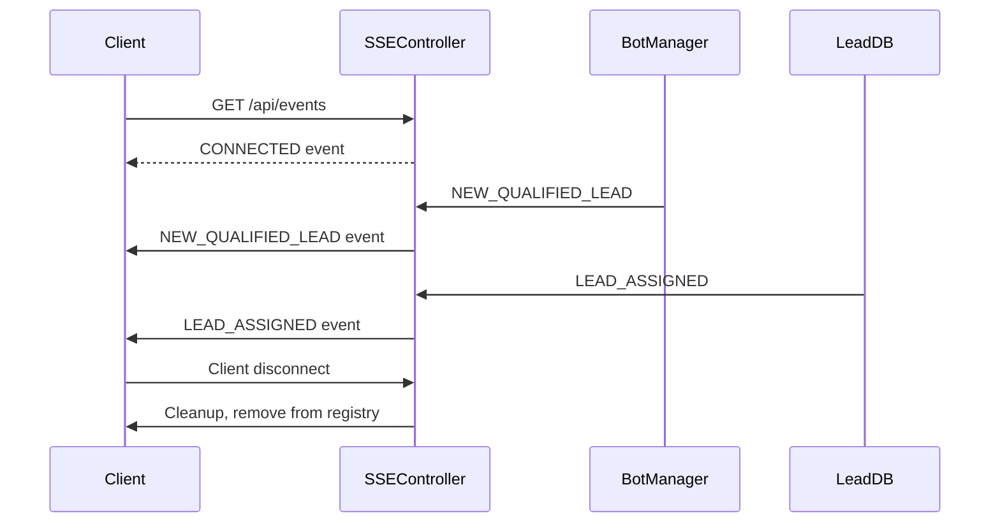
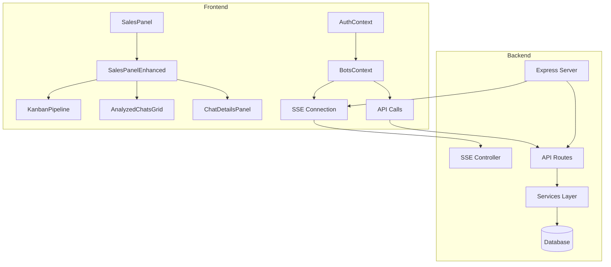

# Sales Panel Architecture Investigation Report

## Executive Summary

The Sales Panel is a comprehensive CRM and lead management system integrated into the WhatsApp Bot Manager platform. It provides real-time visualization of client chats, lead scoring, Kanban pipeline management, and analytics for sales teams.

---

## 1. Frontend Architecture

### 1.1 Main Entry Points

#### [`SalesPanel.jsx`](client/src/pages/SalesPanel.jsx)
- **Purpose**: Original sales panel with basic inbox/kanban toggle
- **Key Features**:
  - View mode toggle (Inbox/Kanban)
  - Real-time SSE connection status indicator
  - Stats cards: Total Leads, Assigned to You, Unassigned
  - Empty state with feature explanations
- **State Management**: Uses [`useBots()`](client/src/context/BotsContext.jsx:16) for leads data
- **Data Flow**: `leads → filtered by user email → stats calculation`

#### [`SalesPanelEnhanced.jsx`](client/src/pages/SalesPanelEnhanced.jsx)
- **Purpose**: Enhanced sales panel with advanced analysis capabilities
- **Key Features**:
  - Three tabs: Kanban Pipeline, Chats Analizados, Tiempo Real
  - Bulk analysis of unprocessed chats
  - CSV export functionality
  - Detailed statistics dashboard
  - Real-time progress tracking for bulk operations
- **API Endpoints Used**:
  - `GET /api/analyzed-chats?limit=100`
  - `GET /api/analyzed-chats/categories`
  - `GET /api/analyzed-chats/statistics`
  - `GET /api/analyzed-chats/unprocessed-count`
  - `POST /api/analyzed-chats/analyze-unprocessed`
- **State Variables**:
  ```javascript
  analyzedChats: [],      // All analyzed chats
  pipelineCategories: [], // Pipeline categories
  selectedChat: null,     // Currently selected chat for details
  bulkAnalysisStatus: {}, // Bulk operation status
  stats: { total, avgScore, assigned, converted }
  ```

### 1.2 Visualization Components

#### [`KanbanPipeline.jsx`](client/src/components/organisms/KanbanPipeline.jsx)
- **Purpose**: Drag-and-drop Kanban board for lead management
- **Features**:
  - Horizontal scrolling columns per category
  - Drag-and-drop using HTML5 native API
  - Chat cards with score visualization
  - Category color coding
- **Props Interface**:
  ```typescript
  interface KanbanPipelineProps {
    chats: Chat[];
    categories: Category[];
    onChatSelect: (chat) => void;
    onCategoryChange: (chatId, newCategory) => Promise<void>;
    loading: boolean;
  }
  ```
- **Data Flow**: `chats` → grouped by `pipeline_category` → rendered per column

#### [`AnalyzedChatsGrid.jsx`](client/src/components/organisms/AnalyzedChatsGrid.jsx)
- **Purpose**: Table/grid view of analyzed chats with filtering
- **Features**:
  - Sortable columns (contact, phone, score, category, last interaction)
  - Search by name, phone, email
  - Category filter dropdown
  - Expandable row details
  - Quick actions (View, Assign)
- **Performance**: Uses `useMemo()` for filtering/sorting (line 25)
- **Stats Footer**: Real-time calculated stats (total, avg score, assigned, last 24h)

#### [`ChatDetailsPanel.jsx`](client/src/components/organisms/ChatDetailsPanel.jsx)
- **Purpose**: Side panel showing complete chat analysis details
- **Sections**:
  1. Contact Info (name, phone, email, date analyzed)
  2. Lead Score visualization with progress bar
  3. AI Analysis metrics (intention, confidence, urgency, engagement)
  4. Positive/Negative signals (flags)
  5. Products mentioned with intent
  6. Suggested next step
  7. Editable notes
  8. Metadata (message count, assignee)
- **Actions**: Assign to vendor

#### [`PipelineBoard.jsx`](client/src/components/PipelineBoard.jsx) & [`PipelineBoardEnhanced.jsx`](client/src/components/PipelineBoardEnhanced.jsx)
- **Purpose**: Alternative Kanban implementation using `@dnd-kit`
- **Differences from KanbanPipeline**:
  - Uses `@dnd-kit/core` for drag-and-drop
  - More sophisticated animations
  - Stage reordering support
  - Lead detail modal
- **Default Stages**:
  - Nuevos (New)
  - Contactados (Contacted)
  - Calificados (Qualified)
  - Propuesta (Proposal)
  - Ganados (Won)
  - Perdidos (Lost)

### 1.3 Lead Scoring Component

#### [`LeadScoreCard.jsx`](client/src/components/LeadScoreCard.jsx)
- **Purpose**: Visual lead score display
- **Scoring Logic**:
  - Score 0-100 displayed as progress bar
  - Color coding: Red (<30), Yellow (30-70), Green (>70)
- **Props**: `score` (number), `tags` (array of strings)

---

## 2. Backend Architecture

### 2.1 Server Entry Point

#### [`server.js`](server.js:1)
- **Port Configuration**: `PORT || DASHBOARD_PORT || 3000`
- **HTTP Server**: `http.createServer(app)` (line 44)
- **Keep-Alive Configuration**: 65s timeout (line 47-48)
- **Key Services**:
  - `botDbService` - Bot persistence
  - `leadDbService` - Lead management
  - `scoringService` - Lead scoring
  - `pipelineService` - Pipeline management
  - `chatAnalysisService` - AI chat analysis
  - `statsService` - Dashboard statistics
  - `baileysManager` - WhatsApp connection management

### 2.2 Real-Time Communication

#### [`controllers/sseController.js`](controllers/sseController.js:1)
- **Connection Management**:
  - `clientsById`: Map<clientId, client>
  - `clientsByUser`: Map<userEmail, Set<clientId>>
- **SSE Configuration**:
  - Content-Type: `text/event-stream`
  - Keep-Alive enabled
  - Heartbeat every 25 seconds
  - Retry interval: 10 seconds
- **Event Types**:
  | Event | Purpose |
  |-------|---------|
  | `CONNECTED` | Initial connection acknowledgment |
  | `INIT` | Initialization signal |
  | `INIT_LEADS` | Initial leads data |
  | `UPDATE_BOT` | Bot status change |
  | `NEW_BOT` | New bot created |
  | `BOT_DELETED` | Bot removed |
  | `NEW_QUALIFIED_LEAD` | New lead qualified |
  | `LEAD_ASSIGNED` | Lead assigned to vendor |
  | `LEAD_UPDATED` | Lead data updated |
  | `NEW_MESSAGE_FOR_SALES` | Incoming customer message |
  | `MESSAGE_SENT` | Vendor message sent |
  | `LEAD_MESSAGES` | Historical messages |
  | `STATS_INIT` | Dashboard stats |
  | `STATS_UPDATE` | Stats changed |

### 2.3 API Routes

#### Core Sales Routes
- `GET /api/bots` - List user's bots
- `GET /api/leads` - List qualified leads
- `POST /api/assign-lead` - Assign lead to vendor
- `POST /api/send-message` - Send WhatsApp message
- `GET /api/lead-messages/:leadId` - Get conversation history
- `GET /api/pipelines` - Get pipeline stages
- `POST /api/leads/:id/move` - Move lead between stages
- `POST /api/ai/suggest-reply` - AI suggestion for response

#### Analyzed Chats Routes
- `GET /api/analyzed-chats` - List analyzed chats
- `GET /api/analyzed-chats/categories` - Get pipeline categories
- `GET /api/analyzed-chats/statistics` - Get analytics
- `GET /api/analyzed-chats/unprocessed-count` - Count unanalyzed chats
- `POST /api/analyzed-chats/analyze-unprocessed` - Trigger bulk analysis
- `PATCH /api/analyzed-chats/:id/category` - Update pipeline category
- `PATCH /api/analyzed-chats/:id/assign` - Assign to vendor
- `GET /api/analyzed-chats/export/all` - Export all data
- `GET /api/analyzed-chats/export/high-value` - Export qualified leads

---

## 3. State Management

### 3.1 Context Architecture

#### [`BotsContext.jsx`](client/src/context/BotsContext.jsx:28)
- **Provider**: `BotsProvider`
- **State**:
  ```javascript
  {
    bots: [],              // User's bots
    leads: [],             // Qualified leads
    selectedLead: null,    // Currently selected lead
    leadMessages: {},      // Messages by leadId
    sseConnected: boolean, // SSE connection status
    dashboardStats: {}     // Dashboard metrics
  }
  ```
- **SSE Integration**:
  - Auto-connect on authentication
  - 10-second reconnection delay on error
  - Heartbeat handling (line 167-169)
- **Methods**: `createBot`, `editBot`, `deleteBot`, `enableBot`, `disableBot`, `assignLead`, `updateLead`, `sendMessage`, `getLeadMessages`, `refreshLeads`

#### [`AuthContext.jsx`](client/src/context/AuthContext.jsx:15)
- **State**: `user`, `loading`, `error`
- **Computed**: `isAuthenticated`, `isAdmin`, `isVendor`, `tenant`
- **Auth Flow**: Google OAuth via Passport.js

### 3.2 API Layer

#### [`api.js`](client/src/utils/api.js:1)
- **Configuration**: Axios instance with credentials
- **Base URL**: From `VITE_API_BASE_URL` or `/`
- **Features**: Automatic cookie handling, CORS support

---

## 4. Real-Time Capabilities

### 4.1 Server-Sent Events (SSE)
- **Endpoint**: `GET /api/events`
- **Authentication**: Required (via `requireAuth` middleware)
- **Heartbeat**: 25-second keepalive comment
- **Reconnection**: Automatic with 10s retry interval
- **Multi-tab Support**: Multiple connections per user tracked via `clientsByUser`

### 4.2 Event Flow


---

## 5. Performance Considerations

### 5.1 Frontend Optimizations
- **`useMemo()` usage**: Filtering/sorting in `AnalyzedChatsGrid` (line 25)
- **Virtual scrolling**: Not implemented (potential improvement)
- **Lazy loading**: API calls on mount only
- **Optimistic updates**: Lead assignment updates UI immediately

### 5.2 Backend Optimizations
- **Connection pooling**: SSE connections pooled by user
- **Heartbeat interval**: 25s to prevent proxy timeouts
- **Compression**: Excludes SSE endpoints
- **KeepAlive**: 65s socket timeout

### 5.3 Known Limitations
1. No pagination on analyzed chats (loads all at once)
2. Bulk analysis uses simulated progress (not real-time)
3. No WebSocket fallback for SSE
4. Memory leak potential in SSE if cleanup fails

---

## 6. Data Models

### 6.1 Chat/Analyzed Chat
```typescript
interface AnalyzedChat {
  id: string;
  contact_name: string;
  contact_phone: string;
  contact_email?: string;
  lead_score: number;        // 0-100
  pipeline_category: string; // Category name
  assigned_to?: string;      // Vendor email
  analysis_results: {
    intencion: string;
    confianza: number;       // 0-1
    urgencia: number;        // 0-1
    engagement: number;      // 0-1
    sentimiento: number;     // -1 to 1
    resumen: string;
    banderaBuena: string[];  // Positive signals
    banderaRoja: string[];   // Negative signals
    proximoPaso: string;     // Suggested next action
  };
  products_mentioned: Array<{
    name: string;
    mention_count: number;
    intent: string;
  }>;
  messages_count: number;
  last_message?: string;
  last_message_at?: ISO8601;
  analyzed_at: ISO8601;
  notes?: string;
}
```

### 6.2 Pipeline Category
```typescript
interface PipelineCategory {
  id: string;
  name: string;           // Internal name (e.g., "new")
  display_name: string;   // Display name (e.g., "Nuevos")
  description: string;
  color_code: string;     // Hex color
  type: 'OPEN' | 'WON' | 'LOST';
  order: number;
}
```

### 6.3 Lead
```typescript
interface Lead {
  id: string;
  name?: string;
  whatsapp_number: string;
  email?: string;
  location?: string;
  score: number;          // 0-100
  stage_id: string;       // Pipeline stage
  tags: string[];
  assigned_to?: string;
  status: 'new' | 'assigned' | 'qualified';
  bot_id: string;
  created_at: ISO8601;
  last_message_at?: ISO8601;
  qualified_at?: ISO8601;
}
```

---

## 7. System Diagram



---

## 8. Known Issues & Recommendations

### 8.1 Issues Identified
1. **Duplicate Code**: `PipelineBoard.jsx` and `PipelineBoardEnhanced.jsx` have overlapping functionality
2. **No Error Boundaries**: React error boundaries not implemented for Sales Panel
3. **Memory Leaks**: Potential in SSE connection cleanup
4. **Missing Validation**: Limited input validation on API endpoints
5. **No Rate Limiting**: API endpoints lack rate limiting

### 8.2 Recommendations
1. Consolidate `PipelineBoard` variants into single component
2. Implement React error boundaries for crash isolation
3. Add connection health monitoring
4. Implement API rate limiting
5. Add pagination to analyzed chats endpoint
6. Use WebSocket for bidirectional communication (fallback to SSE)
7. Implement virtual scrolling for large chat lists

---

## 9. Files Summary

| File | Lines | Purpose |
|------|-------|---------|
| `client/src/pages/SalesPanel.jsx` | 249 | Original sales panel |
| `client/src/pages/SalesPanelEnhanced.jsx` | 756 | Enhanced sales panel |
| `client/src/components/organisms/KanbanPipeline.jsx` | 213 | Kanban board |
| `client/src/components/organisms/AnalyzedChatsGrid.jsx` | 429 | Chat grid with filtering |
| `client/src/components/organisms/ChatDetailsPanel.jsx` | 315 | Chat details sidebar |
| `client/src/components/PipelineBoard.jsx` | 423 | dnd-kit pipeline |
| `client/src/components/PipelineBoardEnhanced.jsx` | 870 | Enhanced dnd-kit board |
| `client/src/components/LeadScoreCard.jsx` | 86 | Score visualization |
| `client/src/context/BotsContext.jsx` | 443 | Bot/lead state |
| `client/src/context/AuthContext.jsx` | 82 | Auth state |
| `client/src/utils/api.js` | 9 | Axios instance |
| `server.js` | 1031 | Express server |
| `controllers/sseController.js` | 282 | SSE handling |
| `controllers/webhookController.js` | 56 | Stripe webhooks |

---

*Generated: 2026-01-01*
*System: WhatsApp Bot Manager - Sales Panel Architecture Investigation*
