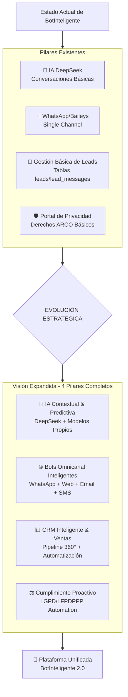
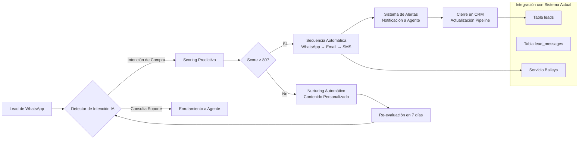
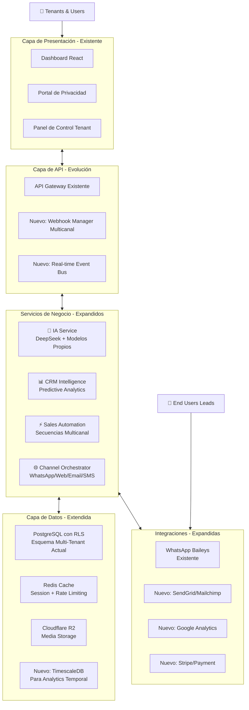

# 🚀 **BotInteligente: Evolución Estratégica hacia Plataforma Integral IA + CRM + Ventas + Bots**

## 📋 **Resumen Ejecutivo Adaptado**

**BotInteligente** evoluciona de una **plataforma de bots para WhatsApp** a un **ecosistema completo de automatización inteligente** manteniendo su base técnica sólida (Node.js, PostgreSQL con RLS, DeepSeek) pero expandiendo sus capacidades hacia los 4 pilares estratégicos. Esta evolución mantiene la compatibilidad con la infraestructura multi-tenant existente mientras introduce capacidades predictivas, multicanal avanzado y un CRM inteligente.

### **Estado Actual vs. Visión Estratégica**


---

## 🔍 **Análisis de Brechas y Plan de Evolución**

### **1. Pilar 1: Motor de IA Unificado - Estado Actual vs. Objetivo**
**Actual:** DeepSeek para conversaciones básicas con prompts configurables por tenant.

**Objetivo Evolutivo:**
- **Capas adicionales de IA:**
  - **Capa Predictiva:** Modelos para scoring de leads y detección de churn
  - **Capa de Análisis:** NLP especializado para dialectos latinoamericanos
  - **Capa de Generación:** Contenido contextual para ventas y soporte

**Plan de Implementación (Fase 1):**
```javascript
// Evolución del servicio DeepSeek existente
class EnhancedAIService {
  constructor() {
    this.deepseek = currentDeepSeekService; // Mantener integración actual
    this.predictiveModels = new PredictiveEngine();
    this.nlpProcessor = new LatinAmericanNLP();
  }
  
  async processMessage(tenantId, leadId, message) {
    // 1. Procesamiento básico actual (mantener)
    const basicResponse = await this.deepseek.generateReply(tenantId, message);
    
    // 2. Nuevo: Análisis predictivo en tiempo real
    const leadScore = await this.predictiveModels.calculateScore(tenantId, leadId, message);
    
    // 3. Nuevo: Detección de intención específica para LATAM
    const intent = await this.nlpProcessor.detectIntent(message, 'es-MX');
    
    return { basicResponse, leadScore, intent, suggestedActions };
  }
}
```

### **2. Pilar 2: CRM Central Inteligente - Evolución del Modelo Actual**
**Base Existente a Expandir:**
- **Tablas actuales:** `leads`, `lead_messages`, `products`
- **RLS ya implementado:** `tenant_id` en todas las tablas
- **Infraestructura:** PostgreSQL + Row-Level Security

**Evolución Propuesta:**
```sql
-- EXTENSIONES a las tablas existentes (no reemplazo)
ALTER TABLE leads 
ADD COLUMN predictive_score DECIMAL(5,2),
ADD COLUMN engagement_index INTEGER,
ADD COLUMN last_prediction_date TIMESTAMP;

-- NUEVAS tablas para CRM avanzado
CREATE TABLE lead_interactions_360 (
    id UUID PRIMARY KEY DEFAULT gen_random_uuid(),
    tenant_id UUID REFERENCES tenants(id),
    lead_id UUID REFERENCES leads(id),
    interaction_type TEXT, -- 'website_visit', 'email_open', 'whatsapp_msg'
    interaction_data JSONB,
    prediction_trigger BOOLEAN DEFAULT FALSE
);

-- POLÍTICA RLS (consistente con el modelo actual)
ALTER TABLE lead_interactions_360 ENABLE ROW LEVEL SECURITY;
CREATE POLICY tenant_isolation ON lead_interactions_360
    USING (tenant_id = current_setting('app.current_tenant')::uuid);
```

### **3. Pilar 3: Automatización de Ventas - Extensión del Pipeline Actual**
**Estado Actual:** Seguimiento básico de estados (New, Qualified, Closed).

**Arquitectura de Automatización Propuesta:**


### **4. Pilar 4: Bots Conversacionales Multicanal - Expansión desde WhatsApp**
**Estrategia de Expansión Gradual:**
1. **Fase 1:** WhatsApp (ya implementado con Baileys) + Web Widget
2. **Fase 2:** Integración con Email Marketing (SendGrid, Mailchimp)
3. **Fase 3:** Canales sociales (Instagram, Messenger)
4. **Fase 4:** SMS y llamadas automatizadas

**Estructura Técnica para Multi-Canal:**
```javascript
// Extensión del BaileysManager actual
class OmniChannelManager {
  constructor(tenantId) {
    this.tenantId = tenantId;
    this.whatsappManager = existingBaileysManager; // Reutilizar
    this.channelHandlers = {
      'whatsapp': this.whatsappManager,
      'web': new WebChatHandler(),
      'email': new EmailAutomationHandler(),
      'sms': new SMSHandler()
    };
  }
  
  // Método unificado para enviar mensajes
  async sendMessage(channel, leadId, content) {
    // 1. Registrar en tabla unificada (extensión de lead_messages)
    await this.logInteraction(channel, leadId, content);
    
    // 2. Enviar por canal específico
    await this.channelHandlers[channel].send(leadId, content);
    
    // 3. Actualizar análisis predictivo
    await this.updateLeadScore(leadId, channel);
  }
}
```

---

## ⚙️ **Arquitectura Técnica Evolutiva**

### **Diagrama de Arquitectura BotInteligente 2.0**


### **Plan de Migración sin Interrupciones**
1. **Fase Alpha (Mes 1-2):** Nuevas tablas y API paralelas
2. **Fase Beta (Mes 3-4):** Funcionalidades optativas para tenants pioneros
3. **Fase General (Mes 5-6):** Integración completa, migración automática de datos
4. **Fase Consolidación (Mes 7+):** Retiro gradual de versiones antiguas

---

## 🛡️ **Cumplimiento LGPD/LFPDPPP - Mejoras sobre Base Actual**

### **Extensión del Portal de Privacidad Existente**
**Funcionalidades Actuales:** Gestión básica de derechos ARCO.

**Mejoras Propuestas:**
1. **Dashboard de Cumplimiento Proactivo:**
   - Mapa de datos personales por tenant
   - Reporte automático de brechas potenciales
   - Asistente para evaluaciones de impacto

2. **Automatización Avanzada:**
   ```javascript
   class EnhancedComplianceService {
     // Extiende el servicio actual
     async autoDetectComplianceIssues(tenantId) {
       // 1. Análisis de consentimientos (extensión de privacy_requests)
       const missingConsents = await this.checkConsentCoverage(tenantId);
       
       // 2. Detección de datos sensibles en mensajes
       const sensitiveData = await this.scanForPII(tenantId);
       
       // 3. Recomendaciones automatizadas
       return { missingConsents, sensitiveData, recommendations };
     }
   }
   ```

3. **Certificación Automática:**
   - Generación de reportes para auditorías
   - Sellos de tiempo blockchain para solicitudes ARCO
   - Integración con autoridades locales (México, Brasil, Colombia)

---

## 📈 **Modelo de Negocio Evolutivo**

### **Estructura de Planes Actualizada**
| Plan | Precio Actual | Precio Evolucionado | Nuevas Características |
|------|---------------|---------------------|------------------------|
| **Starter** | Gratis | $29/mes | WhatsApp básico + 500 leads |
| **Professional** | No existe | $79/mes | + IA predictiva + Email automation |
| **Business** | No existe | $149/mes | + Multicanal completo + CRM avanzado |
| **Enterprise** | Personalizado | $299/mes | + API ilimitada + Soporte dedicado + Cumplimiento avanzado |

### **Proyección Financiera (Basada en Base Existente)**
- **Usuarios actuales:** 150 (estimado)
- **Tasa de conversión esperada:** 40% a planes pagos
- **Ingresos Año 1:** $85,000 (conservador)
- **Ingresos Año 2:** $450,000 (con nuevas funcionalidades)
- **Ingresos Año 3:** $1.2M (expansión regional)

---

## 🎯 **Roadmap de Implementación Detallado**

### **Fase 1: Consolidación (Mes 1-3)**
1. **Análisis de código existente y documentación**
2. **Implementación de métricas y monitoreo**
3. **Primeras extensiones de IA predictiva**
4. **Prototipo de web widget**

### **Fase 2: Expansión (Mes 4-6)**
1. **Sistema multicanal básico (Email + Web)**
2. **CRM avanzado con análisis predictivo**
3. **Integraciones con herramientas populares**
4. **Beta testing con usuarios existentes**

### **Fase 3: Maduración (Mes 7-9)**
1. **Automatización completa de ventas**
2. **Portal de cumplimiento mejorado**
3. **API pública para desarrolladores**
4. **Marketplace de integraciones**

### **Fase 4: Escala (Mes 10-12)**
1. **Expansión a Brasil y Colombia**
2. **Modelos de IA locales por país**
3. **Programa de partners**
4. **Opciones de white-label**

---

## 📊 **Métricas de Éxito Específicas para BotInteligente**

### **Métricas Técnicas (Extensión de lo Existente)**
1. **Tiempo de actividad:** > 99.5% (mantener)
2. **Latencia de respuesta IA:** < 2 segundos (mejorar de 3-4s actual)
3. **Capacidad concurrente:** 10,000+ sesiones WhatsApp (escalar desde actual)

### **Métricas de Negocio**
1. **Retención de tenants:** > 90% anual
2. **Upsell rate:** 30% de usuarios gratis a pagos
3. **Expansión:** 40% de usuarios aumentan plan anualmente

### **Métricas de Cumplimiento**
1. **Tiempo respuesta ARCO:** < 72 horas (actual: manual)
2. **Cobertura consentimiento:** > 95% de leads
3. **Auditorías pasadas:** 100% (automático vs manual)

---

## ⚠️ **Riesgos y Mitigaciones Específicas**

| Riesgo | Impacto | Mitigación para BotInteligente |
|--------|---------|--------------------------------|
| **Compatibilidad con código existente** | Alto | Desarrollo en módulos separados, integración gradual |
| **Migración de datos de tenants actuales** | Medio | Herramientas automáticas, ventana larga de migración |
| **Rendimiento con nuevas funcionalidades** | Alto | Optimización progresiva, monitoreo constante |
| **Cumplimiento regulatorio cambiante** | Medio | Arquitectura flexible, asesoría legal continua |
| **Competencia en espacio multicanal** | Alto | Enfoque en especialización LATAM, precios competitivos |

---

## 💡 **Recomendaciones Inmediatas para BotInteligente**

1. **Priorizar extensión de IA predictiva** sobre tu base DeepSeek
2. **Implementar web widget** como segundo canal (rápido de desarrollar)
3. **Crear sistema de upselling automático** en dashboard actual
4. **Desarrollar módulo de analytics** sobre datos existentes
5. **Establecer programa early-adopter** con usuarios actuales

### **Primeros Pasos Concretos (Semanas 1-4)**
```bash
# 1. Clonar repositorio actual y analizar estructura
git clone <repo-botinteligente>
cd botinteligente
npm run audit-architecture

# 2. Implementar sistema de métricas básico
npm install analytics-package
# Configurar tracking de eventos clave

# 3. Desarrollar módulo predictivo mínimo
cd services
mkdir predictive-engine
# Implementar scoring básico basado en datos existentes

# 4. Planificar integración multicanal
# Evaluar APIs de Email (SendGrid) y WebSockets para widget
```

---

## ✅ **Conclusión: Evolución, No Revolución**

**BotInteligente** tiene una **base técnica sólida** (multi-tenant, RLS, DeepSeek, Baileys) que permite una **evolución gradual** hacia la visión de plataforma integral. La estrategia debe ser:

1. **Extender, no reemplazar** funcionalidades existentes
2. **Mantener compatibilidad** con tenants actuales
3. **Iterar rápidamente** con feedback de usuarios reales
4. **Capitalizar ventajas LATAM** (LGPD/LFPDPPP, dialectos, mercados)

**Próximos pasos recomendados:**
1. Revisar código base específico para planificar extensiones
2. Priorizar desarrollo de web widget (canal adicional rápido)
3. Implementar sistema básico de scoring predictivo
4. Diseñar programa de transición para usuarios actuales
