# WhatsApp Bot Manager - Comprehensive Visual Map

## Overview
This document presents a combined architecture diagram and mind map for the WhatsApp Bot Manager project, using PlantUML to visualize components, relationships, and hierarchical categorization.

## PlantUML Diagram

```plantuml
@startuml
!define RECTANGLE class
skinparam componentStyle rectangle
skinparam nodesep 20
skinparam ranksep 30
skinparam monochrome false
skinparam backgroundColor #F9F9F9
skinparam defaultFontName Arial

title WhatsApp Bot Manager - Architecture & Mind Map

' === EXTERNAL SERVICES ===
package "External Services" #LightBlue {
  [Google OAuth] as GOOGLE
  [WhatsApp Web] as WHATSAPP
  [DeepSeek AI API] as DEEPSEEK
  [Stripe] as STRIPE
}

' === USERS & ACTORS ===
package "Users & Actors" #LightGreen {
  actor "Administrator" as ADMIN
  actor "Vendor/Sales Team" as VENDOR
  actor "End User (WhatsApp)" as ENDUSER
  actor "Business Owner" as BUSINESS
  actor "Marketing Team" as MARKETING
  actor "System Integrator" as INTEGRATOR
  actor "Billing/Finance" as BILLING
  actor "Customer Support" as SUPPORT
}

' === APPLICATION LAYER ===
rectangle "Application Layer" as APP {
  package "REST API Server" #LightYellow {
    component "Express Server" as EXPRESS
    component "Auth Service" as AUTH
    component "SSE Controller" as SSE
  }

  package "Bot Management" #LightCoral {
    component "Baileys Manager" as BAILEYS
    component "Scheduler Service" as SCHEDULER
    component "Scheduler Executor" as SCHED_EXEC
  }

  package "SaaS Services" #LightGray {
    component "User Service" as USER_SVC
    component "Subscription Service" as SUB_SVC
    component "Bot Image Service" as IMG_SVC
  }

  package "Frontend Layer" #LightPink {
    component "React Frontend" as REACT
    component "Auth Context" as AUTH_CTX
    component "Bots Context" as BOTS_CTX
    component "Dashboard Page" as DASHBOARD
    component "Sales Panel" as SALES_PANEL
    component "Login Page" as LOGIN
    component "BotCard Component" as BOTCARD
    component "ChatInterface" as CHAT
    component "Sidebar" as SIDEBAR
  }
}

' === DATA LAYER ===
database "PostgreSQL Database" as DB {
  component "bots table" as BOTS_TBL
  component "users table" as USERS_TBL
  component "subscriptions table" as SUBS_TBL
  component "leads table" as LEADS_TBL
  component "lead_messages table" as LEAD_MSGS_TBL
  component "bot_features table" as FEATURES_TBL
  component "schedules table" as SCHEDULES_TBL
  component "bot_images table" as IMAGES_TBL
}

' === BOT SESSIONS ===
package "Bot Sessions" #LightSalmon {
  component "Bot Session 1" as BOT1
  component "Bot Session 2" as BOT2
  component "Bot Session N" as BOTN
}

' === MIND MAP CATEGORIES (as notes) ===
note top of APP
  <b>Core Platform</b>
  * Node.js/Express
  * React/Vite/Tailwind
  * PostgreSQL
  * SSE
  * Baileys
  * DeepSeek AI
end note

note right of DB
  <b>Database Schema</b>
  * bots
  * users
  * subscriptions
  * leads
  * lead_messages
  * bot_features
  * schedules
  * bot_images
end note

note left of BOT1
  <b>Multi‑Tenant Isolation</b>
  * Independent sessions
  * Process isolation
  * Auth separation
end note

' === RELATIONSHIPS ===
' External services connections
AUTH --> GOOGLE : OAuth2
BAILEYS --> WHATSAPP : WhatsApp Web
BAILEYS --> DEEPSEEK : AI Processing
SUB_SVC --> STRIPE : Payment

' User interactions
ADMIN --> DASHBOARD : Manages
VENDOR --> SALES_PANEL : Uses
ENDUSER --> WHATSAPP : Messages

' Frontend connections
REACT --> EXPRESS : API Calls
REACT --> SSE : Real‑time Events
DASHBOARD --> BAILEYS : Bot Control
SALES_PANEL --> BAILEYS : Lead Messages

' Service to database
EXPRESS --> DB : CRUD
BAILEYS --> DB : Store Leads
USER_SVC --> DB : User Data
SUB_SVC --> DB : Subscription Data
IMG_SVC --> DB : Image Metadata
SCHEDULER --> DB : Schedules

' Bot sessions to manager
BAILEYS --> BOT1 : Manages
BAILEYS --> BOT2 : Manages
BAILEYS --> BOTN : Manages

' Bot sessions to external
BOT1 --> WHATSAPP : Connect
BOT1 --> DEEPSEEK : Query
BOT2 --> WHATSAPP : Connect
BOT2 --> DEEPSEEK : Query

' Data flow within application
SSE --> REACT : Push Events
AUTH --> REACT : JWT
SCHED_EXEC --> BAILEYS : Execute Schedules

' Mind map relationships (conceptual)
ADMIN ..> BOTS_TBL : owns
VENDOR ..> LEADS_TBL : assigned
BUSINESS ..> SUBS_TBL : manages
MARKETING ..> LEADS_TBL : analyzes

@enduml
```

## Diagram Explanation

The PlantUML diagram above combines architectural components with mind‑map‑style categorization to provide a comprehensive visual map of the WhatsApp Bot Manager project.

### Key Sections

1. **External Services** – Third‑party systems integrated into the platform (Google OAuth, WhatsApp Web, DeepSeek AI, Stripe).
2. **Users & Actors** – All human and system roles that interact with the platform, from administrators to end‑users.
3. **Application Layer** – The core software stack, subdivided into:
   - **REST API Server** – Express‑based HTTP server with authentication and SSE.
   - **Bot Management** – Services that handle WhatsApp sessions, scheduling, and execution.
   - **SaaS Services** – User, subscription, and image management.
   - **Frontend Layer** – React components, contexts, and pages that constitute the user interface.
4. **Data Layer** – PostgreSQL database with all major tables.
5. **Bot Sessions** – Isolated WhatsApp bot instances managed by the Baileys Manager.
6. **Mind‑Map Notes** – Textual annotations that group related concepts (Core Platform, Database Schema, Multi‑Tenant Isolation) directly on the diagram.

### Highlighted Relationships

- **Authentication Flow**: Google OAuth → Auth Service → JWT → Frontend.
- **Real‑time Communication**: SSE Controller pushes events to React frontend.
- **Lead Capture**: WhatsApp messages → Baileys Manager → Lead extraction → Database.
- **Multi‑Tenant Isolation**: Each bot session runs independently, with separate authentication and data.
- **Subscription & Billing**: Stripe integration via Subscription Service.

### Visual Design Choices

- **Color‑coded packages** help distinguish different logical layers.
- **Actor symbols** represent human users and system roles.
- **Database icon** clearly identifies the PostgreSQL data store.
- **Notes** provide mind‑map‑like categorization without cluttering the connectivity lines.
- **Directed arrows** show primary data/control flows; dotted lines indicate conceptual ownership.

## How to Use This Diagram

1. **For Development** – Understand service dependencies and data flows when adding new features.
2. **For Onboarding** – Quickly grasp the system’s high‑level structure and key components.
3. **For Architecture Reviews** – Discuss scalability, integration points, and potential bottlenecks.
4. **For Documentation** – Include this diagram in technical specs or project overviews.

## Next Steps

- Render the PlantUML code using any PlantUML viewer (e.g., PlantUML online server, VS Code extension) to generate the visual diagram.
- Update the diagram as the architecture evolves (new services, changed relationships).
- Create additional focused diagrams for specific flows (e.g., lead capture sequence, authentication flow) if needed.

---

*This visual map was generated based on the technical architecture documented in `technical_architecture.md`.*